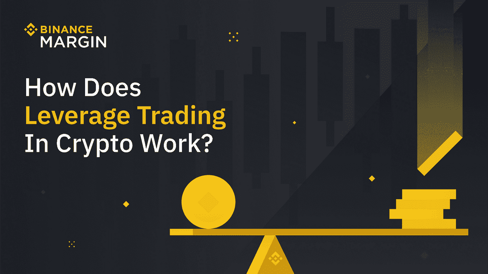

# 我为什么要用币安保证金交易？

> 原文：<https://medium.com/coinmonks/why-should-i-trade-with-binance-margin-a729f85c9de0?source=collection_archive---------6----------------------->

*转让、借用、交易、偿还、隔离&交叉方式！*

Photo: Binance

**加密货币世界保证金交易介绍**

Photo: Binance

[保证金交易](https://www.binance.com/en/trade-margin/BTC_USDT?ref=P10U1GSP)是现货和期货交易的融合，因为它让投资者通过杠杆交易加密货币。正如现货交易一样，保证金交易也会导致加密货币所有权的即时交换。保证金交易仍然不同于其他交易类型，因为它在交易中使用杠杆，将交易价值提高 2 倍至 10 倍。保证金交易使用杠杆资金，其中交易者投资抵押品(或保证金)来选择他们所选择的交易杠杆(2 倍、20 倍等。).

保证金交易涉及通过第三方基金交易资产。保证金账户为交易者提供了获得更高金额资本的途径，促进了头寸杠杆化。保证金交易放大了交易结果，交易者可以在成功的交易中获得更高的利润水平。这种交易结果的放大使得保证金交易在低波动市场(或国际外汇市场)很有吸引力。

在 Cryptoverse(用于加密货币交易)中，保证金交易是由交易员根据保证金资金的市场需求收取利息的。一些加密货币交易所也倾向于提供保证金。交易员利用加密货币市场中的杠杆交易来提高利润。保证金交易是密码世界中杠杆交易的一种形式。它包括提供资产作为抵押品，以获得购买力。

保证金交易让你进入溢价交易对(如 BTC 和瑞士联邦理工学院)。有了它，交易者可以围绕两个交易对的表现进行交易。保证金交易允许多种资产作为杠杆交易的抵押品。如果融资利率出现波动，保证金交易提供了在期货市场套利的途径。

专业交易者可以借入资金投资于币安保证金交易。如果提高交易利润是你的议程，利用保证金交易就是答案。在这篇文章中，你将确切地了解到币安保证金是如何提升你的投资组合的。

但这并不意味着你可以简单地设置和忘记保证金杠杆交易。你仍然需要对加密货币市场情绪保持警惕。如果你的保证金交易出错，你的杠杆可能会立刻耗尽你的资本。如果是这种情况，CEX 将发出保证金通知，交易者将减少他们的头寸或增加抵押品。通过减少名义上的风险，交易者可以降低他们头寸的杠杆作用。否则，交易者将增加足够的交易保证金，以表明交易管理的资金充足。

保证金交易的一个强有力的使用案例是投资组合(或资产)对冲。对冲允许交易者设定与当前头寸负相关的新头寸。对冲让交易者和投资者防范可能的损失。但是不要忘记在保证金交易中使用止损单来控制损失。

为什么币安利润率对你有好处？

Photo: Binance

1.  **多样化的交易对**:币安保证金交易有 600 多个交易对，交易多种加密货币(如 BTC、瑞士法郎、BNB、USDT 等)。).交易者还享受最优惠的交易费用和交易费率，加上优质的服务。
2.  **多资产抵押**:保证金交易通过交叉保证金模式，让用户投资多项资产作为借贷杠杆的抵押。这种交易方式不仅仅是将 BTC 投资于 BTC 的保证金交易。有了它，投资者可以将自己的 BTC 与 ETH 或 BUSD、USDT 等配对投资。与他们的抵押品相对照。这种多资产抵押投资让交易者在开仓交易中灵活操作。
3.  **冷静期:**冷静期功能帮助用户控制交易冲动。通过开启[冷静期](https://www.binance.com/en/support/faq/ad7fd07f63a64954a6d6e9257d16adcc?ref=P10U1GSP)功能，在特定时期内暂停融资融券交易。币安限制不合理的强迫交易行为，同时灌输交易责任。
4.  **保险基金:**币安融券的[保险基金](https://www.binance.com/en/support/faq/152489b2032445c4a77a175d65b80533)在用户账户的资产(减去负债)低于 0 时保护用户账户。它还包括用户由于缺乏资金而无法偿还债务的情况。
5.  **负责任的交易:**币安负责任的交易政策让您负责任地掌控自己的交易和贸易。币安告诫其用户要实行自律，定期教育([币安学院](https://academy.binance.com/en?ref=P10U1GSP)、[币安研究](https://research.binance.com/?ref=P10U1GSP)、[币安博客](https://www.binance.com/en/blog?ref=P10U1GSP)、[常见问题指南](https://www.binance.com/en/support/faq#/4?ref=P10U1GSP))，保护资金。

**使用币安保证金的例子/案例**

简单地说，您希望购买价值 2000 美元的 BTC，但您只有 1000 美元的加密货币支出(预算)经费。在这种情况下，您可以使用保证金交易来实现您的加密货币投资组合目标。如果你打算对冲一项资产或投资组合，你也可以使用保证金交易。

你的币安保证金交易计划是什么？

保证金交易向交易者介绍了传统交易之外的途径。有明确目标和足够重视的保证金交易是一种有趣且有利可图的经历。建议保证金交易只能由有足够经验的交易者执行。交易员应自觉理解保证金交易的内在风险。重要的工具，如止损单，必须尽可能明智地使用。如果你对加密货币交易的诀窍有足够的把握，今天就深入研究一下[币安保证金交易](https://www.binance.com/en/trade-margin/BTC_USDT?ref=P10U1GSP)。

了解更多关于[币安保证金交易指南](https://academy.binance.com/en/articles/binance-margin-trading-guide)。

新来币安吗？[今天注册](https://accounts.binance.com/en/register?ref=P10U1GSP)！

**免责声明**:本文仅用于教育目的，不应理解为投资建议。

> 加入 Coinmonks [电报频道](https://t.me/coincodecap)和 [Youtube 频道](https://www.youtube.com/c/coinmonks/videos)了解加密交易和投资

# 另外，阅读

*   [Bookmap 评论](https://coincodecap.com/bookmap-review-2021-best-trading-software) | [美国 5 大最佳加密交易所](https://coincodecap.com/crypto-exchange-usa)
*   [加密交易机器人](/coinmonks/crypto-trading-bot-c2ffce8acb2a) | [造币评论](https://coincodecap.com/coingate-review)
*   最佳加密[硬件钱包](/coinmonks/hardware-wallets-dfa1211730c6) | [Bitbns 评论](/coinmonks/bitbns-review-38256a07e161)
*   [新加坡十大最佳加密交易所](https://coincodecap.com/crypto-exchange-in-singapore) | [购买 AXS](https://coincodecap.com/buy-axs-token)
*   [红狗赌场评论](https://coincodecap.com/red-dog-casino-review) | [Swyftx 评论](https://coincodecap.com/swyftx-review)
*   [投资印度的最佳密码](https://coincodecap.com/best-crypto-to-invest-in-india-in-2021)|[WazirX P2P](https://coincodecap.com/wazirx-p2p)|[Hi Dollar Review](https://coincodecap.com/hi-dollar-review)