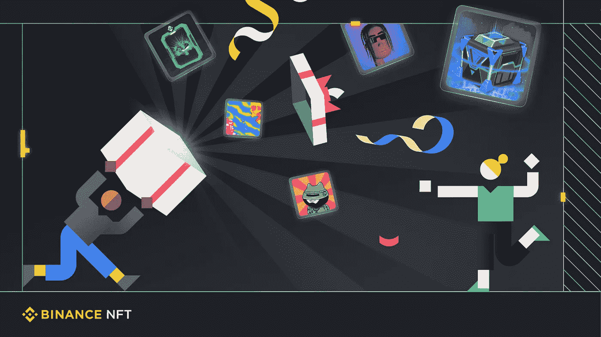

# 为什么要考虑赠送 NFT，如何赠送 NFT？

> 原文：<https://medium.com/coinmonks/why-should-you-consider-gifting-nfts-and-how-to-gift-nfts-4a4638f1b3fd?source=collection_archive---------12----------------------->

*赠送一次永久的 NFT 体验，拥有特殊灵魂的“专属所有权”!*

Photo: Binance

**什么是 NFT？**

想知道 NFT(数字资产)是否是很好的礼物？如果是的话，是时候学习如何发现一个理想的 NFT 礼物了。以 NFT 或不可替代代币形式出现的数字资产将密码体爱好者的狂热推向了一个新的高度。名人和有影响力的人不断蜂拥推出和营销他们自己的 NFT 品牌，获利数百万。但是你有没有想过把非功能性甲状腺素作为礼物送给你的家人、朋友或特别的爱人会是什么样？听起来很刺激，是吗？这就是沉浸在这篇深思熟虑的文章会启发你。

你可能想知道，到底什么是 NFT？

好吧，一个好的 OpenSea 资源非常详细地解释了 NFTs。

> 了解[如何在币安 App 上访问币安 NFT 迷你 App](https://www.binance.com/en/support/faq/7157b1045a3b4fc9b3ef71b9dfcbe08f?ref=P10U1GSP)
> 
> 另请查看:[币安推出币安 NFT 迷你应用功能](https://www.binance.com/en/support/announcement/151c4872cabc4bd3b4946334c4bce029?ref=P10U1GSP)

简而言之，NFT 是具有所有权的标记化数字文件。有资格成为 NFT 的格式包括艺术作品、运动卡片、迷因、视频和音频。这些 NFT 是数字资产，经过令牌化后可以在线买卖。

购买 NFT 后，您将获得一个所有权证书形式的数字令牌。它的所有权在共享账本(或区块链)上注册和存储，交易中使用的记录维护技术是比特币网络。这项技术传达给你作为 NFT 所有者的所有所有权，拥有出售资产的专有权。数字文件可能很多，但其 NFT 版本只有一个或数量有限。这是 NFT 独有的稀有现象。

**赠送 NFT 之前你需要知道什么？**

对于 DeFi 艺术界的新手来说，NFT 仍然有些陌生。对于这些新潮独特的数字收藏品的新手来说，NFT 仍然是非常规的特殊礼物。

倾向于探索 NFT 空间的精通技术的 NFT 新手可能会认为赠送一件与独特的(数字)收藏品相同的 NFT。但它的艺术元素和它所激发的情感超越了它，不仅仅是一件独特的收藏品。作为独一无二的礼物，NFTs 会启发这个特别的人的情感价值，这只会提升久而久之。

NFT 奖这种特殊的礼物会被人们铭记多年，甚至终生。NFT 作为礼物的内在价值会让接受者产生情感上的共鸣，不管其商业价值是否下降。

> 如果你正在努力寻找一份独特的礼物，NFTs 可以在一年中的任何时候都是很好的礼物。购买一个也可能是你进入 NFTs 世界之旅的开始。所以今天就从 [*【币安 NFT】*](https://www.binance.com/en/nft/home?ref=P10U1GSP)*开始准备礼物吧！*

但是首先，在赠送 NFT 时，要让自己了解这些重要的考虑因素:

*   NFT 是存储在数字钱包中的数字收藏品。购买和销售 NFT 通常涉及一种加密货币支付(如以太坊)。
*   NFT 市场倾向于通过固定价格或拍卖来实现交易。
*   世界各地的司法管辖区仍在制定对非关税壁垒征税的适当指导方针。因此，在决定赠送非税收入之前，要适当考虑评估你的具体纳税义务。
*   **交易费、销售费和版税**是 NFT 交易的重要考虑因素。币安总共有五种不同类型的交易费用。这些是存款费、平台费、提现或网络费、版税和铸造费。
*   需要设置一个**区块链网络互动加密货币(NFT)钱包**来接收你的 NFT，因为它是给你崇拜的特殊灵魂的礼物。因此，你的特殊收件人需要设置一个加密货币钱包，并知道(学习)如何使用它。一个 NFT 钱包，就像一个加密货币钱包一样，支持区块链协议，NFT 就是建立在这个协议上的。一个安全的 NFT 钱包倾向于保护和捍卫你的 NFT 收藏。加密货币钱包还为资产的区块链地址生成交易授权私钥。硬币、代币和 NFT 作为数据存储在区块链系统中。钱包充当了访问这些数字资产的手段。

**NFT 钱包的主要功能，以确保**:

*   **强大的安全性**是安全可靠的 NFT 交易的核心。确保您的 NFT 钱包中有 2-FA(双因素身份验证)以增加安全性。
*   一个**用户友好的**加密货币钱包让 NFT 买卖无缝。
*   **交叉链**和(首选) **NFT 市场兼容性:**
*   建议使用支持多个区块链的 NFT 钱包。你的 NFT 钱包也应该支持你选择铸造、购买或出售非功能性食品的市场。
*   **多设备支持:**选择可在两台设备上运行的钱包，同时实现实时同步。
*   **信用卡或借记卡**主导的直接支付使 NFT 交易快捷。
*   **银行提款**功能允许直接向您的银行账户提款，这是一个双赢的局面。

**NFT 钱包的种类**

*   **软件钱包**或热钱包通过移动或桌面应用程序以及浏览器扩展来操作。通过密码、种子短语和 2-FA 来确保软件钱包的安全性。软件钱包的用户友好性增加了它们的实用性。软件钱包支持从任何地方快速存取您的资金。
*   **硬件钱包**或冷钱包是高度安全的钱包，适合长期资金存储，因为它们在设备上创建和存储私钥。冷钱包会保持离线状态，直到您打算访问您的数字资产进行转账或交易。数字资产离线存储在硬件钱包中的特性可以保护它们免受黑客攻击。冷钱包发明的种子短语让你在放错设备的情况下可以访问它的内容。
*   **混合钱包**本身带来了最好、最精致的软件或硬件钱包。混合钱包提升了软件钱包的便利性，同时将硬件钱包的安全性提升到了一个新的水平。

**储存非功能性食物的最佳方法是什么？**

保管型热钱包和非保管型冷钱包，你会选择哪一个来存放你的贵重资产？一个非保管的冷钱包让你绝对控制你的私人钥匙。但这也将确保数字资产和私钥安全的全部责任推给了你。你的种子号和 2-FA 要在钱包热的情况下谨慎处理。

在热钱包或保管钱包的情况下，第三方承担您资金的安全性。当您打算转账或交易时，第三方会返还您的资金。在热钱包里，你不直接负责你的资金安全。但是它还是需要你对你的资金信任第三方。

一个[币安账户](https://accounts.binance.com/en/register?ref=P10U1GSP)或者[币安 NFT 市场](https://www.binance.com/en/nft/home?ref=P10U1GSP)都是保管钱包的。下面列出了一些广受信赖的钱包:

*   **币安钱包**是币安官方的加密货币钱包。[币安钱包](https://academy.binance.com/en/articles/how-to-use-binance-chain-wallet?ref=P10U1GSP)支持访问 BNB 智能链(BSC)、BNB 信标链和以太坊。不管你的目标是购买、出售还是铸造非功能性钱包，使用币安钱包安全地存储你的数字资产是安全的。它还能让你连接到区块链数以千计的项目。
*   **MetaMask 钱包**主要是一款相当流行的以太坊钱包。通过 [MetaMask](https://academy.binance.com/en/articles/how-to-use-metamask?ref=P10U1GSP) 钱包，您可以在以太坊区块链上购买或出售 NFT。MetaMask 钱包的一个令人兴奋的功能是它可以与浏览器扩展和移动应用程序同步，从而实现无缝的资金访问。MetaMask 还允许用户注册多个地址，实现分类组织的加密货币和 NFT 存储。MetaMask 支持 60 多个国家的借记卡和银行转账。

> 提示:通过 [WalletConnect、](https://academy.binance.com/en/articles/how-to-use-walletconnect?ref=P10U1GSP)将您的软件钱包连接到您的币安帐户，如果您已经有一个 MetaMask 钱包。

*   Trezor 钱包与许多钱包应用程序兼容。它因其高度的安全性而备受赞誉。Trezor 是非保管式硬件钱包，易于设置和操作。Trezor 钱包只能连接到 Android 设备。
*   **账本钱包**是一款受欢迎的非保管硬件钱包，被数百万加密货币爱好者使用。由于 Ledger 的高安全性和对各种移动应用程序的强大兼容性，它可以与 iOS 和 Android 设备无缝连接。

**币安 NFT 的非金融交易类型**

目前市场上有各种各样的非功能性测试。要为你所爱的人发现最好的 NFT，你可以访问币安 NFT 市场。

诱人的是，在币安 NFT 市场上，很有可能根据送礼者最喜欢的创作者或爱好来定制 NFT。除此之外，你还可以选择一份符合你心爱或特殊灵魂兴趣的 NFT 礼物:

■溢价

■艺术

■运动

■娱乐

■游戏

■收藏品

■电子竞技

■永远的 NFT(社会事业)

■音乐

**如何去安云鹏 NFT**

1.  首先，注册一个你的币安账户(如果你还没有的话)。然后，用币安 NFT 市场认可的三种加密货币中的任意一种，即 BNB、BUSD 或瑞士联邦理工学院。
2.  发现你梦想中的 NFT，你相信你的爱人也会同样崇拜它。
3.  确保有足够的 BNB、BUSD 或联邦储蓄银行来支付交易费用。
4.  核实两次交易细节的正确性，完成购买过程。
5.  要将 NFT 转移到您的礼物，需要他们的钱包地址(以字母和数字的形式，或者只是一个 QR 码)。确保获得正确的钱包地址，因为一旦 NFT 被发送到错误的地址，这是不可恢复的。NFT 只能发送到兼容的钱包，无论是 ETH 到 ETH 还是 BNB 到 BNB。
6.  核实区块链记录，以确保交易完成时收到正确的 NFT。

**展示 NFT 礼物的贴心方式**

你将需要有创意，而礼物 NFT，因为它不能盒装和礼品包装。但是有一些考虑周到的方法可以把这个特别的 NFT 礼物送给你的爱人、朋友或家人。以下是一些值得考虑的想法:

1.  建议赠送您的专用 NFT 和硬件钱包，以防您的受赠者没有硬件钱包所有权。这样做也保证了硬件钱包将保护即将成为天才的 NFT。
2.  如果你喜欢 DIY 的话，你也可以把 NFT 打印出来并装框。通过这样做，你也可以给特别的 NFT 礼物一个个人风格。只需打印 NFT 并附上访问说明。

有关如何购买 NFTs 的更多信息，请访问:

[如何在币安 NFT 市场购买 NFTs】](https://www.binance.com/en/support/faq/777d6487fb7b491696571e3cbf3518f7)

[如何在币安 NFT 用现金买卖 NFT](https://www.binance.com/en/blog/421499824684902685/nft/how-to-buy-and-sell-nfts-with-cash-on-binance-nft-marketplace)

新来币安吗？[现在就注册](https://accounts.binance.com/en/register?ref=P10U1GSP)！

**免责声明**:本文仅用于教育目的，不应理解为投资建议。

> 加入 Coinmonks [电报频道](https://t.me/coincodecap)和 [Youtube 频道](https://www.youtube.com/c/coinmonks/videos)了解加密交易和投资

# 另外，阅读

*   [Bookmap 评论](https://coincodecap.com/bookmap-review-2021-best-trading-software) | [美国 5 大最佳加密交易所](https://coincodecap.com/crypto-exchange-usa)
*   最佳加密[硬件钱包](/coinmonks/hardware-wallets-dfa1211730c6) | [Bitbns 评论](/coinmonks/bitbns-review-38256a07e161)
*   [新加坡十大最佳加密交易所](https://coincodecap.com/crypto-exchange-in-singapore) | [收购 AXS](https://coincodecap.com/buy-axs-token)
*   [红狗赌场评论](https://coincodecap.com/red-dog-casino-review) | [Swyftx 评论](https://coincodecap.com/swyftx-review) | [CoinGate 评论](https://coincodecap.com/coingate-review)
*   [投资印度的最佳加密软件](https://coincodecap.com/best-crypto-to-invest-in-india-in-2021)|[WazirX P2P](https://coincodecap.com/wazirx-p2p)|[Hi Dollar Review](https://coincodecap.com/hi-dollar-review)
*   [加拿大最佳加密交易机器人](https://coincodecap.com/5-best-crypto-trading-bots-in-canada) | [库币评论](https://coincodecap.com/kucoin-review)
*   [火币的加密交易信号](https://coincodecap.com/huobi-crypto-trading-signals) | [HitBTC 审查](/coinmonks/hitbtc-review-c5143c5d53c2)