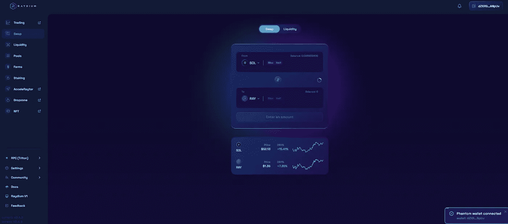

# 为什么索拉纳会多付别人钱

> 原文：<https://medium.com/coinmonks/why-solana-will-overpace-others-d1bbc9690b7?source=collection_archive---------19----------------------->

自从以太坊称王以来，秘密社会认为许多区块链是以太坊杀手。回到 2017 年，第一个 altcoin 赛季强攻的时候，以太坊杀手有 EOS，NANO，TRON 等。然而，今天最被炒作的“以太坊杀手”是索拉纳，阿瓦克斯，特拉，卡尔达诺，波尔卡多特，近协议，等等。这个周期似乎遵循着同样的模式，硬币不断地被炒作，然后随着时间的推移而消失。成为一个“失败的以太坊杀手”是许多人的命运，但他们仍然在以太坊的阴影下共存。那么索拉纳会杀以太坊吗？时间会证明这一点，但我可以很容易地将索拉纳与其他“杀手”区分开来。

索拉纳的联合创始人阿纳托利·亚科文科声称，他们希望接触普通人而不是特权群体，并像互联网一样实现大规模采用。有数以千计的品牌/产品，但只有少数几个是非常受欢迎的和世界闻名的。那么，怎样才能成为一个全球性的产品呢？苹果、谷歌、可口可乐和耐克都是全球品牌。他们有一些共同点；容易获得、创新、营销和可负担性。索拉纳是这样一个职位的合适人选吗？

***赞成索拉纳的论点***

索拉纳生态系统的速度归功于其被称为历史证明的共识机制。这项技术背后的想法非常棒。简而言之，用户发送的事务都标有当前时间，以便在验证阶段之后对事务进行排序变得更加顺畅和快速。

这赋予了索拉纳多样而独特的技术能力。Solana 的技术使其比当前的银行系统优越得多，特别是在速度和能耗方面。每秒可以达到 65000 次交易。交易费用几乎收敛到零。一次交易的能耗几乎相当于一次谷歌搜索的能耗。例如，Visa 和 Mastercard 的费用包含每笔交易的固定金额以及交易价值的百分比。除了这些费用，它们每秒只能分别处理 1700 和 5000 笔交易。如果加密货币在未来变得更受欢迎，由于其快速而廉价的操作，地球上的大多数人很可能会采用 Solana 而不是当前的金融科技公司。

另一方面，索拉纳生态系统背后有巨大的风险资本。这可以被认为是索拉纳可能占上风的另一个迹象，因为“聪明的钱”已经认可了它的技术。就连他们最近也赔偿了在索拉纳和以太坊之间的桥梁上发生的黑客攻击造成的用户损失。这件事足以说明投资者对生态系统的信心有多强。

过去一年，生态系统经历了大幅增长。质量带来了金钱，金钱把人们带到了生态系统。从 2021 年 12 月到 2022 年 12 月，索拉纳生态系统中的开发者数量增加了 5 倍。这可以解释为索拉纳链上的申请数量将会增加。dex、Dao、游戏、NFT 平台、加密钱包和其他 web3 应用将会占据上风，满足社区的需求。所有这些平台都要求用户持有 SOL 币，以激励大众采用 SOL。

至于我在索拉纳生态系统的经历，就像信用卡交易一样顺畅和快速。我主要在几个平台上使用 DeFi 产品/服务。我最喜欢的一个是[ray midi](https://raydium.io/)因为它很容易使用，即使对新手来说也是如此。界面看起来整洁而专业。该设计包括代表具有不同特征的用户马赛克的索拉纳标志的颜色。几个颜色统一在一个标志上，这就引出了分散化的想法。设计和图形的质量非常高，让你觉得你正在浏览一个全球品牌的网站。

***反对索拉纳的争论***

索拉纳因过于集权而受到批评。人们说验证者不够分散，一些风险资本在生态系统中投入巨资。我认为这些论点现在有效，但将来无效。没有一个区块链能在一开始就完全分权。如果我们能置身于交易所的操纵和投机之外，把它纯粹当作一种技术；很容易看出，索拉纳由于收费低、交易快，是区块链最方便大规模收养的地方之一，因此这可能会导致相当程度的权力下放。这是一次耗时的冒险，因为随着人们对区块链的了解，他们加入网络的速度也越来越慢。因此，验证器在世界各地被创造出来。比特币是目前最分散的密码货币，最初完全归它的创建者所有，但随着它越来越受欢迎，世界各地的验证器也逐渐出现。

由于网络在过去多次瘫痪，关于网络的安全性和稳定性一直存在很多争议。因此，就安全而言，索拉纳现在不是最佳选择。然而，索拉纳仍然在 mainnet 测试版上，还有改进的空间。以太网在过去也曾被黑客入侵过几次，但技术的进步从未停止过。路上会有意外，我认为索拉纳团队可以从挫折中吸取教训，稳定局面。

***汇总***

每个区块链网络都有利有弊。经过综合计算和考虑，在我看来，索拉纳凭借其技术，有很大的机会成为未来最受欢迎的连锁店之一。正如苹果和谷歌这样的巨头所展示的那样；安全、可靠、平稳的 UX 带来的技术和创新一直在增值。

Solana 的开发人员表明，他们可以提供创造性的解决方案，并有能力实现他们的想法。毕竟，他们提出了一些独特的东西，创造了一个比竞争对手更快的网络。仅仅这个事实就让我相信，只要这种创新的观点持续存在，这个团队就有能力将这个项目进行得越来越深入。

> 加入 Coinmonks [电报频道](https://t.me/coincodecap)和 [Youtube 频道](https://www.youtube.com/c/coinmonks/videos)了解加密交易和投资

# 另外，阅读

*   [CBET 点评](https://coincodecap.com/cbet-casino-review) | [库币 vs 比特币基地](https://coincodecap.com/kucoin-vs-coinbase)
*   [折叠 App 审核](https://coincodecap.com/fold-app-review) | [Kucoin 交易机器人](/coinmonks/kucoin-trading-bot-automate-your-trades-8cf0ca2138e0) | [Probit 审核](https://coincodecap.com/probit-review)
*   [如何匿名购买比特币](https://coincodecap.com/buy-bitcoin-anonymously) | [比特币现金钱包](https://coincodecap.com/bitcoin-cash-wallets)
*   [币安 vs FTX](https://coincodecap.com/binance-vs-ftx) | [最佳(索尔)索拉纳钱包](https://coincodecap.com/solana-wallets)
*   [比诺莫评论](https://coincodecap.com/binomo-review) | [斯多葛派 vs 3Commas vs TradeSanta](https://coincodecap.com/stoic-vs-3commas-vs-tradesanta)
*   [Capital.com 评论](https://coincodecap.com/capital-com-review) | [香港的加密借贷平台](https://coincodecap.com/crypto-lending-hong-kong)