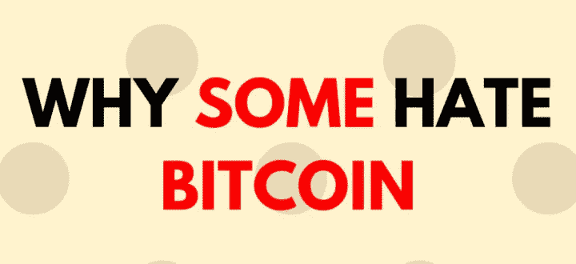

# 为什么有人讨厌比特币？这真的是庞氏骗局吗？

> 原文：<https://medium.com/coinmonks/why-some-hate-bitcoin-is-this-really-a-ponzi-scheme-e94ca9d614f4?source=collection_archive---------23----------------------->

众所周知，很多人不相信比特币，甚至连“专家”也不相信。但是他们为什么那么讨厌呢？有些人甚至称之为庞氏骗局。他们真的是这个意思吗？我们将在本文中深入探讨。

那么谁讨厌比特币呢？

1.  沃伦·巴菲特:这位投资大师公开声明比特币不是一种生产性资产，即使在 25 美元他也不会买入。
2.  杰米·戴蒙:他认为比特币一文不值。不过，现在值很多了。
3.  查理·芒格:他真的认为购买让他变得愚蠢。他认为共产党领导人有足够的智慧来禁止比特币。
4.  保罗·克鲁格曼:美国经济学家、教授、诺贝尔奖获得者保罗·克鲁格曼其实并不喜欢比特币。他认为投资者被卖出去购买比特币。

有很多人，我们不能列出每个人。他们中的一些人甚至不诚实。

经常听说秘密投资者投资他们不理解的东西。嗯，不理解的仇恨可以吗？

**为什么人们讨厌比特币？**

Bitcoin hate

1.  有人认为它不会产生。但黄金也不行。
2.  政府讨厌它，因为它不能轻易控制和窃取。
3.  他们认为这助长了欺诈行为。
4.  人们认为这是一场高回报的赌博
5.  比特币工厂消耗电力

还有很多其他。但是现在让我们来看看这其中有多少是真的。

> **它不生产**

比特币和许多其他加密货币的主要目标是促进安全交易，而不是生产实物产品。它提供了一种服务，这就是它有价值的原因。

> **无法控制**

是的，不能轻易控制。甚至创始人。这是件好事，因为这里没有政治、官僚腐败等..

> **助长欺诈活动**

诚然，有些人利用比特币进行欺诈活动，但这种情况非常少。Chainanalysis 的最新调查显示，只有 0.24%的交易仅用于欺诈，并且可以追踪到涉案人员，国家加密货币执法团队正在这么做。

> **比特币是赌博吗？**

比特币不是一场赌博，但在不了解数字货币的情况下进行投资，可能会像其他任何资产一样导致亏损。
比特币在短期内可能会非常不稳定，但从长期来看，它的价值正在增加。所以这是非常好的长期投资。但由于高波动性，短线交易者在交易时应更加注意。

> **比特币和电力神话**

比特币挖矿确实需要电力，但它只使用了银行服务所需电力的一半。银行有数据中心、ATM 机等..这些都需要比矿工更多的电力。

> 加入 Coinmonks [电报频道](https://t.me/coincodecap)和 [Youtube 频道](https://www.youtube.com/c/coinmonks/videos)了解加密交易和投资

**外卖**

有风险也有利润。许多人讨厌，但大多数人对此没有太多的想法。所以除非有充分的理由，否则不要听从任何“专家”的建议。