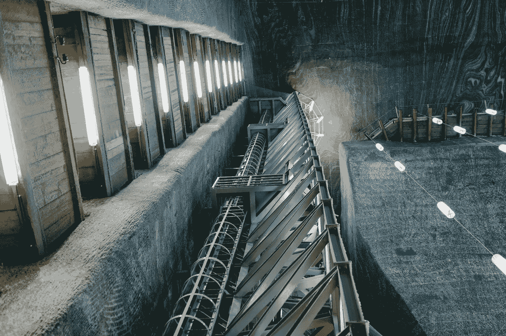

# 为什么德州准备利用比特币采矿

> 原文：<https://medium.com/coinmonks/why-texas-is-poised-to-position-itself-to-capitalize-on-bitcoin-mining-16080b37b95f?source=collection_archive---------49----------------------->

作者:[克里斯托弗·h·卢，医学博士](http://www.drchrisloomdphd.com)

Photo by [Julia Volk](https://www.pexels.com/photo/metal-construction-inside-of-salt-mine-with-lamps-5207427/)

***注:*** *观点均为本人原创。不是投资建议。*

这篇文章探讨了得克萨斯州成为比特币(BTC)采矿领域最具主导地位的参与者的潜力。

2021 年，在包括中国、印度和其他欧盟国家在内的主要国家禁止 BTC 采矿后，许多…