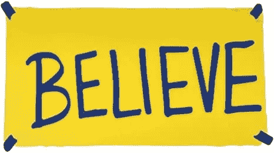

# 为什么黑人总是输

> 原文：<https://medium.com/coinmonks/why-the-blacks-always-lose-2c1009aa0016?source=collection_archive---------68----------------------->

## 美洲原住民也没有真正繁荣起来

“Black Girl” by Neddy Bly, courtesy of ArtStation

为什么看起来黑人总是输？在我的一生中，黑人一直在谈论它，但什么也没有改变。这是为什么呢？

因为他们在和假想敌作战，而不是真实的敌人。

即使是最清醒的嘻哈嬉皮士也是银行的奴隶。

坎耶需要银行。

Kanye 可以把他的家人转移到国外，所以我们看不到他们住在哪里。但是这个新国家需要一定的基础设施。他没有躲在塞内加尔是有原因的。

没有疯狂这回事。两年来，我的话似乎否定了这种说法。运用相反的原则…我以最疯狂的方式提出我的想法来产生信号。你猜怎么着。起作用了。

猜猜谁比我更擅长这个。

坎耶。

我们被出卖了，这是信息时代。华盛顿有一个精通信息的领导人吗？游说行业不是凭空出现的。政客们展现的个性要么是边缘脑残(随便你挑)，要么是边缘选美皇后(AOC、拜登、哈里斯、罗姆尼，名单长得令人震惊，但并不令人意外)。

如果你没有看过怪兽公司，你会讨厌我引用怪兽公司的事实(就像如果你从来没有对 Kanye 摇过屁股或打过拳头，你会讨厌我对 Kanye 的支持。)留在我身边。艺术让生活变得清晰。

不幸的是，《怪物公司》发生在一个整个系统靠孩子们的尖叫声运行的世界里。怪物拜访孩子们，服务他们的轮班并收获尖叫八个小时，然后就到此为止，去酒吧，看一些电视，和他们的配偶甜蜜地做爱，等等。这就是世界的本来面目。任何坚持认为有一个更好但无法想象的世界在等待这些怪物的人(他们可能看起来很可怕，就像人类一样，但实际上是善良和有爱心的，他们只是在一个低劣的系统中长大，就像埋在一个管理不善，缺乏想象力的农场的泥土中的病态蔬菜，只有几个“农民”和一堆机器)被称为疯子。

一个更好但无法想象的世界纯粹是痴人说梦。

任何提出它的人，或者躲在她的地下室里写下它的人，都会被贴上疯狂的标签。

但是…这就是我们玩这个游戏的原因…在一些“疯狂”的事情发生后，你猜怎么着，事实证明，孩子们的*笑声*远比孩子们的尖叫声更有能量。

想象一下。地下室的疯婆子是对的。

地下室的这个疯婆子也是对的。对我来说，我们的世界比怪物公司的世界重要得多(尽管我崇拜并永远感激那个世界。)

如果你不认为坎耶·韦斯特“配得上”或者“有能力”当总统，我问你这个问题——

富有远见的马克·吐温会是一位好总统吗？

叶是马克·吐温的转世。

坎耶·韦斯特是塞缪尔·克莱门斯的转世。

我们的世界变化之快，超出了任何控制媒体机构的权威人士或运行两极政党系统的元老们的理解。

我将很快被宣布为总统候选人坎耶·韦斯特的竞选经理。

我希望你准备好敞开心扉，和我们一起摇摆你的屁股(在正确的人身上，敲击脚趾或打响指和摇摆屁股一样有力)，因为我们创造了一个更美好的世界的蓝图。没有政府官员能够创造一个更好的世界。他们可以做一些更强大的事情:

考虑

去帮助别人

相信。

> *加入 Coinmonks* [*电报频道*](https://t.me/coincodecap) *和* [*Youtube 频道*](https://www.youtube.com/c/coinmonks/videos) *了解加密交易和投资*

# 另外，阅读

*   [3 商业评论](/coinmonks/3commas-review-an-excellent-crypto-trading-bot-2020-1313a58bec92) | [Pionex 评论](https://coincodecap.com/pionex-review-exchange-with-crypto-trading-bot) | [Coinrule 评论](/coinmonks/coinrule-review-2021-a-beginner-friendly-crypto-trading-bot-daf0504848ba)
*   [莱杰 vs n rave](/coinmonks/ledger-vs-ngrave-zero-7e40f0c1d694)|[莱杰 nano s vs x](/coinmonks/ledger-nano-s-vs-x-battery-hardware-price-storage-59a6663fe3b0) | [币安评论](/coinmonks/binance-review-ee10d3bf3b6e)
*   [Bybit Exchange 审查](/coinmonks/bybit-exchange-review-dbd570019b71) | [Bityard 审查](https://coincodecap.com/bityard-reivew) | [Jet-Bot 审查](https://coincodecap.com/jet-bot-review)
*   [3 commas vs crypto hopper](/coinmonks/3commas-vs-pionex-vs-cryptohopper-best-crypto-bot-6a98d2baa203)|[赚取加密利息](/coinmonks/earn-crypto-interest-b10b810fdda3)
*   最好的比特币[硬件钱包](/coinmonks/hardware-wallets-dfa1211730c6) | [BitBox02 回顾](/coinmonks/bitbox02-review-your-swiss-bitcoin-hardware-wallet-c36c88fff29)
*   [BlockFi vs Celsius](/coinmonks/blockfi-vs-celsius-vs-hodlnaut-8a1cc8c26630)|[Hodlnaut 点评](/coinmonks/hodlnaut-review-best-way-to-hodl-is-to-earn-interest-on-your-bitcoin-6658a8c19edf) | [KuCoin 点评](https://coincodecap.com/kucoin-review)
*   [Bitsgap 审查](/coinmonks/bitsgap-review-a-crypto-trading-bot-that-makes-easy-money-a5d88a336df2) | [Quadency 审查](/coinmonks/quadency-review-a-crypto-trading-automation-platform-3068eaa374e1) | [Bitbns 审查](/coinmonks/bitbns-review-38256a07e161)
*   [密码本交易平台](/coinmonks/top-10-crypto-copy-trading-platforms-for-beginners-d0c37c7d698c) | [Coinmama 审核](/coinmonks/coinmama-review-ace5641bde6e)