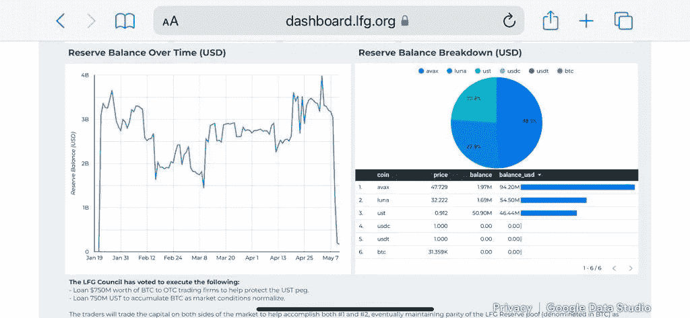
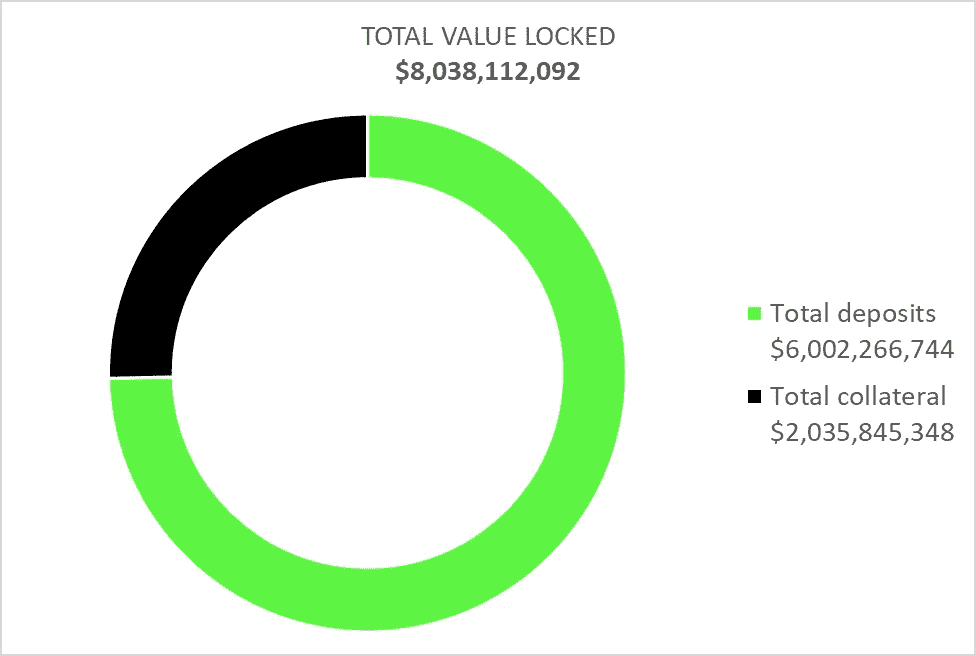

# 为什么泰拉(UST)的坠毁对 DeFi 很重要

> 原文：<https://medium.com/coinmonks/why-the-crash-of-anchor-matters-for-defi-a8e8441dea53?source=collection_archive---------12----------------------->

Terra network 上的 Anchor protocol 一直是 DeFi protocols 的宠儿，在一年内上升到 180 亿美元 TVL。这是 DeFi“储蓄”的首选协议之一。

在 10 月 22 日之前的 3 天里，它遭受了迄今为止最严重的威胁之一。由于储户大量赎回 UST，这给 LUNA 的价格带来了巨大的下行压力，LUNA 的价格在 3 天内被除以 4 倍。

面对大规模资金外流，UST 盯住美元的汇率制度似乎无法维持，在最糟糕的时候，UST 汇率跌至 1 美元兑 70 港元。现在已经恢复到 90 克拉。LFG (Luna Foundation Guard)通过卖出 BTC 买入 UST，扮演了维持联系汇率的角色。截至目前，LFG 的 BTC 储备似乎已消耗殆尽，其总储备也从 40 亿美元降至 1.7 亿美元。

LFG Reserve

与此同时，存款在短时间内减少了一半，至 80 亿美元。

Anchor Protocol, 360 Advisory LLC

存款的回报率仍为 18%。这一利率由借款方和抵押品收到的利息来补偿。总而言之，我们估计该方案需要弥补约 250 万美元/天的缺口。按照这种速度，1.78 亿美元的储备留出了大约 70 天的回旋余地。

在算法稳定币历史的这个阶段，没有人会对 Terra (UST)天生倾向于这种性质的运行感到惊讶。从某种程度上来说，LFG 就是为此而生的，而且至今行之有效。然而，绝对清楚的是，Terra 生态系统仍然需要高度集权的政党。

更长期的影响是，对 Terra 的信任不可挽回地动摇了，回旋的余地看起来很小，因为生态系统的支持者遭受了破坏性的打击，我们估计相当于他们净值的 50%。UST 的存款人和长卢娜·霍德勒都被洗光了。监管机构可能会对算法稳定性问题更加严厉。

然而，DeFi 总体上抵抗了压力，很明显 Terra 需要被完善以更好地隔离这种运行。团队已经在这方面努力了。

**关于—**

*360 咨询有限责任公司是一家总部位于波士顿的 RIA 公司，管理投资，包括加密*

👉[上午 9 点至 30 点](https://twitter.com/930AM2)🐰🕳

**来源—**

 [## Terra 的稳定结构在狂野的一天瓦解了

### UST 的脆弱性从一开始就显而易见。它正盯着市场。马厩硬币的…

thedefiant.io](https://thedefiant.io/ust-terra-stablecoin-analysis/)  [## 泰拉的 UST 在下跌 40%后反弹至 0.90 美元，这是挑衅

### 泰拉的稳定货币 UST，与美元挂钩的分散资产的典型代表，周二大幅反弹…

thedefiant.io](https://thedefiant.io/ust-de-pegs-by-40/) 

## 另外，阅读

*   [OKEx vs KuCoin](https://coincodecap.com/okex-kucoin) | [摄氏替代度](https://coincodecap.com/celsius-alternatives) | [如何购买 VeChain](https://coincodecap.com/buy-vechain)
*   [ProfitFarmers 回顾](https://coincodecap.com/profitfarmers-review) | [如何使用 Cornix 交易机器人](https://coincodecap.com/cornix-trading-bot)
*   [如何匿名购买比特币](https://coincodecap.com/buy-bitcoin-anonymously) | [比特币现金钱包](https://coincodecap.com/bitcoin-cash-wallets)
*   [瓦济里克斯 NFT 评论](https://coincodecap.com/wazirx-nft-review)|[Bitsgap vs Pionex](https://coincodecap.com/bitsgap-vs-pionex)|[Tangem 评论](https://coincodecap.com/tangem-wallet-review)
*   如何使用 Solidity 在以太坊上创建 DApp？