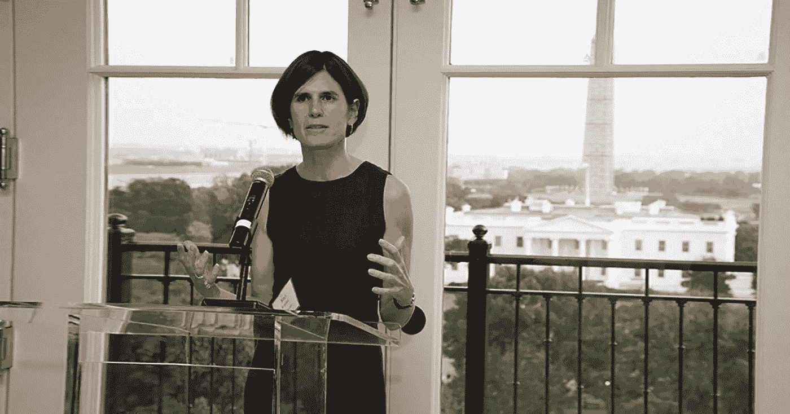

# 为什么这位前摩根大通董事会成为阿尔格兰德基金会的首席执行官？

> 原文：<https://medium.com/coinmonks/why-the-former-jp-morgan-director-becomes-ceo-of-the-algorand-foundation-7cb52cb9289?source=collection_archive---------2----------------------->

阿尔格兰德基金会刚刚任命了一位新的首席执行官。让我们来看看 Staci Warden，一个有着坚实专业背景的人，他将负责开发公司区块链解决方案的光环:algrand(ALGO)。

## 斯塔西·沃顿将领导阿尔格兰德基金会