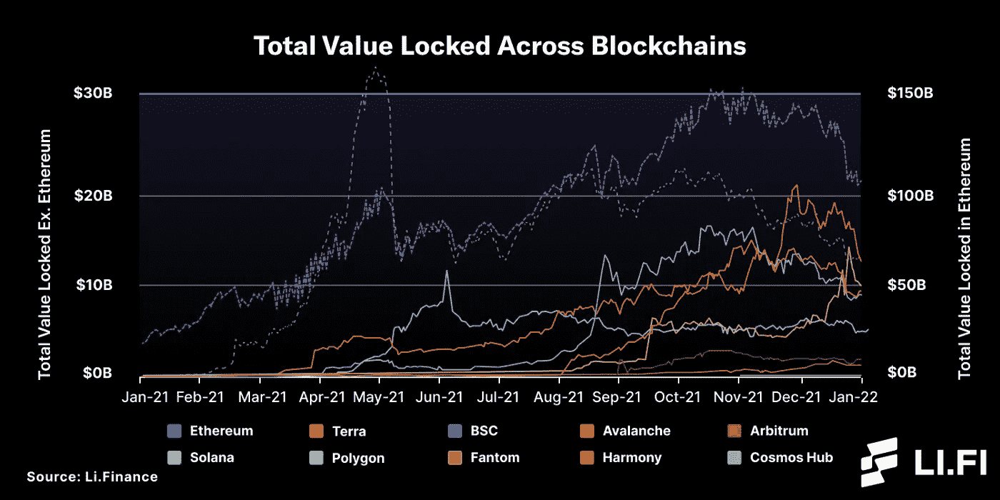
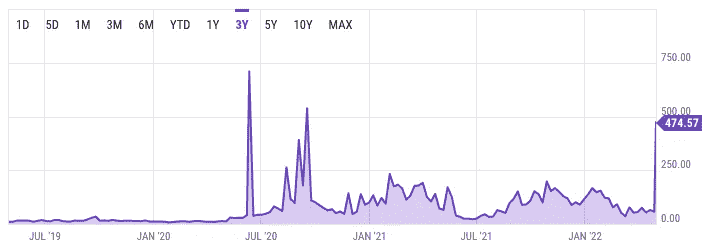
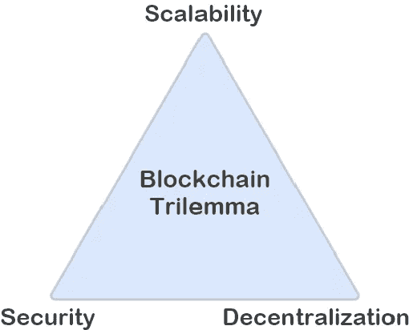
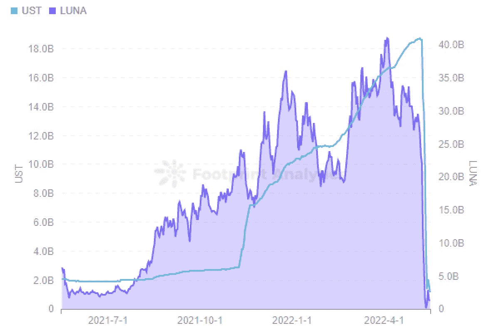

# 为什么未来的 DeFi 协议是多链的？

> 原文：<https://medium.com/coinmonks/why-the-future-defi-protocol-is-multi-chain-d6cb056c691f?source=collection_archive---------40----------------------->

以太坊不仅是第二大加密货币(仅次于比特币)，也是最大的(就市值和 TVL 而言)可编程区块链。它是第一个 DeFis 的所在地，但可扩展性和天然气费用的持续问题推动 DeFi 协议走向多链。

## TL；速度三角形定位法(dead reckoning)

为什么未来的 DeFi 协议是多链的？

*   **进入更大的市场** : TVL 和 DeFi 社区遍布区块链各地
*   **可伸缩性:**飞涨的油价使得在以太坊上执行交易成本过高
*   **多样化** : 不托管协议，道和所有国库只在一条链上

# 介绍

DeFi(分散金融)是一个描述所有提供金融服务的 dApps(分散应用)的术语。

TVL(总价值锁定)是存放在 DeFi 协议中的数字资产的总价值。

# 进入更大的市场

尽管 TVL 的大部分地区都被锁在以太坊里，但其他可编程链正在获得牵引力。原因之一是天然气价格，与以太坊相比，其他连锁店的天然气价格甚至低 1000 倍。

# 可量测性

## 以太坊 AYC 拥塞

以太坊越来越拥挤了。最近的例子是 5 月 1 日 NFT 在元宇宙(Ape 游艇俱乐部旁边)出售土地。

在以太坊上执行一笔交易，天然气价格达到 6000-7000 美元。这不仅惹恼了另一边的社区，也阻止了其他人在链上做任何事情。

## 索拉纳崩溃

区块链三难困境使得在不牺牲安全性或去中心化的情况下提高可扩展性变得不可能。索拉纳(TVL 区块链前十名)优先考虑可扩展性而不是分散化。只有 2000 个验证器，它提供了比以太坊高得多的交易吞吐量。

然而，5 月 3 日，Metaplex Candy Machine 在 NFT 举行的铸造活动导致链条断裂，6-7 小时内完全无法使用。

那一天，Solana 每秒经历了 600 万个事务请求，在单个验证器节点上生成了 100 Gbps 的数据。因此，节点运营商的服务器超出了它们的内存，导致 1730 个节点崩溃，以至于区块链没有足够的票数来批准新的区块。随着未经确认的街区越来越多，区块链开始反复分叉。当太多的分叉建立起来时，解决问题的唯一方法就是关闭整个区块链。

# 多样化

## 土地塌陷

Terra 是区块链的一个例子，它进入了前 10 家连锁店，但由于其基础稳定币 UST 的算法缺陷，一夜之间消失了。在这种情况下，区块链的基础设施几乎工作正常，但问题出在算法稳定币的经济假设上。

UST 是与美元挂钩的稳定货币。这意味着它与美元的交易比例为 1:1。为了保持 1:1 的汇率，UST 得到了 Luna (Terra native token)市值的宽松支持。这种方法一直很有效，直到 UST 的市值几乎和 Luna 的市值一样大(后来发现储量太小)。

要阅读更多关于 stablecoins 的内容，[去我的其他博客](/coinmonks/ultimate-stablecoin-classification-bd70db1ae3f3)。

其余发生在 Terra (Luna)和 UST 身上的事情已经成为历史。然而，这种情况使得许多 DeFi 协议无家可归——这些协议不仅失去了运行它们的核心区块链，还失去了它们的 Dao 和库。

> DeFi 协议应该多样化，不要仅在一个链上托管协议、DAO 和所有资金。

# 结束语

社区对于每个 DeFi 协议来说都是最重要的，但是当它无法访问最喜欢的 DeFi 协议时，它很容易失去忠诚度。缺少访问可能不是由协议本身的缺陷引起的，而是由底层区块链的可伸缩性问题引起的。为了避免拥堵以及访问更广泛的社区，DeFi 协议将采用多链方式。链的多样化将加强 Defi 生态系统，使其更具弹性。

多链怎么走？有三种选择——以太坊第二层，侧链，定制链，我将在我的下一篇博客中描述。敬请关注。

**如何定义——入门系列**

1.  区块链搭便车指南
2.  区块链互联网:为什么有这么多区块链？
3.  [如何通过渗透在宇宙中定义:从零到赌注英雄](/@cyanustech/how-to-defi-in-cosmos-from-zero-to-staking-hero-5682fbb83cda)
4.  如何通过阿卡拉在波尔卡多特定义:从零到铸造英雄
5.  [如何在 Jumbo 附近 DeFi:从零到产量农业英雄](/@cyanustech/how-to-defi-in-near-from-zero-to-yield-farming-hero-6e7053b4e0a6)

📌关注 [Twitter](https://twitter.com/cYanusTech) 获取实时更新

📌加入关于[不和](https://discord.gg/tbNPjFDm)的讨论！

📌访问网站: [www.yanus.tech](http://www.yanus.tech/)

> 加入 Coinmonks [电报频道](https://t.me/coincodecap)和 [Youtube 频道](https://www.youtube.com/c/coinmonks/videos)了解加密交易和投资

# 另外，阅读

*   [CoinDCX 评论](/coinmonks/coindcx-review-8444db3621a2) | [加密保证金交易交易所](https://coincodecap.com/crypto-margin-trading-exchanges)
*   [红狗赌场评论](https://coincodecap.com/red-dog-casino-review) | [Swyftx 评论](https://coincodecap.com/swyftx-review) | [造币厂评论](https://coincodecap.com/coingate-review)
*   [Bookmap 评论](https://coincodecap.com/bookmap-review-2021-best-trading-software) | [美国 5 大最佳加密交易所](https://coincodecap.com/crypto-exchange-usa)
*   [如何在 FTX 交易所交易期货](https://coincodecap.com/ftx-futures-trading) | [OKEx vs 币安](https://coincodecap.com/okex-vs-binance)
*   [CoinLoan 审查](https://coincodecap.com/coinloan-review) | [YouHodler 审查](/coinmonks/youhodler-4-easy-ways-to-make-money-98969b9689f2) | [BlockFi 审查](https://coincodecap.com/blockfi-review)
*   [XT.COM 评论](https://coincodecap.com/profittradingapp-for-binance)币安评论 |