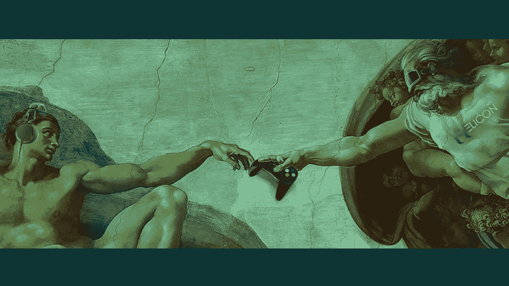

# 为什么游戏行业需要 HeliconNFT

> 原文：<https://medium.com/coinmonks/why-the-gaming-industry-needs-heliconnft-5aba47a37804?source=collection_archive---------45----------------------->

除了有趣的游戏性，传统的游戏场景被不利于游戏玩家的问题和系统所困扰。到目前为止，游戏玩家还没有拥有他们的游戏内资产。如果游戏明天关闭，他们辛辛苦苦得到的所有武器和皮肤都将永远失去。不仅如此，他们也不能将这些资产货币化，使它们基本上一文不值(尽管它们在游戏中可能很稀有)。

NFT 完全改变了这里的权力动态，并彻底改变了游戏格局。如果一个游戏玩家将他们的游戏内资产令牌化，并将其转化为 NFT，那么他们不仅拥有不可否认的所有权，还拥有完全的控制权，可以随心所欲地买卖这些资产。这正是 HeliconNFT 在集中式游戏和分散式 NFT 之间架起桥梁的原因。为了加快这一进程，HeliconNFT 正积极与其他 NFT 游戏领导者以及传统游戏集团合作。

以下是游戏行业、传统和 NFT 生态系统需要 HeliconNFT 的原因:

增值服务

作为一个将游戏元宇宙与 NFT 购买和交易功能相结合的平台，HeliconNFT 正在为游戏场景提供价值。玩家可以玩得很开心，赚取 NFT，用它们交换治理令牌，并在一个地方享受分散的财务功能。

与传统游戏场景中游戏玩家是唯一增加游戏价值的人不同，HeliconNFT 为他们提供了从游戏中获得价值的途径。

玩家掌控一切

在传统的游戏场景中，玩家必须购买游戏中的物品才能享受游戏，但他们不能向其他玩家出售他们的收藏品。一旦他们购买了这些游戏内资产，他们就必须在玩的时候消耗它们，并且不能将它们交易给其他人。

HeliconNFT 背后的概念改变了这一点，因为游戏爱好者有权在市场上出售他们的物品。游戏玩家拥有自己的资产，并可以决定如何使用它们。HeliconNFT 还提供了定制的概念，创作者可以创建量身定制的物品甚至游戏。

可互操作

传统游戏中的物品不能在多个平台上使用，但这在 NFT 游戏生态系统中是不一样的。有了 HeliconNFT 拥有的功能，不同的 NFT 游戏内资产将在多个网络上使用。人们将把他们的 NFT 从一个游戏空间转移到另一个游戏空间并使用它们。

现实生活和虚拟生活的融合

NFT 空间已经从仅仅是一个虚拟世界变成了现实生活的一个分支。这是 HeliconNFT 正在建造的一部分。例如，Bored Ape 游艇俱乐部为 NFT 持有者举办了现实生活中的活动，在虚拟世界之外创建了一个社区。随着 HeliconNFT 提供的创新，未来游戏场景中将会有类似的功能。

奖励流

通过将 DeFi 和 NFT 游戏这两个创新世界联系在一起，HeliconNFT 为游戏行业及其参与者提供了不同类型的奖励流。人们可以购买主 NFT 和 DeFi 流动性矿池的股份。

我们想听听你的想法！

告诉我们！成为社区的一部分！

你的意见很重要！在我们不同的频道上说出你的想法。

抓住我们的[不和](https://heliconnft.world/3o22sbf)！

在[电报上和我们说话！](http://t.me/heliconnftchat)

在 [Insta](https://www.instagram.com/heliconnft/?hl=en) 、 [FB](https://www.facebook.com/HeliconNFT/) 、 [LinkedIn](https://www.linkedin.com/company/heliconnft/) 上关注我们。

你是游戏公司还是忍者开发商？

在此提交您的游戏[，加入我们的生态系统，与我们一起成长！](https://www.heliconnft.com/submit-your-game)