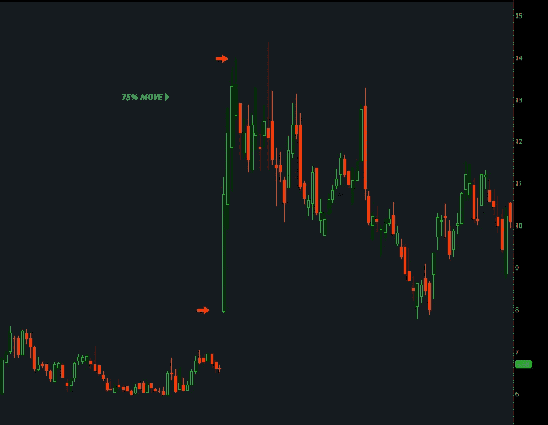
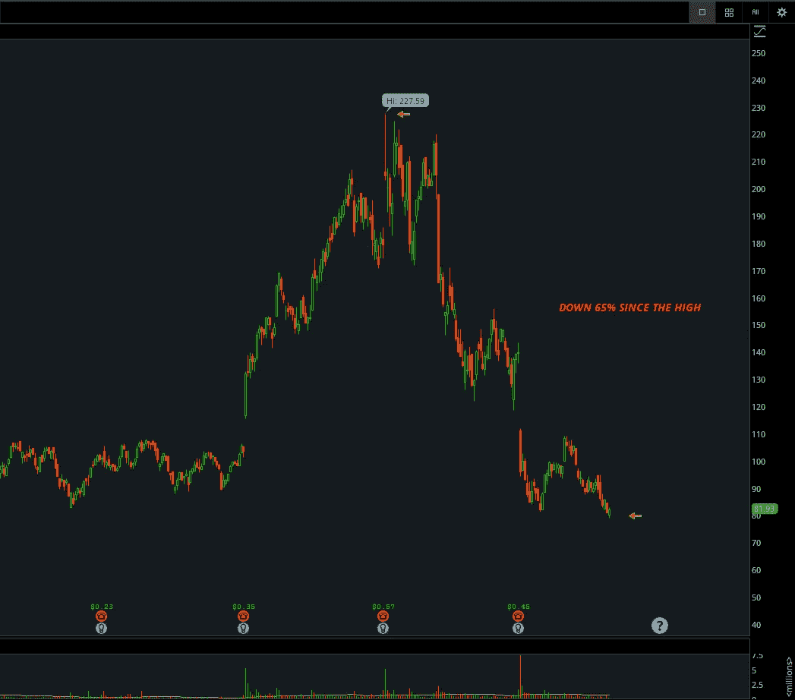
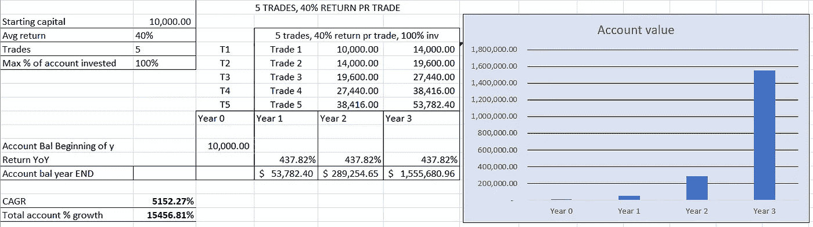

# 为什么股票市场最有利可图的摆动交易系统是阶段性支点(2022)

> 原文：<https://medium.com/coinmonks/why-the-most-profitable-swing-trading-setup-in-the-stock-market-is-the-episodic-pivot-2022-663a3af7b26?source=collection_archive---------2----------------------->

如果有一种策略可以知道一只股票何时会大幅波动，然后在大多数交易者之前进场，你愿意学习这种方法吗？在本帖中，我们将探讨 [*的爆发性回报*](https://www.swingtradesetups.com/learn-setups) *的阶段性支点设置如何能够提供、复利和外卖。*

每个人都听说过，如果你在很多年前购买特斯拉或比特币，并有纪律坚持经历涨跌，它们会给你带来巨大的收益，如果你能及早发现它们，这很好，但如果你能以最小的努力预测和捕捉每年持续几天到几周十几次的大波动，你会这样做吗？如果你这样做了，你的回报将会是巨大的，因为复利效应将会完成你账户上剩下的工作。所以，让我们开始吧。

**我如何开始？**

进入市场有几种方法，但如果你和大多数成年人一样，在市场交易时间接触屏幕的机会有限，但仍想参与市场提供的巨大机会，你会怎么做？如果你在网上搜索，你会发现如何在市场上赚钱的不同方法，如投资 SP500 指数、购买交易所交易基金或投资蓝筹股，因为你可以购买并持有，但如果这样做不够呢？

假设你想要每年 100-200-300%的爆炸性回报**，你必须学习 edge 的交易设置******，并成为该设置的大师。除非你想成为一名买入并持有的投资者，否则你必须在一段时间内获得复合回报，在这种情况下，你必须承受巨大的潜在损失。****

**假设你真的长期看好 AMBA，看看过去几个月发生的事情就知道了。大多数人肯定不希望经历如此急剧的下跌。无论如何，如果你没有任何选股技巧，你选择一只一年内可能上涨超过 100%的股票的机会有多大？**

****

****设置及其工作原理****

**有不同种类的[设置](https://www.swingtradesetups.com/learn-setups)在市场上具有优势，但每年都提供大幅度波动的一种设置是阶段性枢轴设置。情节支点是一个营销术语，它的意思是故事改变者，第一个公开写这个设置的交易者是帕拉德普·邦德，Stockbee 的创始人。这种设置背后的论点是，当突然的意外消息冲击市场并使其措手不及时，股票将发生重新评估。根据消息的严重程度，这可能会导致股票出现爆炸性的波动和双向的长期趋势。你可能已经注意到了，2021 年 8 月在 AMBA(上图)发生了这样一件事，当时它还没有上涨 100%。**

**拥有一个小账户的好处是，比如说在交易时少于 300 万英镑，这种设置可以灵活地快速移动，这意味着你可以在任何时候买卖你想要的首选数量的股票，而不会出现太多的滑点(假设你专注于流动性股票)。对于资金雄厚、管理着数十亿美元的大机构来说，情况正好相反。当股票的重新评估发生在重大新闻发布之后时，实际上推动价格的大玩家将使用几天、几周甚至几个月来达到所需的股票库存，他们不可能只需点击一个按钮就卖出 500 万股而不会以大规模的方式影响价格。这是设置利用的优势。当大型机构在新闻发布后同时想要股票时，价格必然会随着时间的推移而波动，因为它们行动缓慢，必须积累头寸。**

****EPs 的种类****

**有各种各样的情况会导致市场出现阶段性的转折，而这些情况都与新闻有关。这里有几个例子:**

**药物相关研究和 FDA 决定的结果(生物技术等)**

**政府合同**

**政治决策**

**收益和指导**

**有时，生物技术股有药物正在接受 FDA 批准的试验，如果它们获得批准，通常会出现大的波动。比方说，一家生物技术公司发现了所有类型癌症的治疗方法，它将是所有情节支点的母亲，你可以预计股票将会出现天文数字的波动，因为它将能够向世界其他地方出售其专利，并在几个世纪内帮助全球数百万人的同时获得数十亿美元的收入，因此故事发生了巨大的转折。如果你是这样一个声明后第一批买入的人之一，你将会赚一大笔钱。**

**另一个例子是一家名为 force protection 的小公司，该公司生产用于对付暴徒的装甲车，销售额不超过 500 万英镑，但在伊拉克战争开始时，他们从美国和英国政府获得了几份价值超过 5 亿英镑的合同，还有几份合同正在进行中。当一只股票在短时间内获得 100 倍的收益增长，你认为会发生什么？股票在几周内上涨了 1500%,后来被通用动力公司收购。**

**所以，作为一个交易者，你在交易时的工作是找出你认为股票有很大可能大幅波动的情况，然后你必须成为第一个进场的人。有几种行之有效的方法可以在开市前找到这些信息。**

**是真的 EP 吗？**

**每股收益通常很容易在图表上识别，因为它们往往是新趋势的起点。但是，当这只股票被认为有 EP 的时候，你怎么知道它是真的呢？**

**大量的股票缺口和废话，但一个真正的 EP 总是有市场的关注，不会因为所有市场参与者的巨大购买压力而轻易褪色。有些人声称他们可以看到第二层的所有买入，时间和销售，但唯一不骗人的指标是交易量。**

**如果你研究数以千计的每股收益，你会发现在几乎所有的情况下，交易量都有一个很大的峰值，有时比平均交易量大 10-20-30 倍。如果一只股票在开市前没有交易量，并且开市时交易量似乎很低，例如在前 30 分钟只交易了其平均交易量的 25 %, EP 就非常有问题，因为前 30 分钟通常是一天中最繁忙的时间。看到一个真正的 EP 在前 5-10 分钟交易它的平均量并不罕见。成交量很重要，因为它是燃料，没有燃料就没有价格波动。这基本上意味着，当股票缺乏交易量时，人们对它的兴趣就不存在了。**

**在许多情况下，新闻可能很难理解。一些股票出现看似好的消息，它们向下跳空，反之亦然。消除市场与消息不一致的股票的一种方法是，只关注出现缺口的股票。这消除了市场不相信这个消息的所有情况。不管消息有多好，如果市场不同意你的论点，你就赚不到钱。如果你决定研究 EPs，你也会发现大部分的 EPs，至少是大动作的 EPs，都是从一个显著的缺口开始的。**

****让我们来看看数学****

**如果你是一个新手，破产了，并且是一个有抱负的交易者，抛弃你会从 200 美元开始，然后积累到几百万美元的想法，这是不可能的。你应该找份工作并攒钱，同时，你应该学习有利可图的职业并积累知识，无论如何，你必须在挣钱之前学习。也就是说，如果你一开始有一个账户，比如说 10 000 美元，你需要一段时间才能开始赚大钱，但这是可能的，而且如果你做得正确，数学将会极大地帮助你。让我们看一个例子。**

**你已经做了你的工作和研究，并且你能够在一年的时间里抓住 5 个这样的故事改变者。那么让我们假设每个设置的平均回报率为 40%——发现每股收益达到几百倍并不罕见。数学将会是这样的。**

****

**正如你所看到的，你不必每天都坐在电脑前，在几年的时间里在市场上大赚一笔。在这种情况下，你只选择了那些你深信不疑的，而且你一年只做了 5 次交易。选择性是这个系统的关键，但是如果你学会识别大的移动者，成为专家，掌握这个摇摆交易系统，只有天空才是极限。**

****结论:****

**如果你想在市场上赚几百万，你必须学会一种设置。你可以通过自己研究最大的移动股票并找到有效的方法来做到这一点，或者你可以接受如何挑选最好的股票并大大加快你的学习曲线的教育。如果你对教育感兴趣，请前往 https://www.swingtradesetups.com/plans-pricing**。这是你成为盈利交易者的起点吗？****

> ****加入 Coinmonks [电报频道](https://t.me/coincodecap)和 [Youtube 频道](https://www.youtube.com/c/coinmonks/videos)了解加密交易和投资****

# ****另外，阅读****

*   ****[如何在 Bitbns 上购买柴犬(SHIB)币？](https://coincodecap.com/buy-shiba-bitbns) | [购买弗洛基](https://coincodecap.com/buy-floki-inu-token)****
*   ****[CoinFLEX 评论](https://coincodecap.com/coinflex-review) | [AEX 交易所评论](https://coincodecap.com/aex-exchange-review) | [UPbit 评论](https://coincodecap.com/upbit-review)****
*   ****[十大最佳加密货币博客](https://coincodecap.com/best-cryptocurrency-blogs) | [YouHodler 评论](https://coincodecap.com/youhodler-review)****
*   ****[AscendEx 保证金交易](https://coincodecap.com/ascendex-margin-trading) | [Bitfinex 赌注](https://coincodecap.com/bitfinex-staking)****
*   ****[最好的卡达诺钱包](https://coincodecap.com/best-cardano-wallets) | [Bingbon 副本交易](https://coincodecap.com/bingbon-copy-trading)****