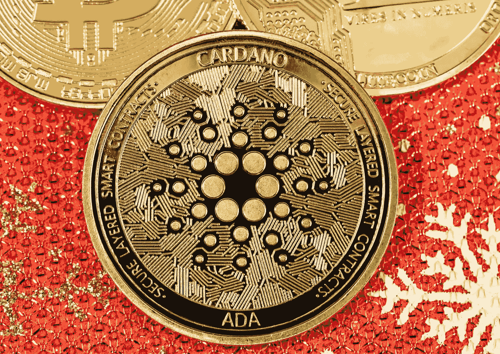

# 为什么 ADA 的价格可以召唤出它唯一的看涨王牌

> 原文：<https://medium.com/coinmonks/why-the-price-of-ada-may-be-able-to-call-upon-its-lone-bullish-ace-e5d0a14201de?source=collection_archive---------31----------------------->

Source photo Unsplash.com

与之前 1.25 美元的波动高点相比，Cardano 的价格下跌了近 29%。从 0.875 美元到 0.955 美元的购买区反弹，有可能上涨 20%到 1.09 美元。
如果日线蜡烛线收于 0.776 美元以下，ADA 的看涨理由将失效。
卡尔达诺的价格自 3 月 28 日达到当地高点后一直在下跌，标志着一次回调…