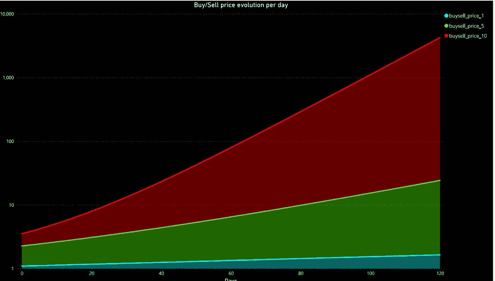
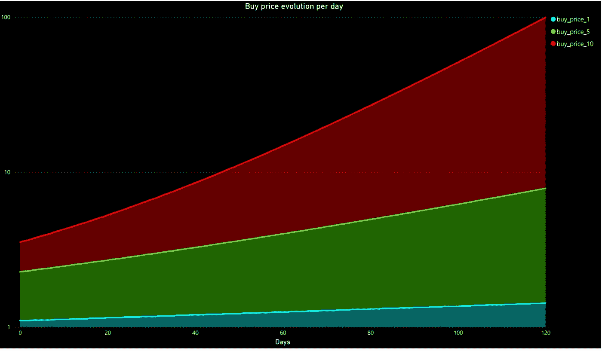
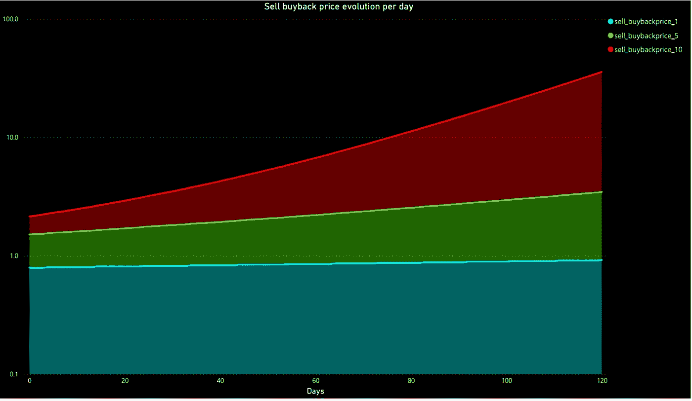

# 为什么权杖令牌是安全的，而且价值不断增加

> 原文：<https://medium.com/coinmonks/why-the-scepter-token-is-safe-and-has-an-ever-increasing-value-6166af085314?source=collection_archive---------9----------------------->

Yes, today we are doing some math. Brace yourselves!

朋友们好。

如果你正在读这篇文章，你会很清楚 WAND 是一个新的模型，它包含了以前没有应用过的 tokenomics。一些投资者对此感到满意，而另一些投资者则需要亲眼目睹这种方法的效果，才会相信这种方法有效。

多亏了我们两个社区成员 Volt 和 PricklyPear 的帮助，这才成为可能。在这篇文章中，你将理解并观想为什么权杖被称为“不断增长的令牌”。

提醒一下，这种代币是独一无二的，因为它完全由 stablecoins 支持，旨在随着时间的推移增值，使其成为最安全的投资之一，同时随着时间的推移产生巨大的价值。

它的两种增长机制在这里被模型化:当投资者以高于支持价格的价格从协议中购买权杖时，以及当投资者以低于支持价格的价格将他们的权杖卖回给协议时。我们对 1%、5%和 20%的代币进行了建模，同时考虑了销售因素和增长因素的影响。当有更多的卖方或买方时，这两个因素增加，并允许反映市场条件的权杖的动态定价，同时使协议既有吸引力又稳定。

**如果投资者买了 SCEPTER 会怎么样？**

让我们看看投资者每天购买流通中的权杖代币全额的 1%、5%或 10%会发生什么。

Evolution of the price of SCEPTER depending on the amount of SCEPTER being bought from the protocol, per day, in percentage of the amount of SCEPTER tokens in circulation

正如你在上面的图表中看到的，当人们购买权杖令牌时，它的价格会上涨。买入压力越高，价格升值越快。这种现象非常普遍，但机理不同:在这里，价格上涨是因为支持价格和购买价格之间的差距，而不是报价/需求动态。

**如果投资者出售权杖，会发生什么？**

让我们看看当投资者每天出售流通中的权杖代币全额的 1%、5%或 10%时会发生什么。

Evolution of the price of SCEPTER depending on the amount of SCEPTER being sold to the protocol, per day, in percentage of the amount of SCEPTER tokens in circulation

正如你在上面的图表中看到的，这是非常不寻常的，当人们出售权杖令牌时，它的价值会增加。发生这种情况是因为投资者以低于支持价值的价格出售股票:这就像他们退出协议时留下了一点自己的份额，从而使持有者的份额增加了一点。而且越多权杖令牌回售给协议，令牌价格升值越快。

**如果投资者买卖权杖会发生什么？**

让我们看看投资者每天买卖流通中的权杖代币全额的 1%、5%或 10%会发生什么。

Evolution of the price of SCEPTER depending on the amount of SCEPTER being bought and sold, per day, in percentage of the amount of SCEPTER tokens in circulation

这个图可以看作是前面显示的两个图的相加。在这里，我们看到，当一些投资者卖出，一些投资者买入时，权杖价格上涨得更快。与前两种情况相比，这也是更有可能发生的情况。

所以上面的三张图显示权杖令牌的价格会一直上涨。交易(买卖)越多，价格升值越快。与许多其他平台不同，大量抛售代币实际上会让持有者受益。

考虑到 SCEPTER 的安全程度(100%由 stablecoins 支持)，这些图表中显示的令牌价格增值非常出色。虽然我们不能保证投资者会像上述模型假设的那样进行买卖，但有理由假设每天都会有一些交易。此外，我们在这里所展示的并没有考虑到权杖国债(包括权杖)的投资和风险国债的现金流入所导致的代币价格升值。

我们已经知道，在许多情况下，3，3 模型不起作用。我们已经研究了博弈论及其背后的机制，以提供一个模型，在这个模型中，持有者实际上确信他们的策略是正确的，并且他们不会受到卖家的伤害。

在这种美好的和谐中，一个投资者的每一个可能的行动都会让其他投资者受益。这种增长不会一蹴而就，但却是必然的。

SGMI！

> 加入 Coinmonks [电报频道](https://t.me/coincodecap)和 [Youtube 频道](https://www.youtube.com/c/coinmonks/videos)了解加密交易和投资

# 另外，阅读

*   [交易信号是什么？](https://coincodecap.com/trading-signal) | [Bitstamp vs 比特币基地](https://coincodecap.com/bitstamp-coinbase) | [买索拉纳](https://coincodecap.com/buy-solana)
*   [ProfitFarmers 回顾](https://coincodecap.com/profitfarmers-review) | [如何使用 Cornix Trading Bot](https://coincodecap.com/cornix-trading-bot)
*   [十大最佳加密货币博客](https://coincodecap.com/best-cryptocurrency-blogs) | [YouHodler 评论](https://coincodecap.com/youhodler-review)
*   [my constant Review](https://coincodecap.com/myconstant-review)|[8 款最佳摇摆交易机器人](https://coincodecap.com/best-swing-trading-bots)
*   [MXC 交易所评论](/coinmonks/mxc-exchange-review-3af0ec1cba8c) | [Pionex vs 币安](https://coincodecap.com/pionex-vs-binance) | [Pionex 套利机器人](https://coincodecap.com/pionex-arbitrage-bot)