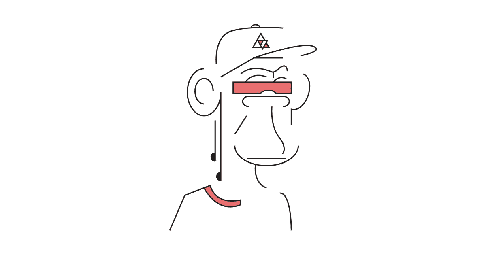

# 为什么 SSI 社区应该拥抱百万美元猿。

> 原文：<https://medium.com/coinmonks/why-the-ssi-community-should-embrace-million-dollar-apes-61d119f20331?source=collection_archive---------35----------------------->

简·里特维尔德

Our own Animo APE, check it out at [OpenSea](https://opensea.io/assets/matic/0xc77269a060d4d3b83cdce91695fef3a027f13b6a/0/)!

几周前，我看到一篇文章，内容是关于一所[三星支持的大学如何发放 NFT 来选拔毕业生](https://forkast.news/headlines/samsung-backed-university-nfts-graduates/)。这让我想起了不久前我在 Reddit 上看到的一个帖子，有人[用以太坊](https://www.reddit.com/r/theinternetofshit/comments/r5n9pj/man_unlocks_door_using_eth_by_verifying_a_nft_ens/)打开了他的门。

作为一个自我主权身份开发者，所以从技术角度来看，这是令人捧腹的。我能想到十种更安全的开门方式。但我相信这些故事还有更多。这些人提出的解决方案符合我们在 SSI 领域多年来一直致力于的大部分核心价值观。

Web 3 在去年的受欢迎程度有了很大的提高。很多人(包括我)正在通过探索加密货币、NFT、DeFi 和区块链游戏来了解这种新的去中心化版本的互联网。

如果你已经有一段时间了，我完全知道你在想什么。我们都看到了这些兴奋的浪潮来来去去。大多数这类东西只是围绕加密货币、元宇宙和其他时髦词汇进行的毫无根据的炒作，以筹集风险投资资金。在 SSI 社区中，我们倾向于远离它，并相信我们正在研究更好、更长期的解决方案。但从根本上说，这些项目与我们在 SSI 领域的工作没有太大的不同。

*   一些加密货币通过引入开放、透明和分散的货币系统，在这个没有任何国家可以免受通胀、腐败甚至欺诈等问题影响的世界中提供了一个避风港。
*   在线所有权多年来一直是一个问题，最可行的解决方案是将你的东西倾倒在某个为你处理的中央机构，同时在这个过程中从收入中拿走一大块。NFT 通过创造稀缺性、独特性和透明性提供了解决这个问题的方法。
*   最近，去中心化的游戏空间获得了很大的人气，因为它承诺你玩的游戏之间有更多的互操作性，并提供了你获得的游戏内资产的真正所有权，其中大部分现在通过黑市处理。

这些项目有很大的价值，通过将它们与我们多年来构建的身份层相结合，可能会有无限的可能性。

例如，尽管 NFT 可能不是开门或颁发文凭的最佳选择，但它们确实为基于所有权的访问管理提供了用例，允许产品和服务变得可交易。DeFi 空间是另一个很好的例子。它仍然难以置信地不受监管，使用可验证凭证的身份层将有助于 DeFi 应对即将到来的关于 KYC 和反洗钱的法规。最后，cheqd 最近的这篇文章解释了 NFTs 的独特性和稀缺性如何与可验证的凭证相结合，也可以使[在去中心化的游戏空间](https://www.cheqd.io/blog/nft-and-ssi-unlocking-a-new-gaming-experience)中产生巨大影响。这最后一项特别显示了我们仍然处于正在进行的创新中，以及我们对将要发生的事情知之甚少。

我认为现在我的一些同行对 NFTs 和加密空间有很多怀疑。但是，如果我们接受围绕这项技术的大肆宣传，向人们展示我们在过去 5 年中所做的事情，会怎么样呢？不要憎恨猿和像素化的人物，拥抱 Web 3 空间作为一个整体得到的关注，并开始与这些准备和我们一起投入去中心化技术的新人群交谈。

所以下次你看到有人鼓吹为什么一个 JPEG 值 50 万，告诉他们[买我们的百万美元 Animo APE](https://opensea.io/assets/matic/0xc77269a060d4d3b83cdce91695fef3a027f13b6a/0/) ！开个玩笑，但你可能会引发一场谈话，告诉他们关于 SSI 和你一直在做的事情。你可以用[我们的演示](https://demo.animo.id/)来实现。

——原文章结尾—

> *加入 Coinmonks* [*电报频道*](https://t.me/coincodecap) *和* [*Youtube 频道*](https://www.youtube.com/c/coinmonks/videos) *了解加密交易和投资*

# 另外，阅读

*   [3 商业评论](/coinmonks/3commas-review-an-excellent-crypto-trading-bot-2020-1313a58bec92) | [Pionex 评论](https://coincodecap.com/pionex-review-exchange-with-crypto-trading-bot) | [Coinrule 评论](/coinmonks/coinrule-review-2021-a-beginner-friendly-crypto-trading-bot-daf0504848ba)
*   [莱杰 vs Ngrave](/coinmonks/ledger-vs-ngrave-zero-7e40f0c1d694) | [莱杰 nano s vs x](/coinmonks/ledger-nano-s-vs-x-battery-hardware-price-storage-59a6663fe3b0) | [币安评论](/coinmonks/binance-review-ee10d3bf3b6e)
*   [Bybit Exchange 评论](/coinmonks/bybit-exchange-review-dbd570019b71) | [Bityard 评论](https://coincodecap.com/bityard-reivew) | [Jet-Bot 评论](https://coincodecap.com/jet-bot-review)
*   [3 commas vs crypto hopper](/coinmonks/3commas-vs-pionex-vs-cryptohopper-best-crypto-bot-6a98d2baa203)|[赚取加密利息](/coinmonks/earn-crypto-interest-b10b810fdda3)
*   最好的比特币[硬件钱包](/coinmonks/hardware-wallets-dfa1211730c6) | [BitBox02 回顾](/coinmonks/bitbox02-review-your-swiss-bitcoin-hardware-wallet-c36c88fff29)