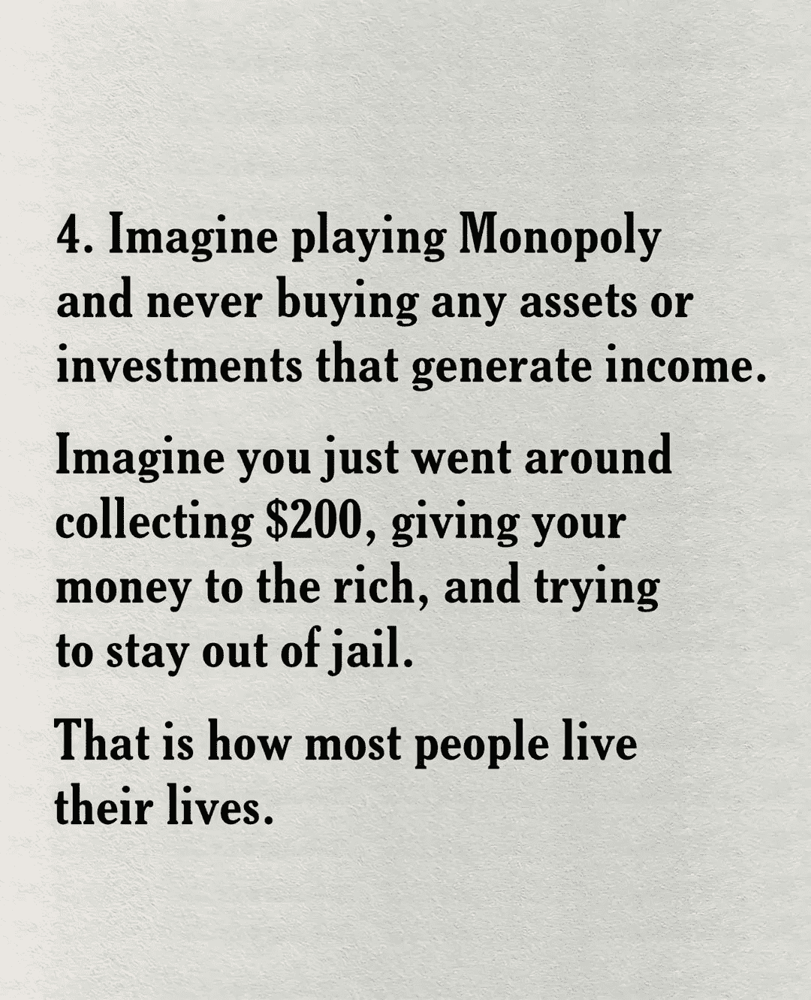
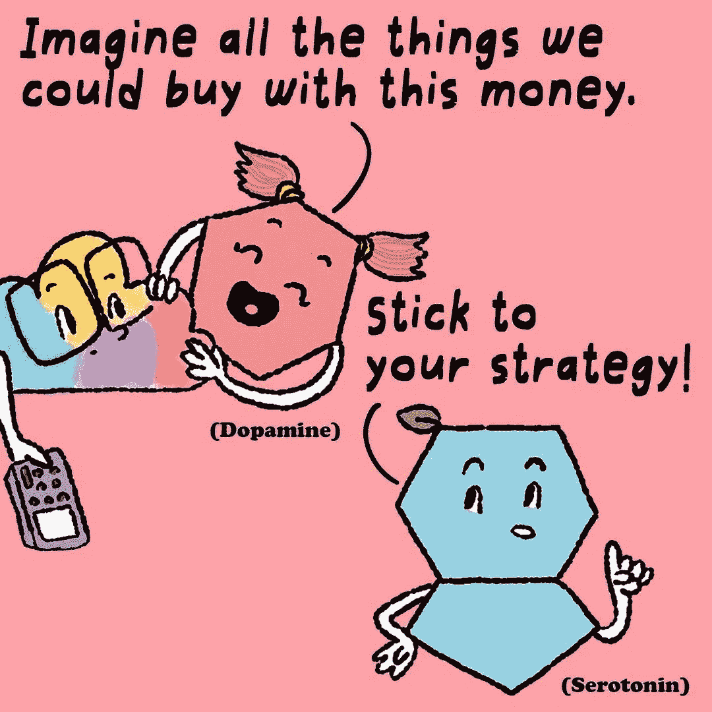

# 你是哪一个交易者，理性的还是感性的？

> 原文：<https://medium.com/coinmonks/why-the-trade-market-is-not-rational-at-all-9be15e761a8c?source=collection_archive---------62----------------------->

## 行为金融学导论

某些市场运动，不管奇怪与否，都可以在**行为金融学**的基础上得到解释。它是行为科学的一部分，分析影响投资者的社会学和心理学方面。行为金融学在整个股票市场中扮演着重要的角色。
比如，比特币狂热是怎么发生的，为什么上世纪末大家都相信互联网股票？这都是关于行为金融学的，但它到底是什么呢？你在这里读。

## 你将在这里学到的行为金融学

-行为金融和有效市场理论
-什么是行为金融？
-交易者的陷阱
-媒体的角色
-行为金融:例子

根据传统理论，投资者总是理性行事，以期增加财富。因此，他会收集尽可能多的信息，尽可能准确地评估一家公司的基本价值。这意味着投资者被视为“经济人”，情感在其中不起作用。这个理论被称为**有效市场理论。在一个有效的市场中，所有的信息都已经在价格中定价了，股票价格会对正确的基本价值进行估价。然而，这个理论不能解释一些模式，需要进行调整以获得更真实的图像。由于行为金融学的理论，投资者被视为一个人，他仍然可以做出非理性的决策和错误。**

## 什么是行为金融学？

行为金融学是**行为心理学**的一部分，专门用来分析投资者行为。它起源于 20 世纪 80 年代，认为某些影响和偏见会影响投资者的行为。此外，它还可以解释股票市场的严重市场偏差。
由于行为金融学的使用，泡沫和深度衰退可以得到解决。例如，它可以解释电晕爆发导致的股市大幅下跌，或大麻股票泡沫。虽然不是有效市场理论的一部分，但大多数投资者和机构都会考虑人们的行为。这样他们就可以分析趋势并优化决策。

## 交易者的陷阱

对投资者来说，有几个关键的陷阱。一个有意识的投资者知道这些陷阱，并能根据事实检验自己的感知。下文对它们进行了大量讨论。

过度自信是第一个陷阱，通常发生在非理性投资者身上。这是经常让投资者陷入困境的错误之一。投资者认为他比自己更有能力或更聪明。最重要的是，他相信自己比一般交易者拥有更多的信息，因此会表现良好。通常情况相反。

第二，有**过度反应理论**，它说当新的信息出来时，投资者经常反应过度。例如，根据有效市场理论，如果公司年度业绩良好，股票价格通常会上涨。因此，份额不成比例地增加。

**前景理论**，是丹尼尔·卡内曼于 1979 年提出的一个理论。有人认为，人们在损失方面往往比在收益方面选择确定性冒更大的风险。这是因为人们看待损失和收益的方式不同。

羊群行为是另一个主要陷阱。 **FOMO** ，或**害怕错过**，与从众行为如影随形。这个想法是，投资者希望享受某种产品、股票、部门等价格的强劲上涨。想想加密货币和大麻股票，它们造成了巨大的价格波动。因此，投资者有可能为产品支付过高的价格。

**参考效应，或锚定偏差，**是另一个。心理学家发现，人们往往倾向于依赖他们得到的第一条信息。因此，这会对决策过程产生巨大影响。例如:一位分析师声称 XYZ 股票价值€10，根据这一信息，你认为目前的价格价值(€8)太低了。

**确认偏差**，意味着人们更关注自我肯定的信息。这样，与自己的想法相矛盾的信息就不那么有价值了。例如，一个人可能只会阅读关于可能即将到来的股市崩盘的文章，但不会考虑股市可能进一步上涨的原因。

**心理会计**，也是行为经济学中的一个概念。这是指人们根据主观标准赋予金钱的不同价值，这通常会产生不利的结果。它涉及个人组织、评估和管理财务的一系列认知行为。

最后，还有**赌徒谬误**。也就是说，过去很少发生的事件在不久的将来会发生得更多。只要想想在 21 点或其他赌博游戏中算牌。在股票市场上，投资者在反复走反方向后，如果他们相信股票会向某个方向移动，就会产生赌徒的误解。

## 媒体的作用

正如效率市场理论所说，金融市场应该是一个完全竞争的市场。这意味着所有投资者都有相同的信息。这在很大程度上也是有效呈现的，但由于通常是先通过媒体，往往会给出一个扭曲的画面。经常会有强烈的夸张，信息有时过于复杂。新闻呈现的方式也不总是中立的。新闻受到了轰动效应、速度和选择性的强烈影响。例如，评估年度报告的方式可能因记者而异。
这就是为什么对每个投资者来说，客观地、批判性地处理这些信息是很重要的。任何允许自己被抓住的人都会被行为金融学的陷阱所抓住。

## 行为金融:例子

加密货币的价格，尤其是比特币的价格，历来波动很大。很多投资者都为此撕了裤子。
**大麻股票**也不稳定，这都是 2018 年的炒作，它们都遵循几乎相同的模式；互联网泡沫从 1997 年增长到 2000 年，由于预期的增长，互联网公司的价格大幅上涨。最后**泡沫破裂**；华尔街股市大崩盘发生在 1929 年。几天之内，在经历了前所未有的长时间大幅上涨后，股价暴跌。1987 年和最近的 2008 年也出现了崩盘。
由于 2020 年**日冕爆发**，价格也平均下降了 40%。然后继续上升，同时再次达到相同的高度。

## 结论

与普遍的看法相反，投资世界真的很不一样，而且一点也不理性。效率市场理论并非滴水不漏，股票市场中的非理性因素同样重要。因此，任何知道行为金融学陷阱的人都比其他人领先一步。

# ✔✔✔✔✔✔✔✔✔✔✔✔✔✔✔✔✔✔✔✔✔✔✔✔✔✔✔✔✔

Aadya2

[https://ko-fi.com/aadya2](https://ko-fi.com/aadya2)