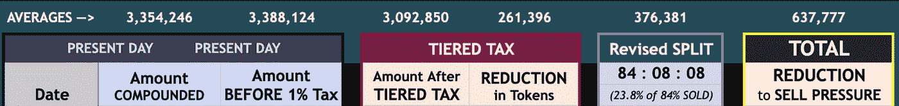

# 为什么 VaporFi 治理投票做出了正确的选择

> 原文：<https://medium.com/coinmonks/why-the-vaporfi-governance-vote-made-the-right-choice-10a97f5bbd22?source=collection_archive---------3----------------------->

财务自由是自我实现的基石。没有它，持续的压力循环会导致越来越棘手的健康问题和个人情况。

我对这些斗争并不陌生，因为我一生都在与它们打交道。这就是为什么 crypto 对这么多人有吸引力。这也是为什么 [VaporFi](https://vapornodes.finance/) 看起来是一个有前途的投资工具。

我将提供一些关于 VaporFi 的信息，他们最近通过的治理提案的背景，以及为什么这是正确的决定。

准备好听听 Moz 是如何让我相信社区做出了正确的选择。

# 什么是 VaporFi？

VaporFi 是一个快速发展的加密项目，试图让每个人都可以公开获得分散的金融服务。

只要花 1000 英镑，你就可以买到一个日回报率为 1%的节点。他们还提供复利和持有奖金(持有奖金被称为钻石手)，以增加回报。

VaporFi 是一个真正的财富积累机器。

2022 年 2 月 19 日，我花了大约 300 美元启动了他们的 5 个“婴儿节点”。Vaporfi 是 crypto 中比较实惠的入门产品之一。从第一天开始，节点每天支付 2 美元，但我一直在复利，直到它让我和我的业务一样多。

# VaporFi 治理提案是什么？

2022 年 3 月 8 日，VaporFi 宣布了一项提案:

1.  将复合税从 1%的统一税率提高到 5-12%的分级税率。

2.更改从新创建的节点接收的资金的分配。

3.减少 5%的复合奖金。

4.减少钻石手奖励，延长持有期领取奖励。

5.将申请税从在 VPND 中支付的统一税率更改为主要在 AVAX 中支付的分级税率。

6.允许 VaporFi 团队在没有机构群体投票的情况下，就此提案中包含的百分比做出未来决策。

欲了解更多信息，[请阅读提案](https://drive.google.com/file/d/1a5JIfQKetZAeF3KXPb-R8-ramZwSz50M/view)。

# 我对这些变化的担忧是什么？

我对前四个提议的改变很满意，因为我知道它们已经非常慷慨了，而且最近采纳的改变仍然是惊人的。

我有三个主要顾虑:

1.  我觉得没有足够的数据来分析这个项目真正的可持续性。
2.  在 AVAX 支付税款将使较小的硬币持有者在需要时提取更具挑战性。
3.  允许在没有社区投票的情况下做出未来的决定，这是从分权到集权的转变。

你可以在下面的市政厅观看 AMA。

[VaporFi 市政厅 3–09–22](https://youtu.be/zKy6T4d2tgw)

别忘了喜欢他们的 YouTube 频道！

在 AMA 期间，我发现这些问题的答案并不令人满意，所以我寻求更多的答案。我投了弃权票，因为在我对自己的知识感到满意之前，投票以巨大的差额(95.67%对 4.33%)通过了。您可以在[快照](https://snapshot.org/#/vapornodes.eth/proposal/0x64653e0dff9dfe2ea330b95d14ab28c2d32ff3dfc6f32acf6b166d0e155d1ddc)上看到结果。

我的推动显得太强了，但幸运的是，Moz 花时间解释了他们是如何得出结论的。Moz 和我就最近通过的 Vapor Node 更改将如何惠及社区进行了长时间的讨论。

这篇文章的其余部分总结了讨论和我从他分享的数据中得出的结论。

# 蚊子和我讨论了什么？

我们从净化空气开始。我为自己表现得如此强势而道歉，Moz 表示，他欣赏我对数据的热情，即使结果是错误的。然后，我们讨论了关键绩效指标、他们希望如何批准这些指标，以及长期可持续性。

# 关键绩效指标(KPI)

这一节总结了墨子的解释和我基于现成数据的计算。

Moz 接着解释了他使用的关键 KPI。主要 KPI 包括:

1.  **代币购买-代币出售**:目前，人们希望出售的代币比购买的代币平均多 360，000 个，这在市场上形成了价格下跌的势头。目标:将日需求量提高到 500，000 或更多。
2.  **资金规模**:该统计影响项目的最大持续性。当前资金状况:接近 5400 万美元，其中 4650 万美元为 VPND。
3.  跑道(Runway):在不改变其他任何事情的情况下，项目可持续的天数、周数、月数或年数:目前最多约 279 天，假设节点数和回报保持不变。
4.  **VaporFi 净买家/卖家**:机构是买还是卖 VPND？目前，本组织是净卖方，而不是净买方。净卖方状态应该变为净买方。
5.  **锁定的总值(TVL)** 已锁定项目的人员数量。

所有这些都是相互关联的指标，但它们才是最重要的。在开始之前，我想提供 Moz 提供的文档，以便您可以查看它们。

## 要审核的文档

以下是已投入节点的令牌分布。请注意，除了子节点之外，分布相对均匀。随着时间的推移，我希望婴儿节点赶上其余的。

婴儿节点的低分布是因为 Vaporfi 在其他节点之后添加了它们，以降低进入壁垒。

下图以更直观的方式展示了分布情况。

下面的平均值显示了复合变化。随着项目的发展，当前和未来变化之间的差异应该会扩大，因此 637，777 是基于使用过去结果建模的较低估计值。

下图显示了申报的税收如何影响国库。卖出压力应该会减少。随着 VPND/AVAX 值的变化，买入压力也会增加。下面的图片和财政部是我用来创建我的许多估计。

## 这些变化如何影响 KPI

这一部分令人兴奋不已。如果 Vapor Finance 团队在 AMA 期间试图向所有人解释，我想人们可能会不知所措。即使以我的工程背景和 MBA 学位，也有很多东西需要理解。

**变化对代币买入-代币卖出的影响**

目标是将购买的代币减去售出的代币，从-36 万/天更改为+50 万/天或更多。这种变化将增加硬币的价值，因为在公开市场上将会出现供不应求的局面。

复合税通过将 VPND 返还给财政部，消除了 26 万至 28 万英镑的抛售压力。修改后的分割将抛售压力又降低了 37.6 万英镑。

分层的 AVAX 报销税将使团队每天可以购买大约 40 万 VPND。它还消除了大约 35 万 VPND 的销售压力。这是 750，750k VPND 的净变化，仅仅是对声称的硬币征税。

这意味着买卖指标从-36 万 VPND 上升到+100 万 VPND。随着时间的推移，这种变化应该会通过提高 VPND 的价格来增加每个人的收益。

**这些变化将如何影响国库的规模**

国库的规模应该从以下行动中增长:

1.  复合税增加:每天国库收入增加 7.7%
2.  修改后的拆分:每天有 11%的 VPND 进入国库
3.  AVAX 索赔税:国库每天增加 2,200 AVAX
4.  不出售 VPND 的额外投资回报。

**跑道**

正如我之前告诉你的，假设没有变化，当前跑道是 279 天，但在所有变化之后，最大跑道将产生以下影响:

1.  复合税:增加跑道到 306 天(增加 9.7%)
2.  **Avax 索赔税**:增加 12.9%，共计 342.9 天，包括#1
3.  **复合费率降低**:增加 5%，共 356 天，包括#1 和#2
4.  **钻石换手**:这个计算起来比较复杂，因为它取决于人们何时兑现。如果大家都等 40 天而不是 16 天套现，那跑道就延长了 250%。在这种情况下，可持续性是 2 年 10 个月 16 天。

**Vaporfi 净买家/卖家状态**

如前所述，增加市场供需的大部分变化都是在 VaporFi 买方/卖方状态内，使他们成为净买方而不是卖方。

**TVL**

我们没有过多地讨论这个问题，但它会降低增长率，给财政部更多的时间来建设，并超过 TVL。国债/ TVL 越高，VPND 的价值就越高。

# 结论

根据对话和数字，批准治理提案所做的决策可能会:

1.  假设其他一切保持不变，大幅延长项目的寿命。
2.  如果新的采用以同样的速度发生，保持项目的可持续性。

此外，这些变化还应该有助于促进美国国债持有量和硬币价格的短期和长期收益。

对于那些还没有关注 Vapor 的人，以下是他们的链接:

*   [不和](https://discord.gg/9WkwpSBK)
*   [推特](https://twitter.com/VaporNodes)
*   [文档](https://docs.vapornodes.finance/project-information/introduction)

你可以在 [LinkTree](https://linktr.ee/BrandonBoushy) 上找到我的所有信息

如果这是一篇有用的文章，请分享。如果你开始一个新的节点，使用我的[推荐代码](https://app.vapornodes.finance/nodes?invite=0x6176FeB65958f08eD4310C4B2900FAbD5d8AE894)来帮助支持独立博客。

继续复利！

> 加入 Coinmonks [电报频道](https://t.me/coincodecap)和 [Youtube 频道](https://www.youtube.com/c/coinmonks/videos)了解加密交易和投资

# 另外，阅读

*   [麻雀交换评论](https://coincodecap.com/sparrow-exchange-review) | [纳什交换评论](https://coincodecap.com/nash-exchange-review)
*   [支持卡审核](https://coincodecap.com/uphold-card-review) | [信任钱包 vs MetaMask](https://coincodecap.com/trust-wallet-vs-metamask)
*   [Exness 回顾](https://coincodecap.com/exness-review)|[moon xbt Vs bit get Vs Bingbon](https://coincodecap.com/bingbon-vs-bitget-vs-moonxbt)
*   [如何开始用加密贷款赚取被动收入](https://coincodecap.com/passive-income-crypto-lending)
*   [加密货币储蓄账户](/coinmonks/cryptocurrency-savings-accounts-be3bc0feffbf) | [加密交易机器人](https://coincodecap.com/best-crypto-trading-bots)
*   [BigONE 交易所评论](/coinmonks/bigone-exchange-review-64705d85a1d4) | [CEX。IO 审查](https://coincodecap.com/cex-io-review) | [交换区审查](/coinmonks/swapzone-review-crypto-exchange-data-aggregator-e0ad78e55ed7)