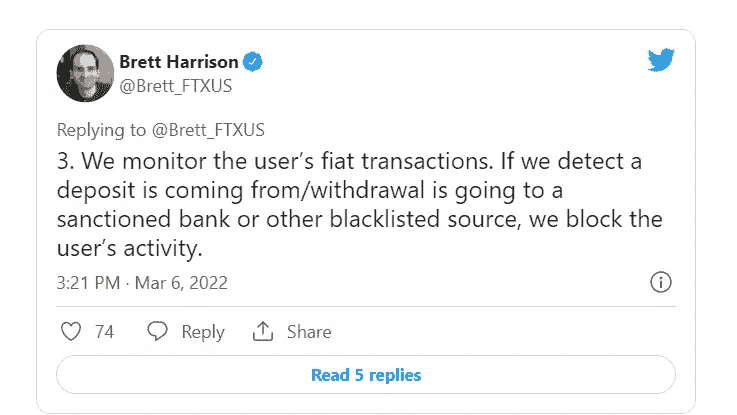

# 为什么乌克兰战争给你的密码交易所带来压力

> 原文：<https://medium.com/coinmonks/why-the-war-in-ukraine-is-putting-pressure-on-your-crypto-exchange-f97e6003a0b7?source=collection_archive---------44----------------------->

在战争的大计划中，唯一真正重要的是受影响者的健康和安全。所有其他问题似乎都无关紧要。话虽如此，如果你是一名加密投资者或希望进入加密世界(是的，我知道只有我的朋友和父母在读这篇文章，但让我们假装我有一个追随者，谢谢)，你需要知道这场战争正在给加密生态系统带来直接压力。在我提出消极方面之前，应该指出，在战争的黑暗时期，有一些鼓舞人心的时刻，包括一些来自密码社区的时刻。其中一个时刻是社区在几天内为乌克兰筹集了 4000 万美元(关于捐款的完整明细，您可以点击下面的链接)。

 [## 沙丘分析

### 以太坊生态系统分析。探索和分享来自以太坊主网、Matic、乐观…

沙丘. xyz](https://dune.xyz/msilb7/Ukraine-Crypto-Donations) 

不仅看到筹集了这么多钱令人印象深刻，而且看到它如此迅速和容易地转移也令人敬畏。当比特币被创造出来时，Satoshi Nakomoto 有一个想法，那就是开发一种简单的方法，在几秒钟内将钱点对点发送出去，而不需要设置任何障碍。欧洲的这种情况是将 Satoshi 的想法付诸行动的一个确切例子。乌克兰公布了他们的加密地址，几分钟内资金就开始流入。你能想象通过人们用来筹集资金的第三方机构的麻烦吗？首先，你需要确保筹集资金的组织者是合法的(看着你 GoFundMe)，你想捐赠的事业可能会被该组织拒绝(看着你 GoFundMe)，然后当钱在他们手中时，直到他们同意才会被发送(*打碎桌子上的玻璃瓶*，你知道什么 GoFundMe，他妈的，我们在战斗)。关于政府援助的笑话太容易开了，所以我忽略了使用它们，但从历史上来说，这将是为一个陷入困境的国家提供资金的唯一选择。向乌克兰捐赠如此顺利的原因是易用性和自由，然而，后者现在受到了抨击。

## **集中交易所类似于银行**

加密的主要吸引力之一是能够远离传统金融系统并获得独立性。然而，随着 crypto 变得越来越大，它不得不不断地与政府进行博弈。为了像比特币基地、北海巨妖、币安等那样的集中交易所。为了扫清道路，让所有人都能轻松使用加密技术，与监管机构密切合作是必须的。说到政府，我不知道哪一个更令人印象深刻，是他们经营着如此组织严密的犯罪企业，还是他们能让公众相信他们不是黑手党。每当你有能力赚钱的时候，政府就认为这是非法活动，直到他们可以得到他们的那份利润。为了让大型交易所成为主流，它们牺牲了一些加密投资者强烈珍视的自由。基本上，“与监管机构合作”已经变成了“我们现在受政府控制，我们应该被视为政府的延伸”。美国 FTX 公司(美国最大的加密交易所之一)的总裁 Brett Harrison 阐述了您是如何受到您所使用的集中式交易所的支配的:

总而言之，他是说如果你把你的密码放在交易所里，你就没有你想象的那么自由了。你根本没有远离传统系统。集中式交换仍然有利于使用，但当涉及到您的加密存储时，拥有自己的钱包是关键。我们大多数人，包括我自己，都会使用集中交易所。然而，有加密经验的人会将他们的货币转移到他们完全控制的分散交易所(DEX)或个人钱包中。

那么，这有什么关系呢？

大多数最近接触加密的人可能不关心中央交易所与政府的关系，但这里是他们应该关心的原因。首先，如果普京和俄罗斯开始购买加密货币以防范废墟倒塌并避免制裁，对立政府可能会介入并冻结中央外汇账户。例如，如果你在比特币基地有价值 1000 美元的比特币，乔·拜登冻结了 crypto 账户，试图伤害 crypto 和 Russia，你的 1000 美元现在被锁定，你是 s.o.l。如果你从比特币基地带走 1000 美元到你的个人钱包或 DEX，你仍然可以自由使用这 1000 美元。此外，让我们说，你觉得无辜的俄罗斯平民谁是真正受到伤害的俄罗斯制裁，普京仍然可以睡在他的豪宅最后我检查。如果你想向民间团体捐款，而政府不同意，他们现在可以自由冻结你的账户，因为你做了他们不同意的事情。如果你从你的私人钱包里捐款，你就清白了。对于那些说政府永远不会做这样的事情的人来说，他们一个月前在加拿大的自由护卫队就是这样做的。因此，除非你在每一项社会事业上都同意现任政府或未来政府的观点，否则你就有风险。虽然俄罗斯不太可能通过购买加密货币等透明资产来绕过制裁，但最好还是稳妥行事，养成真正拥有自己的密码的习惯，这是它真正被设计的方式。

***insta gram*T3:【https://www.instagram.com/warren_feldman/】T4**

***碎碎念:***[https://twitter.com/WarrenFeldman3](https://twitter.com/WarrenFeldman3)