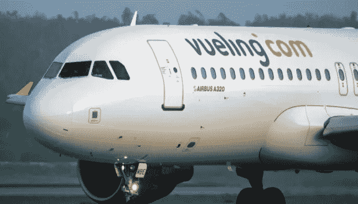

# 为什么 Vueling 会接受加密货币作为新的支付方式？

> 原文：<https://medium.com/coinmonks/why-vueling-will-accept-cryptocurrencies-as-new-payment-method-e262774e1124?source=collection_archive---------38----------------------->

西班牙航空公司 Vueling 与 BitPay 和环球航空旅行计划(UTAP)合作，接受加密货币作为一种新的支付方式。从 2023 年开始，顾客将可以在线购买机票，并可以选择 13 种加密货币，包括比特币(BTC)和以太网(ETH)。

# Vueling 接受…