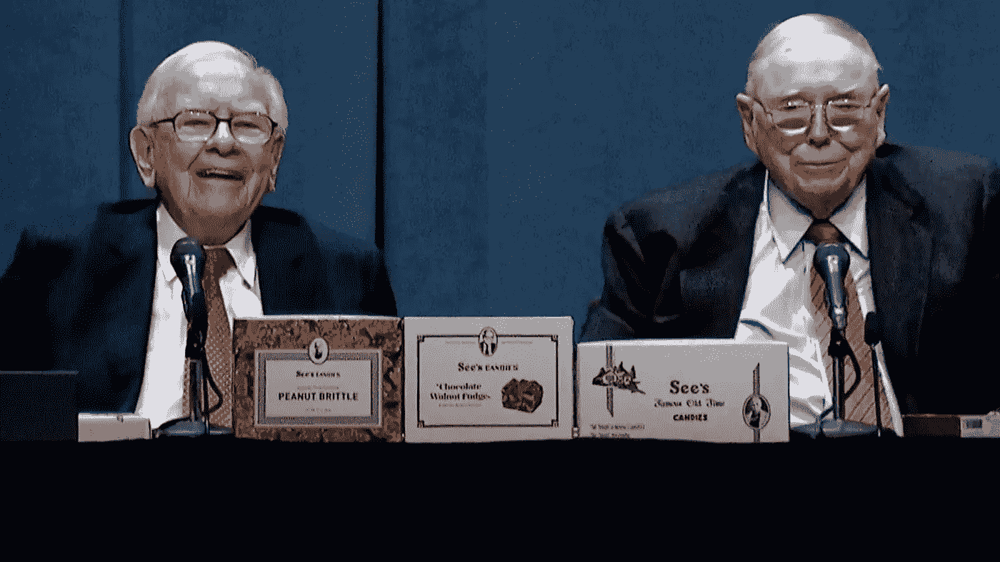
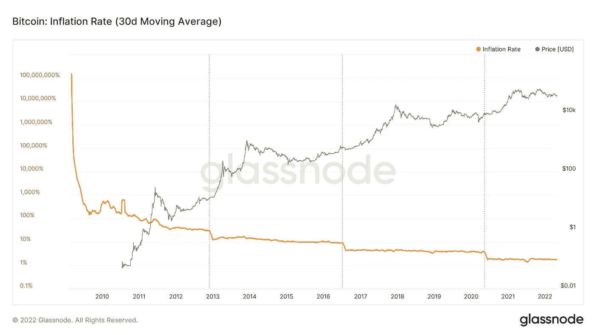

# 为什么沃伦·巴菲特在 2022 年股东大会上对比特币的价值判断错误

> 原文：<https://medium.com/coinmonks/why-warren-buffett-is-wrong-about-bitcoins-value-at-his-2022-shareholder-meeting-16b74bee10c9?source=collection_archive---------33----------------------->

在周六(4/30)的伯克希尔·哈撒韦年度股东大会上，传奇投资者沃伦·巴菲特再次声称比特币一文不值。然而，这一次，他解释了为什么他不相信比特币的未来。本质上，他将比特币比作美国的农田和公寓:“如果你说……为了美国所有农田的 1%的利益，向我们集团支付 250 亿美元，我今天下午会给你开一张支票，”[为了]250 亿美元，我现在拥有 1%的农田。[如果]你给我这个国家所有公寓的 1%，你还想要 250 亿美元，我会给你写张支票，这很简单。现在，如果你告诉我，你拥有世界上所有的比特币，并以 25 美元的价格卖给我，我不会接受，因为我会拿它做什么？无论如何我都得把它卖回给你。它不会做任何事情。公寓将产生租金，农场将生产食物。”

恕我直言，沃伦·巴菲特先生和他的智慧，我认为这种比较是不合理的，也没有理解比特币的价值来自哪里。基本上，他将比特币视为股票、债券、有形资产或任何能为所有者创造收入的资产。股票会派息，或者至少投资者认为一些成长型公司会派息。债券显然会支付利息，而土地和机器等有形资产可以生产产品，从而获得收入。从这个角度来看，沃伦·巴菲特说的对，持有比特币不会为其所有者带来收入。

然而，事实是比特币不是股票、债券或纠结的资产，它实际上是一种货币，就像美元一样。现在我问大家一个问题，持有美元有收益吗？不要！那人们为什么用美元，为什么美元有购买力？因为人们相信美国及其经济、军事和文化影响力以及作为一个国家的整体竞争力。如果有一天美国倒下了(我希望不是)，美元将没有价值。历史上有很多国家的货币变得一文不值的例子，政府不得不用更稳定的其他国家的货币来代替他们自己的法定货币，比如美元。

因此，一种货币的价值来自于人们对国家综合实力的信心，而不是持有这种货币能产生未来收入。所以沃伦·巴菲特用错误的方法给比特币估值。事实上，沃伦·巴菲特自己非常明白这一点，在年度股东大会上，当他开玩笑说“伯克希尔硬币”时，他说，“美国政府没有理由让伯克希尔的钱取代他们的钱。”他似乎明白比特币是一种货币，而不是一种创收资产；他只是不相信比特币是一种好货币。

事实是，从长远来看，比特币可能是比美元更好的货币。什么是好的货币？纵观历史，我们看到过许多成就斐然的大帝国来来去去。没有人能保证今天的任何强大国家(即使是美国、中国或俄罗斯)还能再存在 100 年、300 年或 500 年。

因此，或许应该问的正确问题是，作为投资者，我们应该更信任比特币还是国家？对区块链有一些基本了解的读者应该知道，比特币网络是“不可信的”，这意味着人们不必信任一个中央实体来使用网络。人们“信任”比特币是因为它“不可信”。这是一个由众多节点维护的分散式网络，它们都没有足够的计算能力来处理区块链的数据。相比之下，在今天的银行系统中汇款时，你相信银行或管理银行的人会为你汇款。所以问题归结为“你更相信代码、物理定律还是逻辑，还是更相信人类？”这是一个有争议的问题，现在下结论可能还为时过早。但正如投资 101 一样，多样化对于管理风险和实现风险调整后的阿尔法值至关重要。

还有一点需要记住的是，从长期来看，比特币是通货紧缩的。比特币的总供应量上限为 2100 万。在当前的块奖励(为矿工新铸造的比特币)下，通货膨胀率现在约为 1.8%。随着大宗报酬的减少和流通供给的增加，这一数字只会呈下降趋势。此外，一些比特币由于各种原因(例如，丢失的钥匙、密码、恢复短语)永久丢失并退出流通，这种情况可能会继续发生，使比特币长期通缩。相比之下，美国 2022 年 3 月的通胀率为 8.5%，这意味着美元的购买力在短短一年内下降了 8%以上！

BTC’s Inflation Rate

US Inflation Rate

总之，将比特币视为创收资产是不合适的。相反，它应该作为一种货币来分析，而且很可能是人类历史上第一种被大规模采用的通缩货币。比特币的兴起本身就是一个有趣的社会实验，我渴望看到 10 年或 20 年后的结果。

> *加入 Coinmonks* [*电报频道*](https://t.me/coincodecap) *和* [*Youtube 频道*](https://www.youtube.com/c/coinmonks/videos) *了解密码交易*

# 另外，阅读

*   [3 商业评论](/coinmonks/3commas-review-an-excellent-crypto-trading-bot-2020-1313a58bec92) | [Pionex 评论](https://coincodecap.com/pionex-review-exchange-with-crypto-trading-bot) | [Coinrule 评论](/coinmonks/coinrule-review-2021-a-beginner-friendly-crypto-trading-bot-daf0504848ba)
*   [莱杰 vs n 格拉夫](/coinmonks/ledger-vs-ngrave-zero-7e40f0c1d694) | [莱杰纳诺 s vs x](/coinmonks/ledger-nano-s-vs-x-battery-hardware-price-storage-59a6663fe3b0) | [币安评论](/coinmonks/binance-review-ee10d3bf3b6e)
*   [Bybit Exchange 审查](/coinmonks/bybit-exchange-review-dbd570019b71) | [Bityard 审查](https://coincodecap.com/bityard-reivew) | [Jet-Bot 审查](https://coincodecap.com/jet-bot-review)
*   [3 commas vs crypto hopper](/coinmonks/3commas-vs-pionex-vs-cryptohopper-best-crypto-bot-6a98d2baa203)|[赚取加密利息](/coinmonks/earn-crypto-interest-b10b810fdda3)
*   最好的比特币[硬件钱包](/coinmonks/hardware-wallets-dfa1211730c6) | [BitBox02 回顾](/coinmonks/bitbox02-review-your-swiss-bitcoin-hardware-wallet-c36c88fff29)