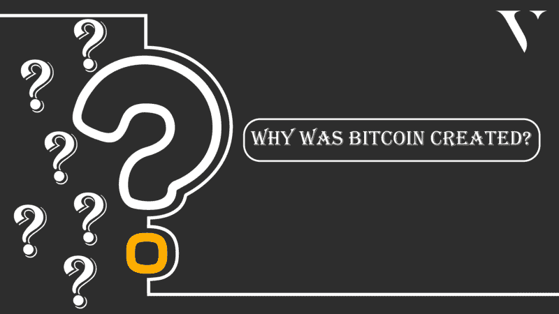
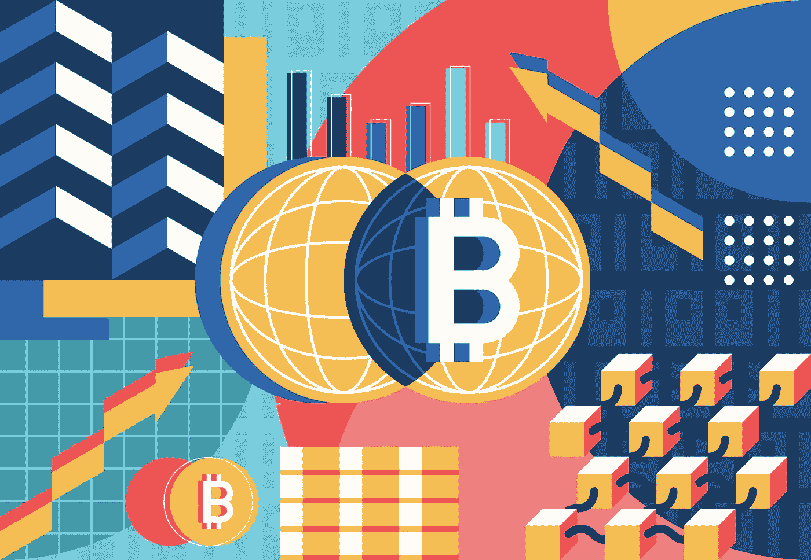

# 比特币为什么被创造出来？

> 原文：<https://medium.com/coinmonks/why-was-bitcoin-created-f5c2dfd3a666?source=collection_archive---------27----------------------->

中本聪，[比特币](https://valorexchange.com/blog/post?slug=what-is-bitcoin-a-brief-introduction)杰出而神秘的创造者，有一个简单的目标，他们想用这种货币来实现。他们想创造一种数字货币，让人们可以通过[个人对个人(p2p)](https://valorexchange.com/) 发送和接收资金。不会有第三方，因为不需要第三方。传统货币需要中央银行或中央金融支付系统的参与才能运行。

这个拟议中的比特币系统将是去中心化的，并在[工作共识证明下工作。这意味着没有人会控制或监视它。你可以相对轻松地在早上发送比特币，在深夜接收比特币。你所需要的只是一个钱包和一张兑换单。你可以在](https://valorexchange.com/blog/post?slug=proof-of-stake-and-proof-of-work-a-beginner-s-guide) [ValorExchange](https://account.valorexchange.com/signup) 上用你的免费账户获得这两样东西。它安全可靠，你只需要一封电子邮件和一个电话号码就可以开始了。

在它被创作并向公众介绍的时候，美国正面临着一场金融危机。人们失去了他们的家园，一生的积蓄，以及更多。人们普遍不信任银行和政府。猜测中本聪当时的想法是不可能的，但他们显然想改善现状。人民已经把他们的信念寄托在一个让他们失望的制度上，中本聪想给他们一个新的选择。

使用比特币意味着没有第三方可以监控或干涉你的金融交易。这是因为比特币使用数字身份，在区块链允许用户匿名。有点像让你隐形的衬衫。比特币没有税收，没有监管，也没有限制。

当然，这吸引了很多犯罪活动。去中心化的数字货币被称为暗网货币，这极大地影响了公众对它的接受。人们将数字货币视为非法活动的非法工具，有一段时间，似乎中本聪对这种货币的目标就此结束了。

幸运的是，随着时间的推移，这种情况开始改变。比特币的价格和用途现在已经飙升。

**比特币为什么被创造出来？**

*Photo credit: Vecteezy.com*

比特币是为特定目的而创造的，例如:

**不可信的银行业:**人们对整个中央银行系统抱有很大的信心。你相信银行会提供你的姓名、地址和许多其他个人信息。你真诚地把你的存款交给他们，他们会代表你保护这些存款，而你所要支付的只是偶尔的银行手续费。2009 年，比特币和区块链一起推出。区块链将充当生态系统中所有交易的去中心化的不可改变的历史书。如果 A 给 B 寄钱，所有人都能在区块链上看到。虽然姓名、地点和其他个人信息被省略。

**隐私:**比特币最大的优势之一是它赋予交易的隐私级别。传统的中央银行通常有一个人在银行进行的金融活动的记录以及这个人的其他个人信息。他们不仅知道你用你的钱做了什么，而且知道什么时候，在哪里，有时还知道为什么。就像有一个成年后到处跟着你的父母。

比特币和区块链提供了第三种选择，除了你和相关的另一方，没有人知道你进行了什么交易。

**交换手段:**虽然以上更多是针对特定兴趣用途，但普通用户可能更倾向于使用比特币购买商品。随着比特币市场规模的增长，它被用来做这件事将变得越来越普遍。比特币首先是一种数字货币。

**总之**

不受任何政府监管的货币是必不可少的。比特币给人一种无与伦比的财务自由感。

我们希望创建一个社区，在那里我们可以与志同道合的人交谈，他们希望从他们的加密货币中成长、学习或赚取更多。因此，我们创建了我们的[电报社区来做这件事](https://t.me/valorexchangecommunity)。

我们分享与您在行业中的成长相关的资源和信息。您今天可以加入我们，丰富您的加密之旅。