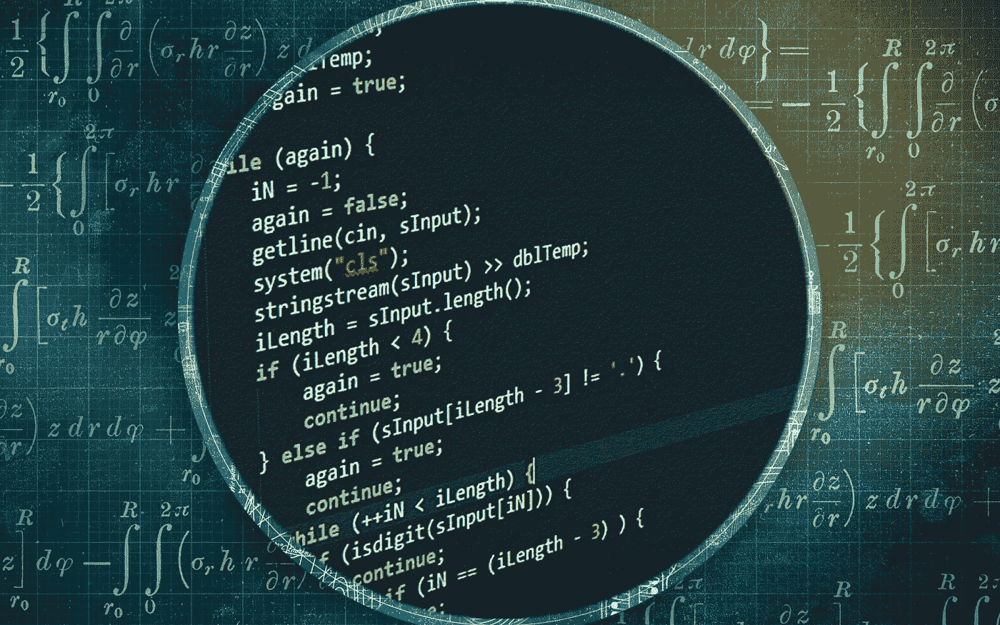

# 为什么我们需要一个基于算法的稳定币

> 原文：<https://medium.com/coinmonks/why-we-need-an-algo-based-stablecoin-that-works-b6b116b71b6b?source=collection_archive---------13----------------------->

## 因为另一种选择是摧毁你的财富

在我上一篇文章的评论区[中，我收到了一个很好的问题。我喜欢优秀的问题，所以我真诚地感谢有问题的读者提问。我把一个优秀的问题定义为一个总结了什么是真正的…](https://dmhco.medium.com/luna-dollar-a-real-algo-stablecoin-e33553c2f665)