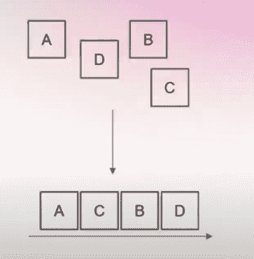

# 为什么我们需要模块化区块链来实现可扩展性？

> 原文：<https://medium.com/coinmonks/why-we-need-modular-blockchains-for-scalability-276f4d724b0e?source=collection_archive---------1----------------------->

在这篇文章中，我将解释:

1.  什么是铁板一块的区块链
2.  区块链有哪些不同的层次
3.  什么是模块化区块链，它与整体式区块链有何不同
4.  模块化区块链的优势是什么？

> 这篇文章高度基于 Celestia Labs 的联合创始人兼首席执行官 Mustafa Al-Bassam 在 2022 年模块化峰会上的讲话，我强烈建议你去查看一下[这里](https://www.youtube.com/watch?v=35_rr8Vf-4k&ab_channel=Celestia)。

# 什么是铁板一块的区块链？

整体区块链是区块链架构的一种形式，旨在区块链中完成从执行、共识和数据可用性的所有工作(下一节将详细解释各层)。

这意味着所有完整的节点和验证器都同意并在链上执行。

例如，比特币和以太坊都是单片区块链。除了以太坊用一个被称为以太坊虚拟机的通用智能合约环境取代了比特币的执行层

The architecture of Monolithic Blockchains. Credits: Celestia

# 问题是

问题是验证链的完整节点必须:

1.  检查共识
2.  检查交易是否有效

因此单片区块链不能很好地扩展。尤其是如果全部节点必须执行网络的整个状态和历史。

# 什么是模块化区块链？

将至少一个组件完全外包给外部链的区块链。

> 模块化:使用单独不同的功能单元，如在装配一个系统时。在区块链的例子中，它将区块链的核心功能拆分为不同的应用程序，这些应用程序可以很容易地交换。

例如，想象以太坊上典型的第 2 层。

以太坊上的第 1 层用于数据可用性和一致性。

第 2 层(如 Polygon)在将数据发送回第 1 层之前，使用不同的汇总机制来执行链外计算。

**什么不是模块化区块链**

*   处理所有组件但具有模块化软件设计的区块链
*   一种区块链网络，其中每个区块链处理所有组件(例如，用于雪崩的子网，因为子网中的每个链处理所有层)

从本质上讲，区块链的模块化设计允许不同的技术来实现底层区块链中最适合的组件。

# 模块化区块链的层次

**共识/结算层:**获取任意消息(交易)并对这些消息进行排序

这为交易及其排序提供了安全性和一致性。

The consensus layer orders the incoming data from transactions. Credits Celestia.

**数据可用性层:**一种向网络发布有序消息的可验证方式。

这确保了块头后面的事务数据被发布和可用，以便任何人都可以容易地计算状态和检查状态转换。

The Data availability layer checks if the transaction submitted is valid before sending the transaction to the entire network. Credits Celestia.

**执行层:**获取消息，然后对消息进行处理，输出“状态”。

这是更新链所需的计算。获取当前状态，添加一堆新事务，并转换到新状态。

Credits Celestia

例如，在上图中，区块链的执行层获取所有事务(消息)并处理这些事务以输出用户余额(状态)。

**模块化堆栈配置是什么样的？**

Credits Celestia

区块链中的不同组件被分成模块，允许模块与任何链一起改变。上面的例子显示了 Celestia 是一个模块化的区块链。

# 为什么模块化区块链很重要？

## 可量测性

模块化允许资源分离→更专业化→更高效。

模块化区块链允许的另一个重要组件是诸如[数据可用性欺诈证明](https://sonnino.com/papers/fraudproofs.pdf)或 ZK-proof 等技术，在这些技术中，节点不必执行所有事务来检查有效性。这对可伸缩性很重要，因为它使区块链能够增加吞吐量，同时使用户能够获得关于正确性和可靠性的保证。

基本上，这允许用户成为网络的一等公民，并且具有与下载所有事务的完整节点几乎相同的安全级别，而不需要与完整节点相同的资源要求。

> 一等公民:运行自己的节点进行验证而不是依赖第三方的人

## 灵活性

它允许开发人员跨堆栈进行快速试验，这可能会产生更好、更专业的分散式应用程序。开发人员可以根据他们的需求和未来的技术进步升级区块链中的不同模块。

它允许开发人员借用他们正在使用的第 1 层的可信度，并在其上建立一个高级的计算层或数据一致层，例如以太坊第 2 层，带有 zksysnc、Starkware、乐观。

## 逃离 L1 周期

区块链遇到了交易问题、高额汽油费问题和优化问题，确保区块链规模的方法是快速改进单个组件。

由于部署独占式汇总比获得分散式验证器网络要容易得多，因此可以用更快的专用区块链迭代周期来修复堆栈中的不同问题。

总之，模块化区块链将是重要的下一步，以确保区块链的可扩展性，同时仍保持其分散的性质。查看模块化提交了解更多信息

参考资料:

> 加入 Coinmonks [电报频道](https://t.me/coincodecap)和 [Youtube 频道](https://www.youtube.com/c/coinmonks/videos)了解加密交易和投资

# 另外，阅读

*   XT.COM 评论[币安评论](https://coincodecap.com/profittradingapp-for-binance) |
*   [SmithBot 评论](https://coincodecap.com/smithbot-review) | [4 款最佳免费开源交易机器人](https://coincodecap.com/free-open-source-trading-bots)
*   [比特币基地僵尸工具](/coinmonks/coinbase-bots-ac6359e897f3) | [AscendEX 审查](/coinmonks/ascendex-review-53e829cf75fa) | [OKEx 交易僵尸工具](/coinmonks/okex-trading-bots-234920f61e60)
*   [如何在印度购买比特币？](/coinmonks/buy-bitcoin-in-india-feb50ddfef94) | [瓦济克斯评论](/coinmonks/wazirx-review-5c811b074f5b)
*   [隐翅虫替代品](/coinmonks/cryptohopper-alternatives-d67287b16d27) | [HitBTC 审查](/coinmonks/hitbtc-review-c5143c5d53c2)
*   [CBET 评论](https://coincodecap.com/cbet-casino-review) | [库科恩 vs 比特币基地](https://coincodecap.com/kucoin-vs-coinbase)