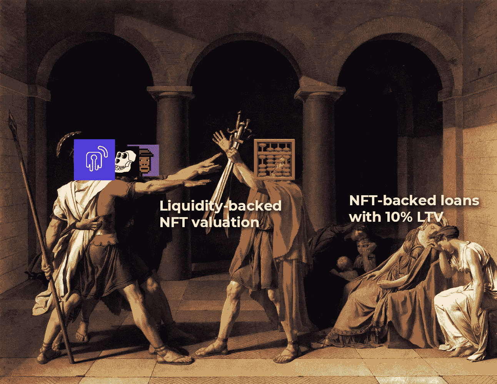

# 为什么我们应该停止使用底价来评估 NFT 收藏:解开 x 算盘。

> 原文：<https://medium.com/coinmonks/why-we-should-stop-using-floor-prices-to-appraise-nft-collections-3494de3d4d99?source=collection_archive---------10----------------------->

在 Unlockd，我们寻求从根本上创新 DeFi x NFT 行业，创建一个高效和高流动性的融资协议，释放所有不可替代代币的流动性和效用。

我们一直在寻找协作和整合合作伙伴的方式，以实现这一愿景。获得 Web 3 行业中最好的服务和基础设施是至关重要的。因此，我们很高兴地宣布，由于我们新的[unlocked x Abacus 合作关系](/coinmonks/2022-will-unlock-the-gates-to-the-full-value-of-your-nfts-bb8c9a2c0690)，我们将整合高质量、高流动性、完全在线、实时和无风险的价格估值。

通过这种整合，Unlockd 将能够提供最有效的 NFT 支持贷款，在市场上具有最具竞争力的 APYs(年百分比收益率)和 LTV(贷款价值比)水平。

## “基于底价”的估值机制效率低下。

以非金融交易为抵押品的货币市场目前的状况有些初级和低效。主要问题在于 NFT 的价值并不总是客观计算的结果；它通常与不断变化的特征相关，如稀有性、趋势或 NFT 持有者可以享受的效用——他们会以不同于你我的方式欣赏这些因素的重要性。

这显然使得给出一个普遍的、精确的值实际上是不可能的。

目前的解决方案非常简单——尽管不太令人满意:根据每件藏品的底价进行估价。每个 NFT 的价值都与特定收藏的最低价格有关，这存在某些缺陷。

在负责提供这些信息的甲骨文的另一方，必须有一个愿意提供流动性的交易对手，因为如果不是这样(通常也不是这样)，那甲骨文的数据根本不能保证是真实的，直接影响协议的安全性。

这对所有用户都有不利影响，导致 LTV 受到限制，因为贷款人愿意借出更少的资本，而为擦除支付的年利率将非常高——这创造了一个非常低效和缺乏流动性的市场。

此外，这种方法与 NFT 生态系统本身直接矛盾。顾名思义，不可替代令牌应该被独立地评估。

因此，在 Unlockd，我们始终寻求与生态系统中最好的基础设施应用保持一致，以便为这些问题提供解决方案，并在 DeFi 生态系统中释放 NFTs 的真正力量。

与 Abacus 一起，Unlockd 将成为 DeFi 历史上第一个能够为每个 NFT 提供独立估价数据的协议，虽然这种估价也是主观的，价格会波动，但它将始终得到有保证的流动性的支持。

这从根本上改变了 NFT 借贷游戏的规则。

## 珠算是如何解决这个问题的？

Abacus 是一个 DeFi 协议，致力于为 NFTs 评估提供第 0 层解决方案，开启无限可能。为了做到这一点，他们设计了一个基于乐观的股权证明的新估值系统。

Abacus 为 NFT 估价创建了一个现货市场，允许交易者通过锁定 ETH 来押注藏品的当前价格。这使得所有有价值的 NFT 在 casa 清算中都有一个有保证的和流动的交易对手。交易者将在该池中承担资本风险，因为他们可以在 NFT 在市场上以更高的价格出售的情况下赚取 ETH，并赚取 ABC 令牌作为协议激励(类似于 PoS 系统)。

这使得 Abacus 能够利用有保证的流动性、实时和无风险数据进行估值，简化 Unlockd 等货币市场的评估和清算流程。

随着这项技术的发展，Unlockd 更接近成为允许 NFT 抵押品的领先货币市场，为借款人提供最高的 LTV 比率，增加流动性和更好的 APYs。

## 在解锁模型中集成算盘

Abacus 提出的作为 NFT 估值机制的新系统有其特殊性，即流动性是由交易员保证的，这些交易员投机 NFT 的价值，以换取出售 ABC 令牌的利润和持续奖励。换句话说，流动性是链上可用的，使得透明和安全的集成成为可能，而不需要依赖链外数据和利用 oracles。

Unlockd 中的智能合同将能够直接在 Abacus 中的链上咨询评估结果。该数据自动生成贷款条件，从其 LTV 到要借出的最大值。这个链上过程避免了依赖外部数据，使得协议更加安全。

Unlockd 和 Abacus 契约之间的交互取决于 LendingPoolDataProvider 契约，它负责获取数据并将其传输到整个 Unlockd 协议。在这种情况下，数据提供者与负责管理流动性和执行解锁基础计算的贷款池核心契约进行交互。通过这种方式，借贷池数据提供者将与 Abacus 合同进行交互，并将以链上的方式获得关于锁定流动性的信息、用户的位置、关于会话的数据以及 Abacus 提供的其他相关数据。

在清算的情况下，该过程以同样的方式工作。Unlockd 自动接收 Abacus 中交易员冻结的总 ETH，作为回报，他们接收在相关 NFT 市场中通过清算产生的价值。

我们的团队目前正在整合过程中，很快就能更新进展情况。敬请期待！

# 关于解锁

Unlockd 是一个分散的跨链协议，为艺术、JPEGs、DeFi、元宇宙、真实世界和游戏解锁民主化的 NFT 流动性和效用。

Unlockd 提供即时低息贷款，并实现无缝的跨链借贷——通过 Unlockd，借款人可以通过 NFT 支持的贷款增加他们的财富，同时保持 100%的所有权补贴。

[**网站**](https://unlockd.finance/) **|** [**推特**](https://twitter.com/Unlockd_Finance) **|** [**不和**](http://discord.gg/unlockd) **|** [**电报**](http://t.me/unlockd_finance) **|** [**博客**](https://unlockd-finance.medium.com/)

# 关于算盘

Abacus 的目标是打开 NFT 金融世界，以及它能为更大的加密世界带来的好处。Abacus 以开源的链上方式提供 100%可靠的估价，其系统作为基于共识的协调游戏运行。

Abacus 应用乐观汇总和利益一致逻辑证明的组合来解决加密领域的大规模 NFT 定价问题。

[**网站**](https://abacus.wtf/) **|** [**推特****|**](https://twitter.com/abacus_wtf)[**不和**](http://discord.com/invite/abacus)|**|**[**博客**](https://medium.com/abacus-wtf)|[**App**](https://app.abacus.wtf/)|[**白皮书**](https://docs.google.com/document/d/1VriJSb1yBap3IoMckADAx60V582dYdSqa0Ihtpgx8Fs/edit#)