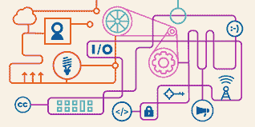
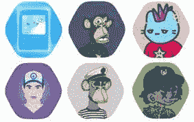

# 为什么 Web 2.0 和 Web 3.0 应该可以互操作

> 原文：<https://medium.com/coinmonks/why-web-2-0-and-web-3-0-should-be-connected-cb5c5e5b7ce9?source=collection_archive---------8----------------------->

eff.org

关于 Web 3.0 及其好处，从隐私和数据所有权到去中心化，已经有了很多的讨论——名单很长。虽然 Web 3.0 的好处无处不在，但有一个方面被忽略了；Web 2.0 在采用 Web 3.0 中的作用。

关于这个话题的一个不受欢迎的观点是，“Web 2.0 产品不会消亡，它的发展也不会阻碍，而是将通过互操作性促使用户更广泛、更快速地采用 Web 3.0 产品。”

为了阐明这一观点，让我们首先回顾一下相关的术语— *Web 2.0 和 Web 3.0 产品。*

基于 Web 2.0 的产品通常被称为社交网络，是互联网的一种形式，允许用户创建内容并参与这些内容，例如社交媒体平台等。

相反，基于 Web 3.0 的产品被认为是 Web 的引爆点。他们的目标是一个更加自主、智能和开放的互联网。值得注意的是，Web 3.0 应用程序依赖于区块链，并且热衷于去中心化。

明确解释了这两个术语之后，是时候讨论互操作性、其本质和一个微观案例研究了。

## 什么是互操作性及其本质？

根据牛津词典，互操作性是计算机系统或软件交换和使用信息的能力。

这里的互操作性是指 Web 2.0 和 Web 3.0 产品之间的数据交换。请将此视为连接和塑造更好联盟的纽带。简言之，互操作性相当于“交叉交互”

让我们来看看 Meta(前脸书公司)允许在 Instagram 和脸书之间交叉发布的决定。

交叉发布的引入是一种帮助拥有脸书和 Instagram 账户的个人出于多种目的连接两个平台的手段。梅塔说，“通过同时使用脸书和 Instagram，你可以接触到更多向你寻求灵感的人。”交叉发布背后的想法有利于用户和 Meta。

交叉发布，类似于互操作性，影响了 Meta 的脸书和 Instagram 的使用。当 Meta 允许交叉发布到其本地应用程序之外的其他社交媒体应用程序，如 Twitter 和 Tumblr 时，更高级和更广泛的连接性出现了。

对用户的好处包括更好的后期管理和更容易的内容再利用途径。交叉发布功能允许用户进行优先排序，并有助于中小企业、创造者和几家初创公司的发展。Meta 从交叉发布中获得的优势是增加了 feed 内容的下降，以及一种支持屏幕时间的策略。

## Web 3.0 和 Web 2.0 的互操作性

使用 Meta 的案例研究，最好是使用社交媒体平台(Web 2.0)使互操作性合理化——这将形成下文的基础。

Twitter 是一个社交媒体平台，通过微博来增强沟通。它可以将人们联系起来，让他们轻松分享自己的想法。最近，它被证明是一种更快、更有效地与一群人分享信息的方式——通过它的多媒体功能。

这一特性使得 Twitter 能够接触到广泛的受众，并建立重要的认知。它影响了人们对整个 Web 3.0 的好奇心和疑虑。一个明显的证据是通过平台的不可替代代币(NFT)行业的繁荣。一个突出的事件是购买了杰克·多西的第一条推特，售价为 290 万美元。这条推文的销售在采用*不可替代代币*方面发挥了关键作用，并通过提供信息帮助降低了准入门槛。

随着时间的推移，Twitter 成为了一系列 NFT 项目和社区计划的联系点。*“Twitter 是人们谈论他们关心的事情的地方，也是人们第一次体验加密和 NFTs 的地方，”*Twitter 发言人告诉 Techcrunch。不可能忽视 Twitter 在不可替代的令牌行业的成功中的地位。

Meta 还表示对不断增长的 NFT 产业感兴趣。虽然许多人对 Web 3.0 持怀疑态度，但通过其服务积累了高度信任的可信品牌的参与是采用 Web 3.0 不可或缺的。

web 3.0 能够流行的唯一方式是依赖 Web 2.0 平台。Web 2.0 和 3.0 的生存是相互依存的。web 2.0 需要整合 Web 3.0 的某些部分来保持其价值，而 Web 3.0 依赖于 Web 2.0 来获得更大的空间采用。

## 一个重要的互操作特性

互操作性的定义是明确的，Web 2.0 在这一领域的影响也是显而易见的。一个关键的问题是 web 2.0 产品如何使 Web 3.0 协议或衍生协议(如 NFT)的可访问性变得容易。

2022 年 1 月 20 日，Twitter 为 Twitter blue 订户推出了 NFT 个人资料图片。该功能允许个人通过将其 Twitter 链接到兼容 NFT 的钱包来证明其 NFT 的所有权。身份验证后，PFP 显示为六边形。这个特性是由于 Twitter 对将区块链集成到它的系统中感兴趣。下面是它的样子。

knowyourmeme.com

实现这一点解决了该领域出现的主要问题——其中一些问题包括:如何表达对 NFT 收藏品的喜爱？如何证明所有权？等等。

这种实现允许拥有 NFT 的个人将它展示为他们的 Twitter 个人资料，给他们更多的用例，而不仅仅是购买 NFT。

随着我们走向未来，人们可能会为使用不属于他们的 NFT 图片支付版税——这可能会通过 Web2.0 平台实现。此外，更多的 Web 2.0 平台将包含一个功能，让人们展示他们的“NFT”收藏——在 Web 2.0 平台上购买 NFT 的交易就像 Twitter 通过第三方一样。

## 最佳互操作性

web 2.0 和 web 3.0 的孤立版本将导致缓慢的采用，并停止潜在用户的获取和该领域的相关性。随着用户发现需求，交叉交流将很快成为优先考虑的事情；一种设计方法是同时编织 Web 2.0 和 Web 3.0。适当的连接将把行业构建和塑造成预想的 web 3.0。

将来，我们会看到更多的中央机构和组织将 Web 3.0 的一部分整合到他们的系统中。随着整个空间的当前趋势，它将在载人方面走很长的路。信息交换是 Web 3.0 整体发展不可或缺的一部分。

基于 Web 2.0 的产品将逐渐过渡到将 Web 3.0 的元素整合到它们的产品中，以适应不断变化的技术世界并保持长寿。

## 结论

Web 2.0 和 Web 3.0 产品的互操作性的重要性没有被夸大；很明显，web 3.0 产品受益更多。目前也有一种模式在起作用；Web 2.0 平台逐渐转变为面向区块链的平台。

在几个月或几年内，像 Meta 和 Twitter 这样的平台将更加进步地重新定义它们的核心，并转向 Web 3.0 的主题——去中心化。

达到去中心化的顶点并实现 Web 3.0 的目标，需要 Web 2.0 和 Web 3.0 的联合。