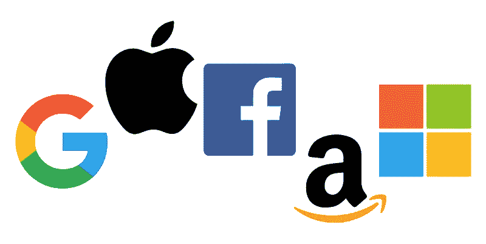

# 为什么 Web3 不会颠覆 Web2

> 原文：<https://medium.com/coinmonks/why-web3-wont-disrupt-web2-2a47c8445c70?source=collection_archive---------25----------------------->

以下是智能合约区块链适用范围的详尽列表:

*   创建和管理链上数字金融资产

这里有一个列表，列出了它们不适合做的事情:

*   其他一切

**智能合约是操纵区块链资产的最佳工具。智能合同区块链和设计&正是为了这个目的，而不是其他。这是他们做得最好的一件事。它们提供了方便的本地 API 来表达创建、转移、汇集、存储或以其他方式操纵这些链上资产的任何类型的逻辑，并允许您安全地将转移分组到全有或全无的事务中。**

区块链&智能合约平台对于通用的、非资产集中的计算来说是**可怕的**。即使有即将到来的可扩展性增强，如 L2s，它们也会比使用亚马逊网络服务或谷歌云等提供商的“集中式”云计算原语慢几个数量级，也更复杂。加密网络不是通用的“分散云计算”。它们更像是分散的**资产计算**。

**智能合同区块链不是通用的分散计算**

区块链网络激励结构的关键创新之一是，它们提供了一种可持续地为分散计算网络的开发和持续维护提供资金的方式— *但它们是通过发行新的本地数字资产来实现的，这些资产托管在顶层。*这些系统将“所有权”和“资产”铭刻在其 DNA 的最底层——这是它们存在的理由。他们是(或可能渴望)分散的，但他们提供给建筑商的与其说是“分散层”,不如说是所有权层。将它们用于不涉及某种资产转移的计算任务，将违背它们的技术本性。

**Web3 破坏的是所有权，而不是“集权”或“信任”**

我们从中可以得出的结论是“Web3”只有在以所有权为中心的应用中才有机会成功。好的用例将与创建或操作新的数字资产有关。注意,“操纵”意味着一个极其广泛的金融服务领域——借贷、交易、期权，当然，偶尔还有庞氏骗局。这是“DeFi”的领域。NFT 是数字资产，所以像游戏赚取游戏，元宇宙等部门。当新资产的创造和操作是他们的核心时，也可以符合这个定义。

这不是“Web2”巨头建立竞争优势的地方。谷歌抓取网页并根据搜索结果出售广告；脸书和 Twitter 针对其用户生成的内容销售广告；微软向企业销售基于云的软件；网飞制作原创娱乐节目并出售订阅服务。去中心化资产所有权平台的出现并没有以任何方式破坏这一切。

**用户不关心去中心化——在 Web2 或 Web3 中**

Web2 巨头平台的分散化或更加私有的替代品已经存在。例如，如果你关心谷歌使用你的数据的方式，你可以使用 DuckDuckGo 来代替。如果你关心 Twitter 或脸书使用你的数据的方式，你可以用[乳齿象](https://mastodon.social/about)来代替。在解决这些问题时，加密不是必需的，也没有帮助。对 Web2 平台的批评者来说，挑战是让任何人都足够关心集中化或他们的隐私，从而真正转向这些替代品。

即使在 Crypto/Web3 领域，市场一次又一次地证明，超过某个阈值，用户似乎并不太关心他们使用的平台有多分散。用户纷纷涌向币安智能连锁，尽管它由一家公司主导，而且远不如以太坊分散。多年来，比特币最大化主义者一直在绞尽脑汁，试图教育用户比特币的去中心化比竞争对手强得多，他们发现，这种恳求基本上被置若罔闻。没有一个加密网络成功地基于分散化度量(例如，节点计数、验证器硬件要求等)，而是基于它们向用户提供的具体功能或激励来引导用户牵引力。对于大多数用户来说，去中心化太不可见，太深奥，难以理解。

[所以，与你可能被告知的相反](/coinmonks/why-everyones-so-confused-about-web3-725790e9e371)，Web3 不会扰乱 Web2。如果 Web3 试图与基于卓越分散化的高效 Web2 服务竞争，它将永远不会成功。Web3 不会把我们从拥有你的数据的大型中央互联网平台中拯救出来。

相反，Web3 正在探索一个围绕互联网的新设计空间——原生资产所有权。如果说它会破坏什么，那就是我们围绕资产所有权、合同协议和转让的现有平台，例如银行和金融部门。这应该足够令人兴奋了。

> 加入 Coinmonks [电报频道](https://t.me/coincodecap)和 [Youtube 频道](https://www.youtube.com/c/coinmonks/videos)了解加密交易和投资

# 另外，阅读

*   [CoinFLEX 评论](https://coincodecap.com/coinflex-review) | [AEX 交易所评论](https://coincodecap.com/aex-exchange-review) | [UPbit 评论](https://coincodecap.com/upbit-review)
*   [AscendEx 保证金交易](https://coincodecap.com/ascendex-margin-trading) | [Bitfinex 赌注](https://coincodecap.com/bitfinex-staking) | [bitFlyer 审核](https://coincodecap.com/bitflyer-review)
*   [麻雀交换评论](https://coincodecap.com/sparrow-exchange-review) | [纳什交换评论](https://coincodecap.com/nash-exchange-review)
*   [支持卡审核](https://coincodecap.com/uphold-card-review) | [信任钱包 vs MetaMask](https://coincodecap.com/trust-wallet-vs-metamask)
*   [Exness 回顾](https://coincodecap.com/exness-review)|[moon xbt Vs bit get Vs Bingbon](https://coincodecap.com/bingbon-vs-bitget-vs-moonxbt)