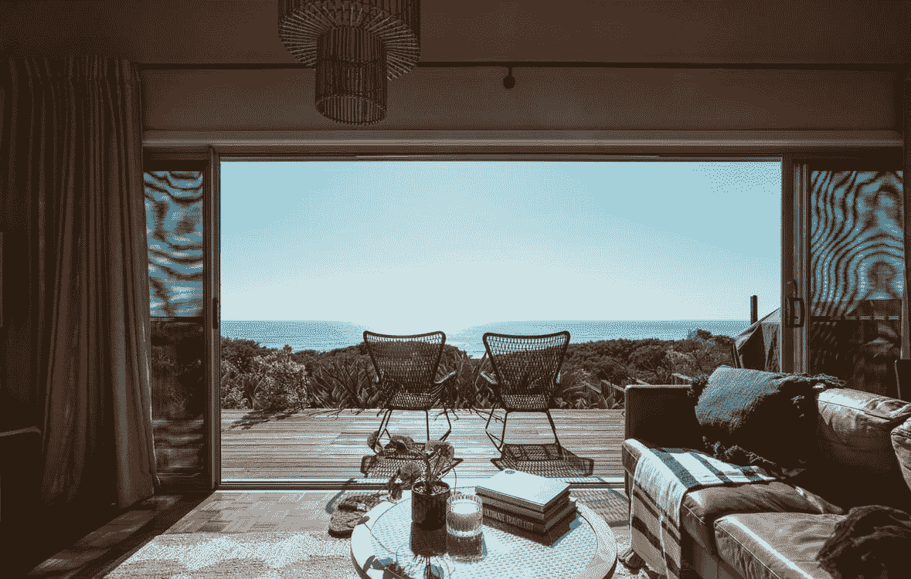

# 为什么一个盲人会花 100 万美元去看风景？

> 原文：<https://medium.com/coinmonks/why-would-a-blind-person-pay-1-million-for-a-view-3924dae5feef?source=collection_archive---------22----------------------->

Picture by Ben Mack from Pexels

想象一下，在你的超豪华床垫上睡了一夜后，早上醒来，你发誓感觉像睡在云端。你穿上丝绸长袍，走到厨房，按下定制卡布奇诺自动咖啡师的按钮。喝第一口咖啡因会让你的边缘系统活跃起来，你会拉开客厅的窗帘。