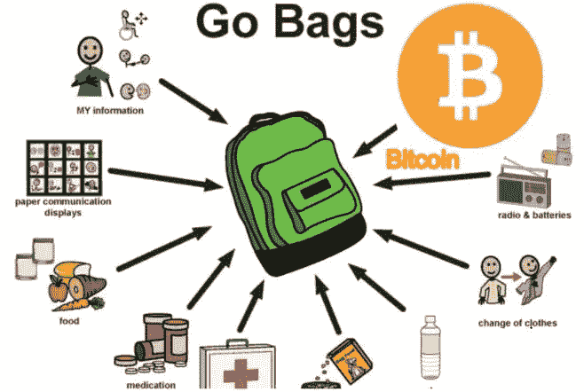

# 为什么你的包里需要比特币

> 原文：<https://medium.com/coinmonks/why-you-need-bitcoin-in-your-go-bag-1153f4ba5d05?source=collection_archive---------31----------------------->

Go Bag Items

在过去的两周里，我沉迷于媒体对世界事件的报道，特别是关于人民自由和国家主权的报道。当然，我说的是正在进行的乌克兰-俄罗斯冲突。为了支持北约和欧盟的报复立场，一些世界银行机构开始禁止任何参与或参与无端入侵乌克兰的人进入。

随着全球银行系统成为一种旨在削弱俄罗斯及其人民向普京施压的武器，俄罗斯正在发生的事情确实令人着迷，并无意中强调和刺激了数字货币的采用。

举个例子，上周末，我向乌克兰政府控制的钱包直接转账了一些比特币，以支持这项事业。我这样做是因为我知道，一旦钱包地址被证实在乌克兰政府的控制之下，这是支持乌克兰最直接、最便捷、最安全的方法。

我想起了几年前我有幸与之共事的一位企业家讲的一个我最喜欢的故事。为了简单起见，我们称这个人为亚伯，他在桑给巴尔一个舒适的中上阶层生活中长大，从很小的时候就沉迷于航海的热情。然后，随着 1964 年的革命，桑给巴尔岛的情况发生了迅速的变化。当时，他的家族持有相当大一部分黄金财富。十几岁的时候，亚伯把家里的金条藏在他帆船的油箱里偷偷带了出来。如果他被抓住，这可能意味着死亡，但肯定是没收他的家庭财富。

幸运的是，这个故事有一个快乐的结局。阿贝尔成功地将他自己、他的家人和他们的金融资产运出了这个国家，最终到达了美国。在这里，阿贝尔创建并领导了一些公司，这些公司在 20 世纪 70 年代和 80 年代初获利数千万美元。今天，阿贝尔仍然比以往任何时候都更加热爱航海。

周三乌克兰战争爆发时，我看到基辅的自动取款机前排起了长队。我不得不怀疑有多少潜在的亚伯会因为等待从银行取出至少一部分钱而失去他们的金融资产。这让我明白，这不是浪费时间等待银行清算你的交易或等待自动取款机吐出现金的时候，在这些危险的时刻，很可能有被盗或被没收的风险。

这一系列事件凸显了传统银行体系在紧急情况下的弱点，当情况发生快速变化时，人们迫切需要获得他们的资金和金融资产——无论是出于政治动机的战争行为还是某种自然灾害，迫使他们实际上，甚至可能是永久地撤离。

在我和妻子居住的旧金山舒适安全的小屋里，我们目前最大的紧急威胁是地震或火灾，这需要随身携带。当不得不在短时间内快速旅行时，拥有比特币的真正保管所有权要实用得多。(尽管我们生活在一个高档的邮政编码区，偷窃是一种真实的可能性，不幸的是，在真正紧急的情况下，从绝望的人那里偷窃的可能性会增加。)

郑重声明，我在加州长大，对地震的担心远不如我妻子(除非我碰巧在电梯里)。火灾是现在更大的问题，我在 2019 年实际上处于一个非常可怕的情况下，需要一个旅行袋。

本周，随着我继续关注乌克兰事件的发展，我开始意识到我已经做好了应对紧急情况的准备。我们可以很容易地一接到通知就离开，并出售少量比特币来为我们的旅程提供资金，同时防止袭击者(无论他们是谁)获取我们的比特币。

在我的生命和自由面临生存威胁的情况下，比如乌克兰正在发生的事情，或者作为我的政府(比如俄国)突然愿意牺牲其人民的金融主权的受害者，拥有种子短语和两个或更多签名的 BTC 的自我监护将是我的最佳选择。即使被俘虏，犯罪者也很难获得我的比特币财富，除非给出种子短语，或者在两个或更多签名的比特币钱包的情况下，他们以某种方式从受信任的保管人那里获得第二个密钥(极不可能或如果不是不可能)。

在上面的场景中，我有 100%的信心，分散的比特币网络会在我们逃跑时保护我的比特币财富。即使俄罗斯人干掉了欧洲和北美的每一个比特币矿工和节点，比特币网络也会保持安全，保护我的比特币资产财富，直到我准备好再次访问它。试试黄金、现金或传统银行业务。

直到上周，我甚至从未想象过这样的场景，我仍然有理由相信，我个人永远不会处于需要如此极端措施的境地。是我的妻子确保我们有地震和火灾旅行袋，我很高兴我们有，但我从来没有想到我会需要这些，直到 2019 年加利福尼亚大火。

过去两周的世界事件让所有人都看到了现存遗留金融体系的弱点，尽管我们热切希望冻结普京、俄罗斯寡头和其他坏角色资产的制裁能够成功。我相信会有更多的民族国家、公司和个人制定 B 计划，就像比特币一样，以防范几周前还难以想象的事件。

我相信在不久的将来，我会直接使用比特币网络进行更多的交易。正如上周末所证明的。逃亡的难民在没有中介的情况下进行点对点交易，肯定会引发更广泛的采用和交易，无论是本地交易还是跨境交易。

万事如意

吉姆·福克斯

> 加入 Coinmonks [电报频道](https://t.me/coincodecap)和 [Youtube 频道](https://www.youtube.com/c/coinmonks/videos)了解加密交易和投资

# 另外，阅读

*   [南非的加密交易所](https://coincodecap.com/crypto-exchanges-in-south-africa) | [BitMEX 加密信号](https://coincodecap.com/bitmex-crypto-signals)
*   [MoonXBT 副本交易](https://coincodecap.com/moonxbt-copy-trading) | [阿联酋的加密钱包](https://coincodecap.com/crypto-wallets-in-uae)
*   [Remitano 审查](https://coincodecap.com/remitano-review)|[1 英寸协议指南](https://coincodecap.com/1inch) | [购买 Floki](https://coincodecap.com/buy-floki-inu-token)
*   [MoonXBT vs Bybit vs 币安](https://coincodecap.com/bybit-binance-moonxbt) | [Arbitrum:第二层解决方案](https://coincodecap.com/arbitrum)
*   [买 PancakeSwap(蛋糕)](https://coincodecap.com/buy-pancakeswap)|[matrix export Review](https://coincodecap.com/matrixport-review)
*   [最佳免费加密信号](https://coincodecap.com/free-crypto-signals) | [YoBit 评论](/coinmonks/yobit-review-175464162c62) | [Bitbns 评论](/coinmonks/bitbns-review-38256a07e161)
*   [OKEx 审核](/coinmonks/okex-review-6b369304110f) | [Kucoin 交易机器人](/coinmonks/kucoin-trading-bot-automate-your-trades-8cf0ca2138e0) | [期货交易机器人](/coinmonks/futures-trading-bots-5a282ccee3f5)
*   [AscendEx Staking](https://coincodecap.com/ascendex-staking)|[Bot Ocean Review](https://coincodecap.com/bot-ocean-review)|[最佳比特币钱包](https://coincodecap.com/bitcoin-wallets-india)
*   [霍比审核](https://coincodecap.com/huobi-review) | [OKEx 保证金交易](https://coincodecap.com/okex-margin-trading) | [期货交易](https://coincodecap.com/futures-trading)
*   [比特币基地赌注](https://coincodecap.com/coinbase-staking) | [热点评论](/coinmonks/hotbit-review-cd5bec41dafb) | [库币评论](https://coincodecap.com/kucoin-review)