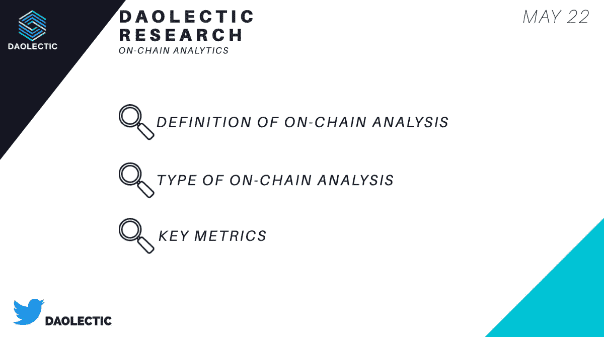
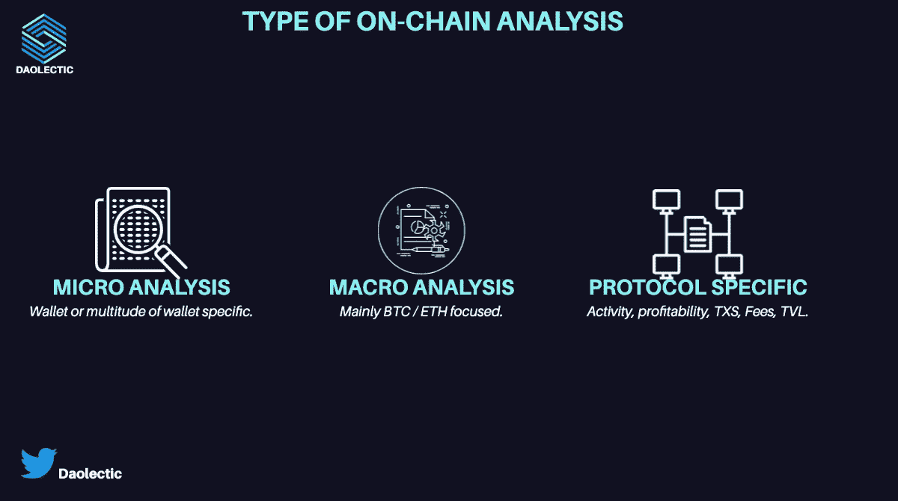
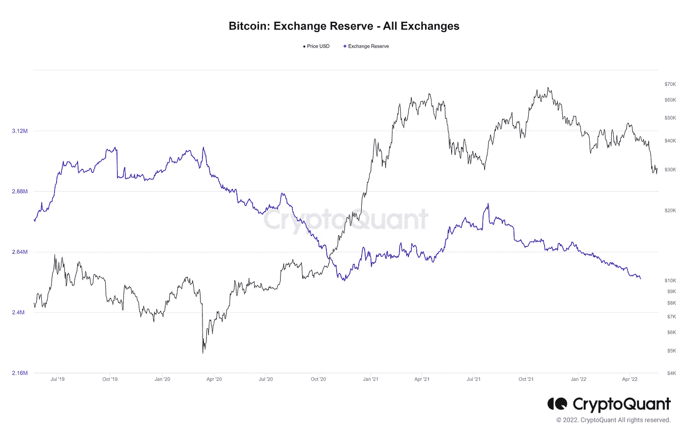
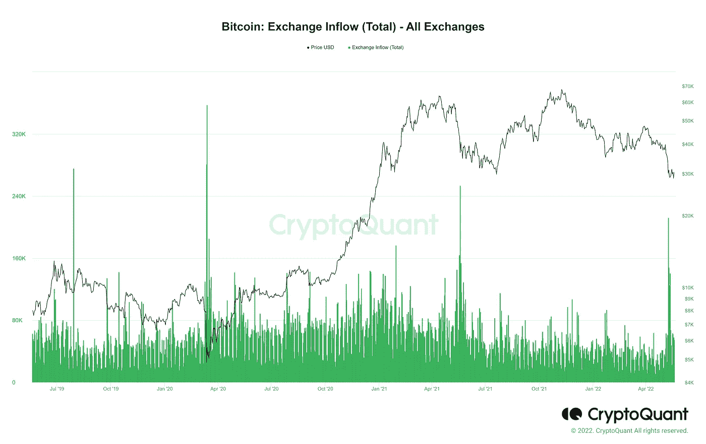
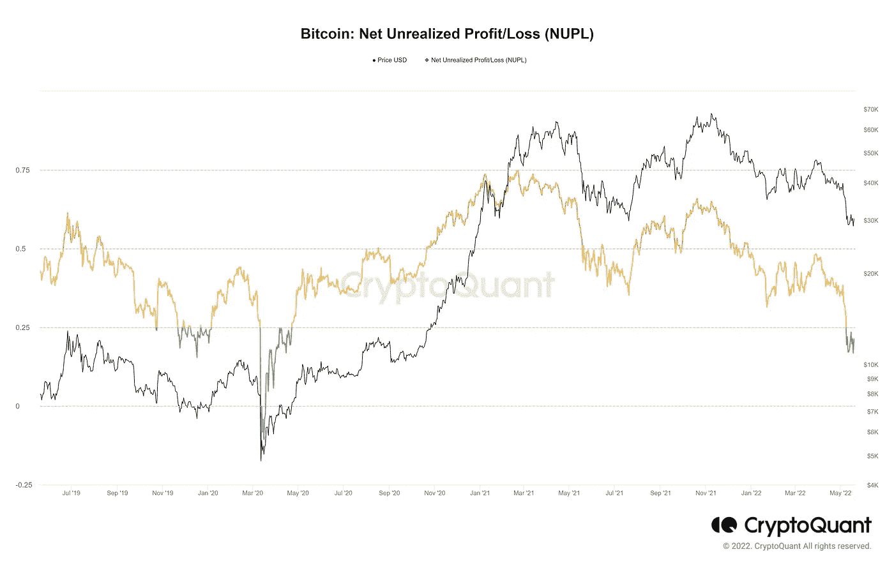
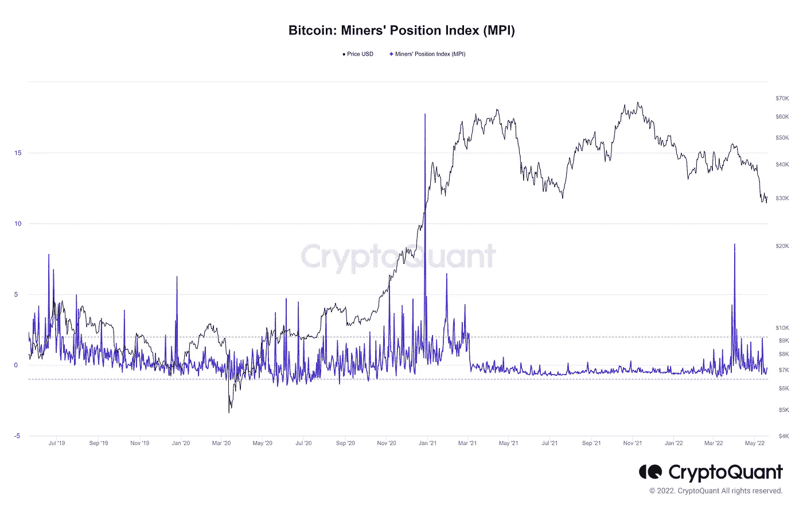
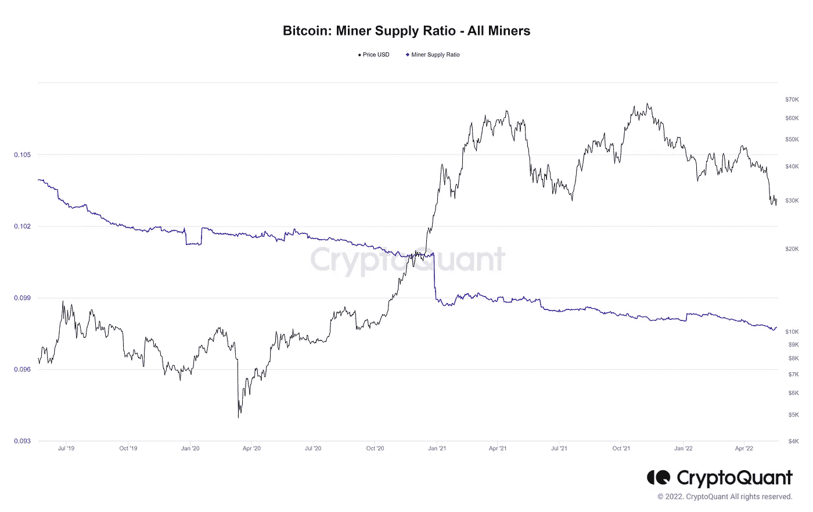
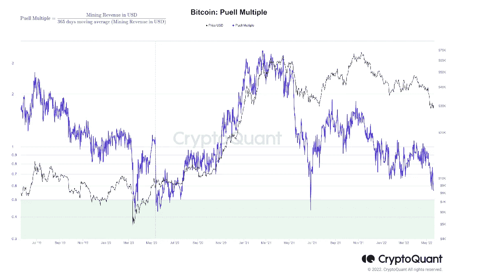
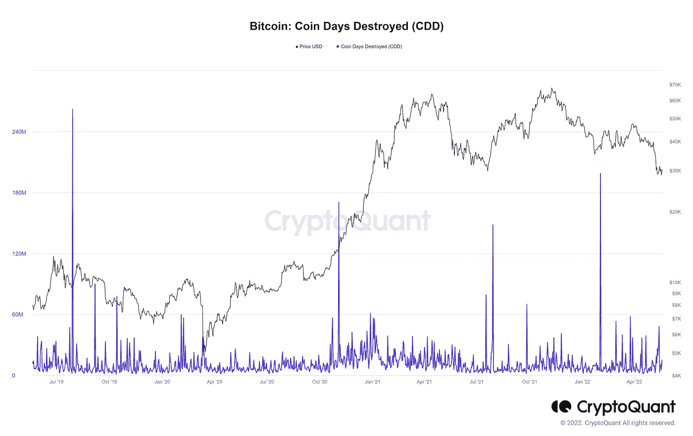
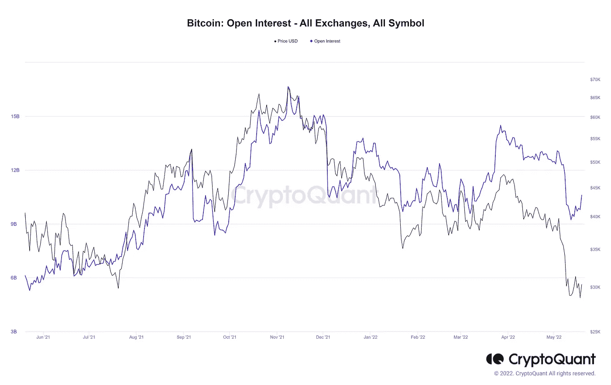

# 熊市中为什么需要链上分析？

> 原文：<https://medium.com/coinmonks/why-you-need-on-chain-analysis-in-a-bear-market-f3b13feea47c?source=collection_archive---------13----------------------->

每个人都知道，我们正处于投降阶段，但有一个工具将永远告诉你真相；这叫做链上分析。区块链产生了可靠的数据，使我们能够获得加密网络中重要经济活动的准确、可靠的指标。

这种分析是可能的，因为大多数区块链是公共分类账。多亏了这个细节，你可以实时检查所有的活动。

有很多付费和免费的工具来执行链上分析，我们将深入到最重要的。

虽然预测未来是不可能的，但大多数行为都有共同的模式。通过释放这些链上数据，我们可以改变我们衡量市场情绪和行为的方式。

# **微观、宏观和特定于协议的分析。**

我们关注三种不同类别的链上分析。

**微**分析是通过区块链浏览器对特定钱包的检查。通常，所有最大的连锁店都有自己的；多亏了它，你可以检查它的所有方面:最大的持有者，VC 钱包，DeFi 钱包，硬币的流入和流出。

我们具体案例中的**宏观**分析将是对 BTC 那些关键指标的评估。它通常可以通过付费工具获得，并且不涉及单个钱包，而是一系列宏观数据。

你经常听到“BTC 是国王”，嗯，大多数时候，这是真的。

检查鲸鱼的行为，外汇存款流动，休眠，以及更多可以帮助衡量市场情绪。

**协议特定的**分析有助于判断协议活动、TVL、TXS 数量、盈利能力和许多关键指标。

这有助于比较相似的协议，并决定在你的研究中哪一个是赢家。

# 我们的焦点。

我们将只关注$BTC 宏观分析方面的链上分析这份报告。那么，在不同的市场周期中，我们会关注哪些主要的关键指标呢？这些指标的偏差是什么？在执行这种分析时，哪些工具可以派上用场？

有很多网站可以对 BTC 进行宏观分析；这一次，我们将使用 CryptoQuant。

下面是我们最喜欢的加密链上分析指标。

# 1.外汇储备(所有交易所)

等于交易所中持有的硬币总数。

如果储备指标在上升，则意味着更高的抛售压力。越来越多的人存入交易所出售他们的硬币。

与稳定的外汇储备结合使用可能会有所帮助；为什么？当稳定币值上升时，表明可能存在买入压力。

# 2.汇兑流入总额(所有汇兑)

与之前的图表非常相似，这张图表显示了转移到交易所的硬币数量。一个高指标与现货交易中增加的抛售压力相关联。

与之前相同的稳定币规则也适用于此。

# 3.未实现利润/亏损净额(NUPL)

让我们假设最后的硬币运动总是购买。

如果这个数量的硬币卖出获利，指标上升，而不是亏损/盈亏平衡。

指标越高，或获利的人越多，抛售压力增加的风险就越高。

未实现净损益(NUPL)是市值和已实现市值之差除以市值。

# 4.矿工位置指数

该指标的峰值显示，矿工发送的硬币比平时多，这可能与可能的抛售有关。当矿商同时发送大量储备时，可能会引发价格下跌。

# 5.矿工供应比率—所有矿工

这在与矿工位置指数(MPI)相关联时非常有用。

它表明，与 BTC 总供应量相比，矿工钱包的储备，较低的储备=可能的抛售压力。

矿商的业务核心是市场，所以请放心，他们对市场的研究比任何人都多。

# 6.普尔倍数

另一个跟踪矿工情绪的有趣指标是普尔倍数。

Puell 倍数是“如果所有创造的比特币都在市场上出售，矿商相对于过去一年的利润有多高？”

Puell Multiple 将矿商 365 天的平均预期收入与其短期收益进行了比较。

# 7.硬币毁天灭地(CDD)

在浏览那个指示器之前，你必须知道 UTXO 是什么。
不要担心；我们为你提供了安德烈亚斯·m·安东诺普洛斯的简单解释。

CDD 提供了长期持有人的情绪和行为。

在 CDD 图表中，该指标的高值意味着长期持有人正在转移他们的硬币，这通常表明可能会抛售。

# 8.未结利息(CDD)

每天之后，市场参与者持有的未平仓合约总数(仅针对衍生品交易所交易对)称为未平仓合约。

期货市场的总活跃程度是通过未平仓合约来衡量的。

未平仓合约增加表明新的现金正在进入市场。因此，目前的趋势(上涨、下跌或横盘)将会继续。

未平仓合约下降表明市场正在清算，当前的价格趋势正在结束。

因此，未平仓合约是即将到来的趋势变化的领先指标。

# 偏见

*   第 2 层上发生的一些事件和事务可能会避开链上指标。
*   从历史数据来看，我们只有有限的几年时间。毕竟，BTC 只存在了 13 年。
*   链上分析是一种着眼于长期博弈的工具；对日交易者可能没什么帮助。
*   尽管鲸鱼被认为是这个领域的“专家”，但它们并不总是把握市场时机。这就是为什么我们决定不包括任何鲸鱼指标。
*   一些著名的指标在过去已经失效。

# 放弃

无论如何，这不是财务建议；我研究的目标永远是深入项目，从不同的角度研究它们；我确实包含了基于我最近了解到的类似项目经验的个人观点。

我现在和将来都愿意接受讨论。

**在 Twitter 上关注我们:**

**@道辛**

**在投资任何东西之前，请务必做好调查**。