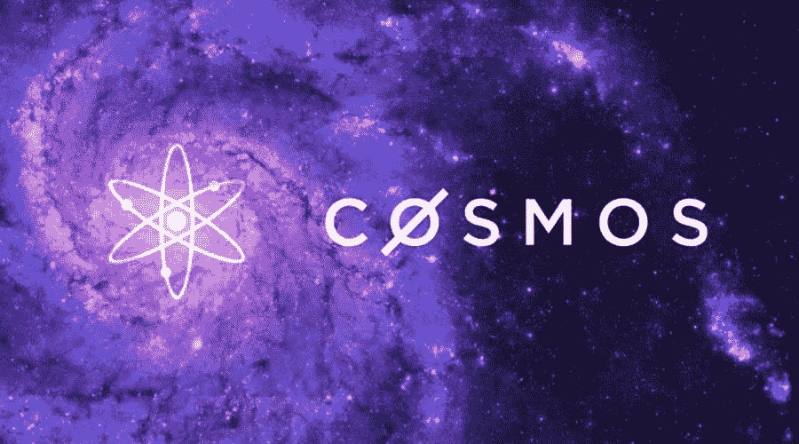
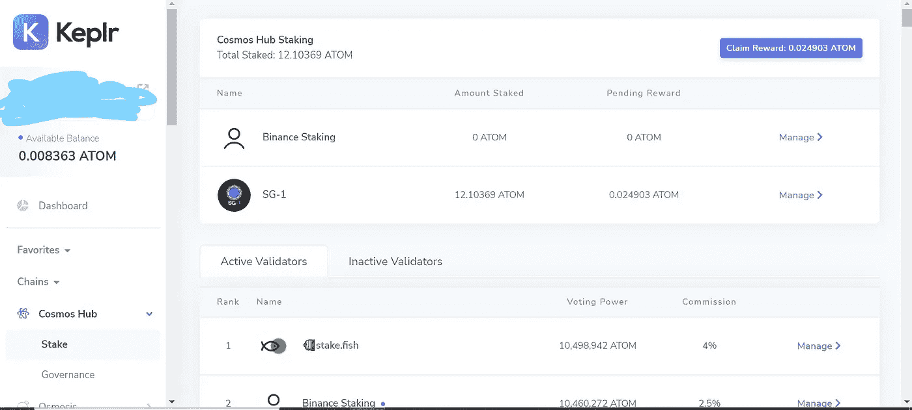
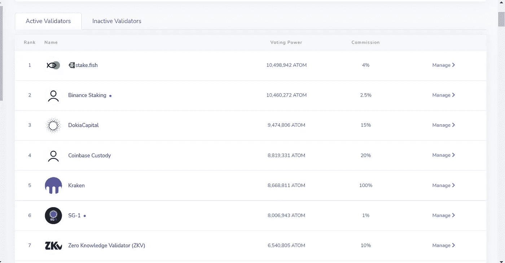
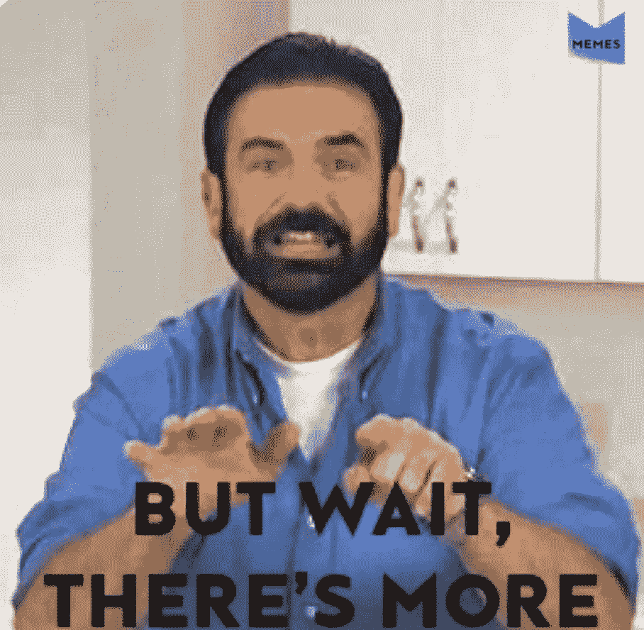
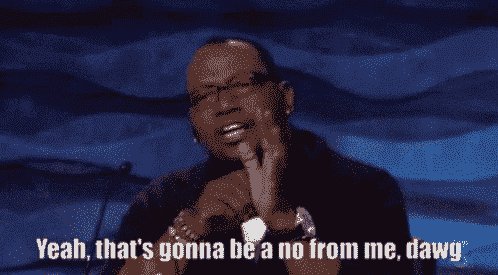

# 为什么您需要立即停止在集中式交易所上使用 ATOM

> 原文：<https://medium.com/coinmonks/why-you-need-to-stop-staking-atom-on-centralized-exchanges-immediately-abee23c249e7?source=collection_archive---------13----------------------->

有多年经验的投资者可以证明，你从第一天开始的投资策略将与你在第 1000 天所做的截然不同。这是可以预料的，因为你开始通过试错获得经验，并开始适应。作为 2020/2021 年加密牛市的一部分，每个主流平台都夸口说，如果你“押注”你的代币，他们会提供某种形式的利息。通过为受欢迎的代币提供最高利率，公司可以让他们的平台看起来更有吸引力。然而，正如你将在这篇文章中了解到的，如果你想让你的投资策略更上一层楼，你将会停止在集中交易上下注！

什么是赌注？

让我们来看看宇宙生态系统，以及如何赚取赌注奖励。以 Cosmos Hub 为例，我将分析它是如何工作的。Cosmos 使用“利害关系证明”共识机制工作。有了 PoS，您就有了一组验证者，他们达成一致，认为在区块链中发生的交易是准确的。让我来分解一下。

用最简单的术语来说，赌注就是拿走你的代币，然后把它借给一个叫“验证者”的人，这会让你获得利息。把 Cosmos Hub 想象成一家公司。这家公司由一个大董事会管理，但没有首席执行官或总裁发号施令。每个验证者代表一个董事会成员，每个验证者的权力取决于其拥有的令牌数量(虽然一些验证者拥有更多投票权，但没有一个董事会成员处于控制地位)。当交易发生在公司内部时，所有的验证者都在审查这些交易，并同意它们是准确的。这些验证器从所有交易中收取费用。就当是验证一切运行顺利的报酬吧。为了成为验证者，您必须能够全天候运行验证者节点。大多数人没有这种能力，所以他们没有创建自己的节点，而是加入一个验证器并支付少量费用。就我个人而言，我在 Cosmos Hub 上下注时使用 Keplr wallet(也有其他选项)，这里是用户界面的截图。

SG-1 charges 1% commission

Cosmos Hub 下注奖励是根据下注人数进行数学计算的，下注奖励通常为每年 15%左右。锁定期为 21 天，所以一旦我将 ATOM 令牌交给验证者并下注，解锁过程将需要 21 天。如果 ATOM 的价格在一天内上涨了 3 倍(手指交叉)，我将无法卖出并获利，因为它们被锁定了，所以这是赌注令牌的一个风险因素。在这个账户上，我有大约 12 个 Atom 令牌。我押的验证器叫做“SG-1”。你可以看到 SG-1 排名第六。这个排名是由投票权决定的。SG-1 拥有 8，006，943 个原子的投票权。这意味着我和许多其他用户已经将我们的 ATOM 令牌汇集在一起，并将所有这些令牌委托给 SG-1(我的 12 个 ATOM 构成了 8，006，943 个 ATOM 的一部分)。每个验证器都有不同数量的代币以及不同的佣金。SG-1 收取 1%的佣金。这意味着，通过将我的 12 ATOM 押在 SG-1 身上，我将获得 15%的利息回报，然后这些回报的 1%将返回给 SG-1。按照目前的汇率和原子数量，我全年将赚 1.8 原子，并将向 SG-1 支付 0.018 原子。验证者想要更多的投票权，因为他们委托给他们的代币越多，他们的佣金就越多。例如，如果 SG-1 只有我的 12 个代币，它将产生 0.018 原子的佣金。因为它有 8，006，943 个原子，所以它每年生产 12，010 个原子(粗略计算)。请注意，通过 Keplr 下注时，像比特币基地这样的验证者赚取 20%的佣金，北海巨妖赚取 100%的佣金，币安赚取 2.5%的佣金。

**为什么你应该避免集中交易你的宇宙赌注**

**赌注回报:**当你看一下目前在集中交易所下注 ATOM 的 apy 时，你会发现比特币基地提供 5%，币安提供 1.5-3%，北海巨妖提供 7.5%。对于那些在家里跟踪的人来说，与使用 Keplr 钱包时直接在 Cosmos Hub 上下注可以获得的 15%的年利率相比，这只是一个薪酬削减。如果你打算长期拥有一项资产，寻求最高的赌注回报是有意义的，如果你花时间建立一个额外的钱包(很容易做到)，就可以做到这一点。当你用比特币基地下注时，他们得到 15%的回报，给你 5%的回报，然后他们将差额收入囊中。他们实际上是给你赚的钱的一小部分。这是这些交易所将交易所变成企业的方式之一！当你以为你赚了 5%的利息就很划算的时候，**比特币基地赚的钱比你自己的资产还多！有了币安，情况更糟！当你能赚 15%的时候，你只能得到少得可怜的 3%。很难证明选择这两个交易所中的任何一个都是正确的。不幸的是，如果你目前是一个集中赌注者，痛苦还没有结束。**

Shoutout to you if you get this reference

**空投:**除了得不到你的全部赌注回报，集中交易还通过机会成本让你赔钱。他们影响你的最大方式之一就是让你没有资格享受“空投”。空投在宇宙生态系统中很常见。空投是项目的免费代币分发，希望把你变成他们产品的用户。为了获得空投的资格，通常你需要下注至少 10 个原子。项目将寻找符合他们要求的钱包，并向他们发送免费令牌。这些空投的美元价值从 50 美元到 25000 美元不等。空投的一个常见要求是，所有委托给集中交易所的令牌都是不合格的，因此当我将令牌委托给 SG-1 时，我是合格的，但当我委托给比特币基地、北海巨妖或币安时，我就不合格了。想象一下，你错过了 5000 美元的空投，因为你通过 Keplr 把你的硬币押在币安而不是 SG-1。此外，那些通过集中交易直接下注的人也永远得不到空投。概括地说，到目前为止，你已经损失了 50%或更多的赌注奖励，而且通过使用集中交易，你已经失去了空投的筹码。

**治理:**在 cosmos 生态系统中，区块链是通过治理运行的，这意味着社区就某些主题进行投票，以选择区块链的方向。Cosmos 的用户可能会提出一个建议，即“我们希望从我们的社区池中提取资金，并将其捐赠给乌克兰人道主义援助组织”。然后区块链将投票决定这是否会发生。如果您通过 Keplr 下注，您可以单独投票，也可以弃权，然后由您委托的验证者为您投票。如果你通过集中交易所下注，你将失去投票权，你的声音将不会在区块链的决策中被听到。同样，对于不插手的人来说，这可能没什么大不了的，但是对于那些想要参与的人来说，投票的重要性不容忽视。

总而言之，你持有和投资宇宙资产的地点可能会花费你大量的时间。通过选择你的赌注，你就决定了你想要得到多少你自己的钱。如果你是一个不干涉型的投资者，集中交易应该只用于股权。这些交易所从他们的用户身上赚取了大量的被动收入，并没有承担更多的风险。归根结底，他们是一家企业，你付钱给他们是为了方便。集中交易赌注会减少你的赌注回报，阻止你获得空投，并剥夺你对区块链决策的发言权。当我还是新人的时候，我曾经是一个集中的赌注者。有了火的考验，我可以告诉你，多走一步，多加一点努力，就会走得很远。我希望有一天，当一家集中交易所向你敲竹杠时，你能友好地告诉他们:

当我开始写加密货币时，我的主要目标是为我那些对加密一无所知的最亲密的朋友提供一个学习的地方。我的朋友和陌生人，他们已经读了我的前几篇博客，我希望你已经学到了一些东西，至少得到了一点娱乐(我希望我的笑话不会太老土)。我感谢你花时间支持我。对我来说，教育是主流加密内容中被忽视的第一件事。Youtube 和 Twitter 上挤满了列出这些大规模价格预测的人，他们试图让你充满希望，而不是专注于教学。老实说，我觉得这很讨厌。我在 [NewsCrypto.io](https://newscrypto.io/) 上发现了一个非常有用的教育内容。这基本上是我希望创建的平台。我目前有一个免费帐户，并一直在参加他们的学院课程(免费)，以提高我的知识基础。他们有一个完整的学院，教授加密领域最简单的主题。从学习什么是区块链，到掌握交易和分散金融的世界，他们有各种课程，让你的知识更上一层楼。就我个人而言，我对他们的平台仍然是陌生的，将有更多的探索要做，但毫无疑问，如果你对加密感兴趣，这是一个必须使用的平台。当你阅读我的博客并搜索结构化的内容时，我建议你参加他们的学院课程并查看他们的平台，因为我认为这将有助于你更清楚地理解我的内容。

***insta gram***:[https://www.instagram.com/warren_feldman/](https://www.instagram.com/warren_feldman/)

***推特:***[https://twitter.com/WarrenFeldman3](https://twitter.com/WarrenFeldman3)

***邮箱*:**warrenfeldman92@gmail.com

https://app.newscrypto.io/unchained-education/WarrenF92[:](https://app.newscrypto.io/unchained-education/WarrenF92)[news crypto . io](https://app.newscrypto.io/unchained-education/WarrenF92)

> *加入 Coinmonks [电报频道](https://t.me/coincodecap)和 [Youtube 频道](https://www.youtube.com/c/coinmonks/videos)了解加密交易和投资*

# *另外，阅读*

*   *[有哪些交易信号？](https://coincodecap.com/trading-signal) | [Bitstamp vs 比特币基地](https://coincodecap.com/bitstamp-coinbase) | [买索拉纳](https://coincodecap.com/buy-solana)*
*   *[ProfitFarmers 点评](https://coincodecap.com/profitfarmers-review) | [如何使用 Cornix 交易机器人](https://coincodecap.com/cornix-trading-bot)*
*   *[十大最佳加密货币博客](https://coincodecap.com/best-cryptocurrency-blogs) | [YouHodler 评论](https://coincodecap.com/youhodler-review)*
*   *[my constant Review](https://coincodecap.com/myconstant-review)|[8 款最佳摇摆交易机器人](https://coincodecap.com/best-swing-trading-bots)*
*   *[MXC 交易所评论](/coinmonks/mxc-exchange-review-3af0ec1cba8c) | [Pionex vs 币安](https://coincodecap.com/pionex-vs-binance) | [Pionex 套利机器人](https://coincodecap.com/pionex-arbitrage-bot)*