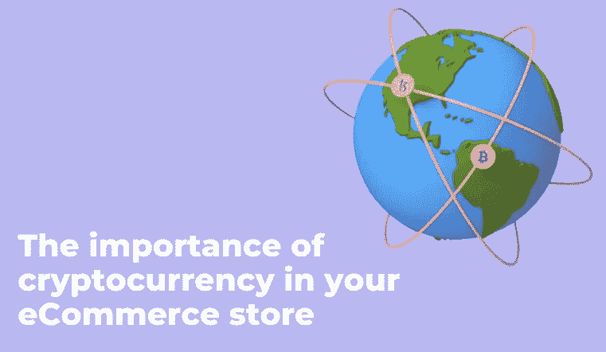

# 为什么你的电子商务商店应该接受加密货币

> 原文：<https://medium.com/coinmonks/why-you-should-accept-cryptocurrency-in-your-ecommerce-store-8951f6683ab4?source=collection_archive---------59----------------------->

> 今天，加密货币已经占领了世界。它在[支付方式](https://www.zegashop.com/web/top-4-payment-trends-to-watch-in-2022/)中越来越常见，你需要特别注意在你的[电子商务业务](https://www.zegashop.com/web/5-ways-to-increase-leads-for-ecommerce-businesses/)中使用它。现金早已过时。是时候拥抱引领支付系统新时代的技术发展趋势，创造新的支付方式了。
> 
> 这是加密货币的时代，因此接受加密货币作为支付方式可以改善客户的旅程，并通过在收银台提供更多选择来扩大您的消费者群。

# 什么是加密货币？

加密货币是一种存储在数字钱包中的数字、加密、分散的交易所。

分散系统用于记录交易和发行新单位，因为它们没有中央发行或监管机构。加密货币是越来越受欢迎的在线支付替代品。有超过 17，000 种加密货币，但最受欢迎的一些包括比特币、以太坊、系绳和币安币。名字中的“crypto”指的是交易细节在区块链上被加密，加密货币所有者持有一把数字“钥匙”，证明他们拥有该货币。

# 如何在电子商务中使用加密货币

对于那些寻找更快捷、更方便的方式来支付商品和服务的人来说，加密货币是一种额外的选择。是时候考虑在你的[电子商务网站](https://www.zegashop.com/sign-up) e 上使用这种支付方式了。为什么使用加密货币作为支付方式，一些需要注意的要点。

**市场扩张** —在您的[网上商店](https://www.zegashop.com/web/how-to-launch-your-online-store-in-less-than-3-minutes/)中使用加密货币作为支付方式将允许您扩张您的目标市场。定制您的平台，让人们可以使用他们的加密钱包进行支付，这使得购买过程更加简单，速度更快，并有助于增加网站的流量。

**高安全性** —密码是去中心化的。它允许使用加密的钱包地址在不提供个人数据的情况下进行购买，这证明了加密货币支付是如此安全，没有人可以攻击它们或进行任何形式的欺诈。

**低费用快速交易** —加密货币最重要的优势之一是数据的即时处理和交易的快速执行。并且每笔交易的费用低于例如 PayPal 或其他提供商的服务费用。

# 2022 年交易的五大加密货币

# 比特币

比特币是世界上最好的加密货币。比特币是开启这一切的硬币。根据这种货币的创造者的说法，他创造了一个将金融部门集中化的系统，将通过人们的数字交易系统来归还权力。

# 以太坊

这种数字资产仅次于市值数十亿美元的比特币，位居第二。以太的价值主要取决于以太坊区块链。作为市场上最大的品牌之一，以太总是出现在新闻中——无论是因为一些采用的新闻还是因为以太坊链的升级。

# 币安硬币

该资产由币安推出，是世界上第三大最有价值的加密货币，被大多数加密货币接受。这样做的一个巨大优势是，币安的资产与世界上最大的加密货币交易所相关联，币安总是与时俱进。这意味着股票市场的最新消息肯定会影响 BNB 的价格。

# 幸运积木

Lucky Block 使用区块链来确保交易的透明和公平。该平台旨在颠覆在线游戏行业，利用区块链技术改变赌博者玩在线游戏的方式。

# Dogecoin

Dogecoin 是世界上最好的加密货币之一。它们是以迷因硬币海报形式存在的资产，被赋予了价格波动性。

# 如何在您的网站上接受加密货币支付？

加密货币已经接管了世界，你需要知道如何开始接受加密货币作为商品和服务的支付方式。像微软、Overstock 和特斯拉这样的公司都已经开始采用比特币和其他数字货币。几家公司来帮助你接受加密货币支付。

# 比特币支付

BitPay 是希望接受加密支付的网站的最佳选择之一，它有 1%的交易费，但它的零价格波动功能有助于保护你免受价格波动的影响。

它为您的客户提供了多种支付方式，包括支付按钮、嵌入式收银机、内置发票以及几个插件和集成。所有这些都很容易处理，这意味着你可以毫不费力地开始接受比特币支付。

# 比特币基地

比特币基地是买卖比特币和其他加密货币的最佳市场之一。它使网站能够快速轻松地接受比特币支付，这也说明了高安全性。

# GoCoin

另一个多年来一直在帮助企业管理加密货币的加密货币处理器提供 1%的交易处理费，并与大多数[电子商务](https://www.zegashop.com/web/the-metaverse-and-ecommerce-how-ecommerce-engage-in-metaverse/)服务合作。

# 摘要

无论你对加密货币的看法如何，加密货币是金融的未来，因此它对[电子商务](https://www.zegashop.com/web/the-role-of-dropshipping-in-ecommerce/)的影响必须考虑在内。无论你是否决定在你的[业务](https://www.zegashop.com/web/essential-tips-for-growing-your-business/)中采用加密货币，你至少应该知道虚拟货币。

> 加入 Coinmonks [电报频道](https://t.me/coincodecap)和 [Youtube 频道](https://www.youtube.com/c/coinmonks/videos)了解加密交易和投资

# 另外，阅读

*   [有哪些交易信号？](https://coincodecap.com/trading-signal) | [Bitstamp vs 比特币基地](https://coincodecap.com/bitstamp-coinbase) | [买索拉纳](https://coincodecap.com/buy-solana)
*   [ProfitFarmers 点评](https://coincodecap.com/profitfarmers-review) | [如何使用 Cornix Trading Bot](https://coincodecap.com/cornix-trading-bot)
*   [十大最佳加密货币博客](https://coincodecap.com/best-cryptocurrency-blogs) | [YouHodler 评论](https://coincodecap.com/youhodler-review)
*   [my constant Review](https://coincodecap.com/myconstant-review)|[8 款最佳摇摆交易机器人](https://coincodecap.com/best-swing-trading-bots)
*   [MXC 交易所评论](/coinmonks/mxc-exchange-review-3af0ec1cba8c) | [Pionex vs 币安](https://coincodecap.com/pionex-vs-binance) | [Pionex 套利机器人](https://coincodecap.com/pionex-arbitrage-bot)