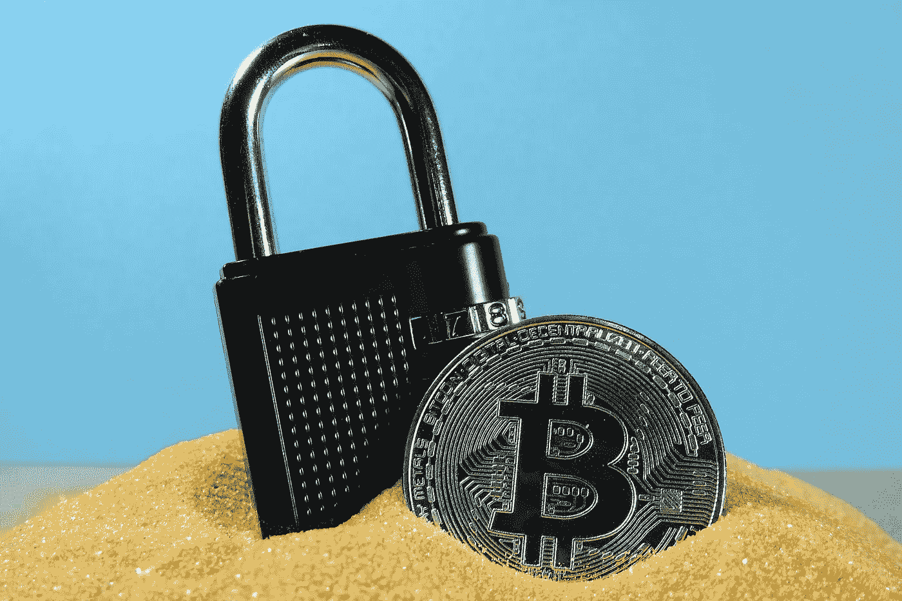
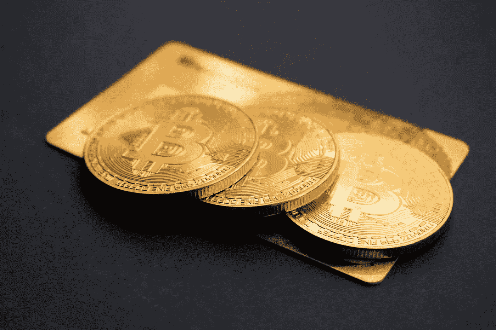
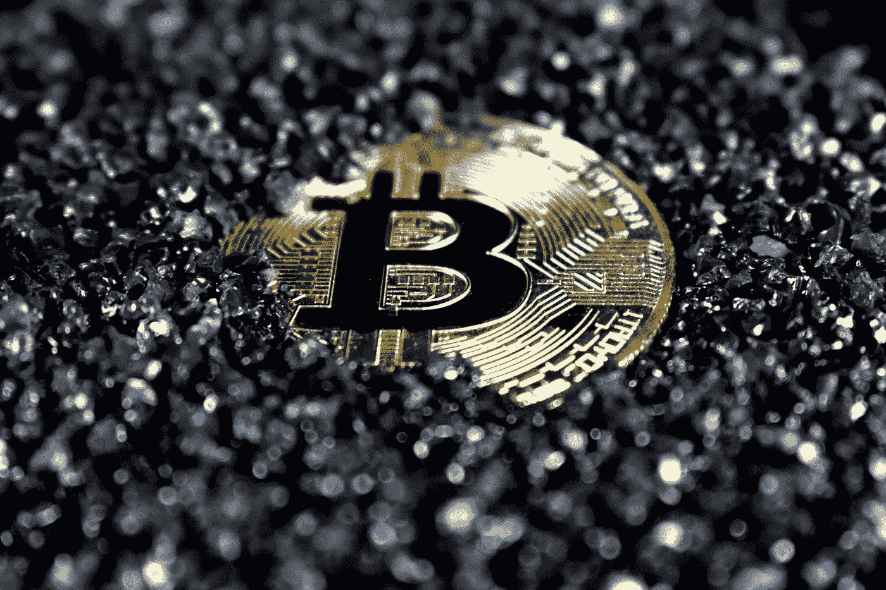

# 为什么你应该关注比特币:初学者指南。

> 原文：<https://medium.com/coinmonks/why-you-should-be-concerned-about-bitcoin-a-beginners-guide-70c3f2878f03?source=collection_archive---------62----------------------->

Source: Unsplash.com

你很有可能听说过比特币，并想知道它到底是什么。许多故事都是关于这种数字货币的短暂性，它会受到价格剧烈波动的影响。本文探讨了关于这种被称为比特币的新型货币你需要知道的一些事情。

首先注意，比特币是一种数字货币。你可能认为真的硬币是存在的，但事实并非如此。它是一种虚拟货币。比特币最初的目标是提供一种安全、匿名的互联网汇款方式。在某些方面，现代世界仍然如此。

> **参见:** [**为什么比特币是发展中经济体货币的未来。**](/@ilekeairende/why-bitcoin-is-the-future-of-money-in-developing-economies-72d953d79e60)

**分散货币的发展**

Source: Unsplash.com

比特币在全球多个国家引发担忧。与传统货币不同，它不受任何政府或中央银行的监管。比特币在一些国家已经被宣布为非法。

因为比特币不受任何政府强加的通货膨胀或通货紧缩措施的影响，所以它比传统的法定货币具有显著的优势。和黄金一样，比特币的供应量有限，因此价值极高。

> **另见:** [**为什么加密市场这么野？推动密码市场的因素。**](/geekculture/why-is-the-crypto-market-so-wild-factors-that-move-the-crypto-market-10f9267e3d1c)

**比特币的底层技术**

要制造比特币，你需要使用区块链技术。“区块链”一词源于这样一个事实，即它是一个公共分类账系统，有助于形成一个长长的已确认交易链。自 2009 年成立以来，任何人都可以查看整个比特币区块链。未来，这个数据会变得更大。

使用区块链技术验证金融交易后，该交易不可撤销。区块链创造了不可更改的记录。这对安全来说很好，但如果你在比特币交易中出错，就不那么好了。核实确认后，就没有回头路了。

组成比特币区块链网络的成千上万台电脑(称为“节点”)不断验证着这个系统。换句话说，一个区块链网络不可能被黑客攻击，因为它需要比组成它的机器多得多的计算能力。

**挖掘比特币**

比特币矿工负责确认交易。那些解决验证每笔交易所需的复杂密码的人依赖于个人、团体或组织使用的高性能计算机设备。

比特币矿工的努力会得到比特币的奖励。随着比特币价值的飙升，挖掘可能是一项有利可图的工作。问题在于，当新的比特币被创造出来时，现有比特币的供应就会减少。

如果你想参与比特币挖矿，你需要强大的计算能力。即使是高端台式电脑也远远达不到这个标准。换句话说，如果你想成为一名比特币矿工，你需要花很多钱购买高端计算机设备，并准备好一周七天、一天 24 小时运行它，并在这个过程中产生大量的电力支出。

> **另见:**[**2022 年 10 国必须有加密货币。**](/coinmonks/10-must-have-cryptocurrencies-in-2022-cc5c6cd9feeb)

**去哪里买比特币**

像[比特币基地](https://www.bing.com/search?q=coinbase+login&cvid=ff272934c1b94b1d8b35992f2ad81683&aqs=edge.1.69i59j0l8.4789j0j1&pglt=41&FORM=ANNTA1&PC=U531)、 [Bitxmi](https://www.bitxmi.com/en_US/register) 、[和币安](https://www.binance.com/en)这样的加密货币交易所，可以让你用比特币购买本国货币的比特币，比如美元。如你所料，买卖的过程伴随着交易成本，而交易成本通常是可以承受的。

你的比特币在加密货币钱包里安然无恙。加密货币交易所将为你提供一个在线钱包，但你也可以使用桌面钱包，纸质钱包或硬件钱包来存储你的比特币。

硬件钱包是最安全的，因为你不会把它插在电脑或移动设备上。网上钱包是最不安全的，因为任何人只要有电脑和互联网连接就可以使用它们。

> 加入 coin monks[Telegram group](https://t.me/joinchat/Trz8jaxd6xEsBI4p)学习加密交易和投资