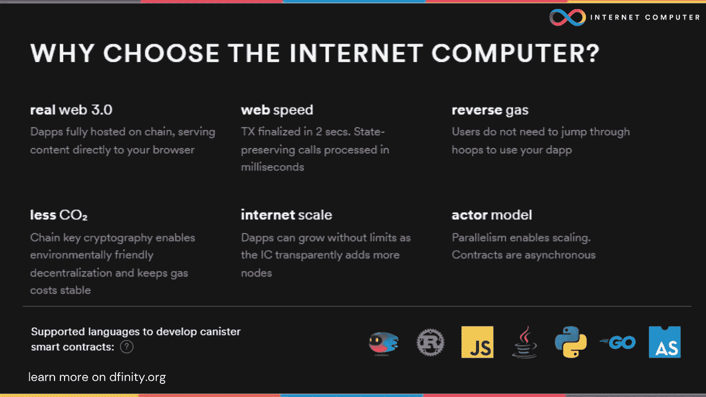
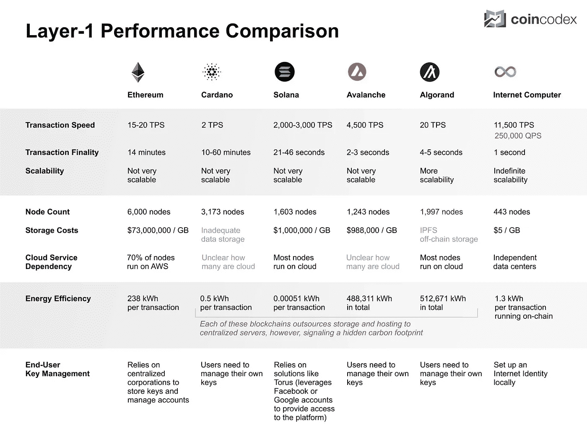
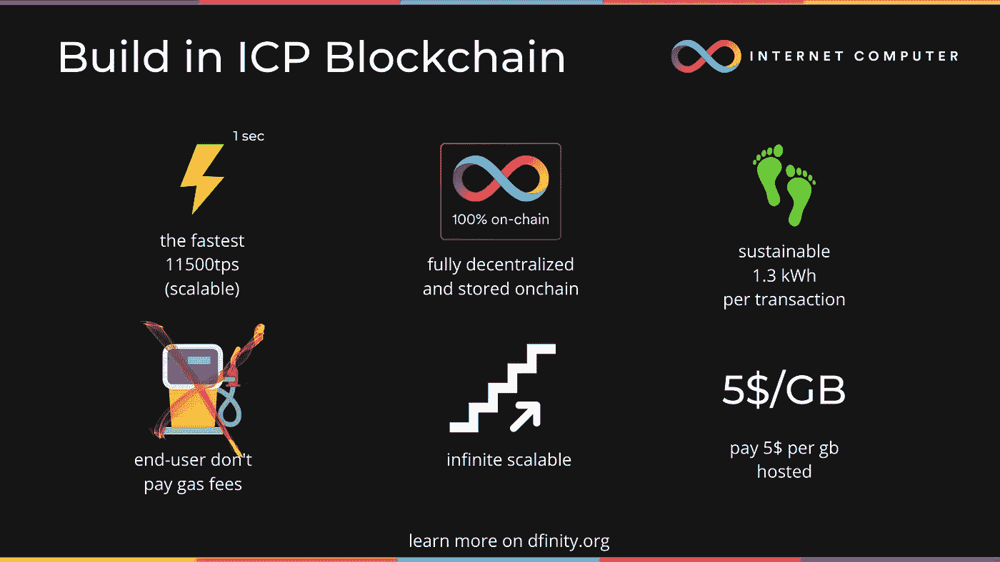
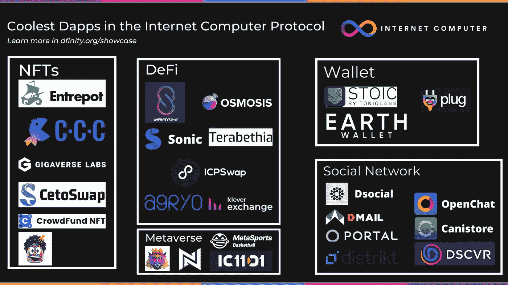
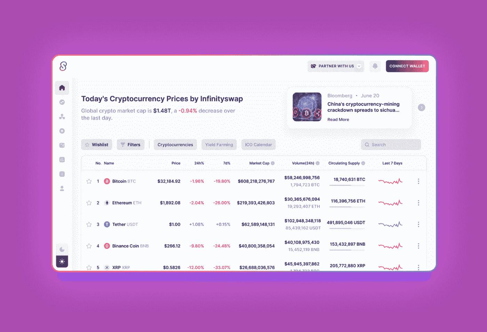
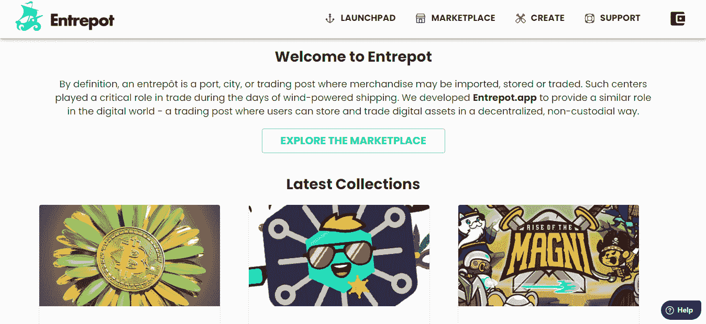
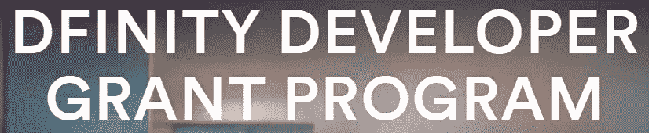
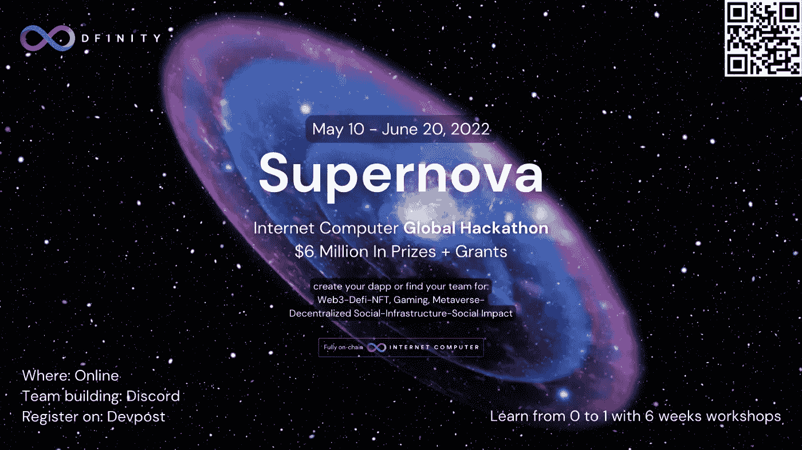

# 为什么应该在 ICP 区块链中构建您的 web3 dapp

> 原文：<https://medium.com/coinmonks/why-you-should-build-your-web3-dapp-in-icp-blockchain-702e4498ad2c?source=collection_archive---------8----------------------->

## 利用 ICP 区块链充分利用 web3，提供 web3 领域的最佳功能

我们都知道。甚至有太多的区块链和部门非常混乱

我应该在哪里构建我的 web3 项目？以太坊，索拉纳，雪崩或者可能是 ICP？

今天，我想向你们解释建立互联网计算机协议区块链的机会。

让我们开始吧。

# 特征

Source: Coincodex

互联网计算机是世界上最快的通用区块链，用来构建 Web3 的未来。

> ICP 的基本想法是创建一种新型的去中心化互联网和全球计算系统——世界各地的独立数据中心可以联合起来，创建一种替代云服务(来自亚马逊网络服务和谷歌云等公司)的服务，为当前的互联网提供动力。ICP 的计划是让该协议在全世界数百万台计算机上运行。
> 
> ICP 开发者表示，由此产生的网络与集中式网络相比具有一些关键优势。首先，它通过开放标准运作，避免了当主要云计算提供商托管与其自身服务竞争的产品时可能出现的利益冲突。
> 
> *摘自比特币基地关于 ICP 的文章*

some other interesting features

## **网速运行**

互联网计算机协议的 TPS 为 11500，并且可以无限扩展。换句话说，现在 ICP 可以在 1 秒钟内完成交易。

## 100%链上存储

以太坊等大多数区块链利用 AWS、Azure 或类似的云集中式服务来托管他们的文件和节点。区块链技术主要用于与 defi 相关的小额交易。

**ICP 可以依靠独立的数据中心**，由于互连的隐形子网，它可以存储任何文件，并且可以扩展。

## 每 GB 每年 5 美元

与其他区块链相比，完全在 ICP 中构建和托管你的 web3 dapp 是便宜的:例如，在 Solana，它将花费 100 万美元

## 逆向气费模型

最终用户不支付煤气费。罐(智能合约)预装了周期，为自己的计算付费，用户不需要付费(甚至不知道他们正在与 dapp 交互)。

# 我可以在 ICP 上构建什么样的 web3 dapp？

任何种类。在互联网计算机上，你可以在可互操作的容器(智能合同)内创建你在 web2、web3 上创建的任何东西。

## 查看生态系统中已经存在的 dapps:

[在 icApps 上查看更多信息](https://n7ib3-4qaaa-aaaai-qagnq-cai.raw.ic0.app/#/)

## 例子

[DSCVR](https://h5aet-waaaa-aaaab-qaamq-cai.raw.ic0.app/):Reddit 的去中心化版本，用户是所有者。建立在互联网计算机上，可从任何浏览器访问。

a footage of the website

InfinitySwap :一个在互联网计算机上创建、下注和交换代币的 AMM 平台。由 Polychain Capital 和 9YardsCapital 支持

a footage of the prototype

[转口港](https://entrepot.app/):设计、部署和管理传统 NFT 和令牌的链上工具和服务。

a footage of the website

了解更多关于 https://dfinity.org/showcase/[的信息](https://dfinity.org/showcase/)

# DFINITY 基金会的赠款

ICP 生态系统正在成长，Dfinity 基金会正在资助新的有趣的项目。

有开发商赠款、社区赠款和灯塔基金。
了解更多关于[dfinity.org/grants](http://dfinity.org/grants)的信息

# 苏佩诺娃黑客马拉松

Supernova Hackathon 将于 5 月 10 日开始，奖金为 600 万美元。

在我之前的[文章中了解更多信息。](/coinmonks/build-your-own-dapp-web3-and-win-6m-in-prizes-and-funding-with-the-supernova-hackathon-3258e52f2d16)

有任何问题或疑问吗？或者，我可能忘记了一些有趣的功能，这将是很好的添加到文章中？
欢迎发表评论，并在 [Twitter](https://twitter.com/pinoweb3) 上与我联系

> 加入 Coinmonks [电报频道](https://t.me/coincodecap)和 [Youtube 频道](https://www.youtube.com/c/coinmonks/videos)了解加密交易和投资

# 另外，阅读

*   [阿联酋 5 大最佳加密交易所](https://coincodecap.com/best-crypto-exchanges-in-uae) | [SimpleSwap 评论](https://coincodecap.com/simpleswap-review)
*   购买 Dogecoin 的 7 种最佳方式
*   [最佳期货交易信号](https://coincodecap.com/futures-trading-signals) | [流动性交易所评论](https://coincodecap.com/liquid-exchange-review)
*   [用于 Huobi 的加密交易信号](https://coincodecap.com/huobi-crypto-trading-signals) | [Swapzone 审查](/coinmonks/swapzone-review-crypto-exchange-data-aggregator-e0ad78e55ed7)
*   最佳[密码交易机器人](https://coincodecap.com/best-crypto-trading-bots) | [购买索拉纳](https://coincodecap.com/buy-solana) | [矩阵导出审查](https://coincodecap.com/matrixport-review)