# 为什么应该配置元掩码节点提供程序

> 原文：<https://medium.com/coinmonks/why-you-should-configure-the-metamask-node-provider-e11983d9e455?source=collection_archive---------18----------------------->

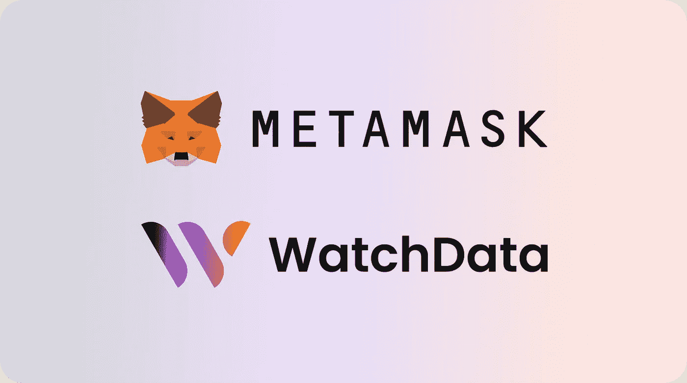

## 我们先来定义什么是元掩码，它是如何工作的？

[**MetaMask**](https://metamask.io/) 是一款加密货币钱包，可以轻松发送、接收和存储您喜欢的加密数据。它还可以让你直接从浏览器访问 dapps(不需要下载程序)，所以你可以使用 Uniswap、MakerDAO 和 Nifty Gateway 之类的东西。您甚至可以在钱包中存储 NFT！

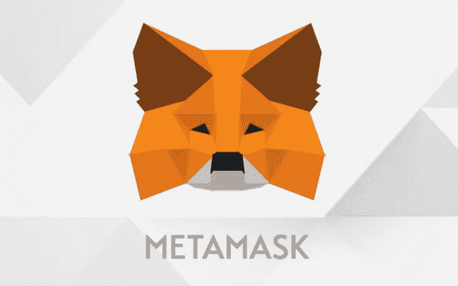

使用 MetaMask，您可以从一个方便的位置管理您的所有数字资产。因为它是分散的，没有第三方持有或控制你的资金——它们总是在你能接触到的地方。这意味着 MetaMask 比其他要求你信任中介的加密货币钱包更安全。

MetaMask 可作为 Chrome 和 Firefox 的浏览器扩展，以及 iOS 和 Android 上的移动应用程序。浏览器版本允许您在浏览网页的同时使用钱包，而移动应用程序允许您随时访问您的所有帐户，即使是离线时！

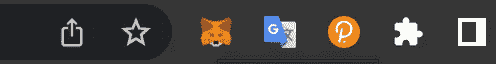

Metamask extension (Google Chrome)

## 让我们试着弄清楚 MetaMask 是如何处理所有这些重要信息的？

元掩码通过使用在所有元掩码用户之间共享资源的默认节点提供程序连接到节点。虽然拥有一个默认的共享提供程序意味着用户可以很容易地进行设置，但是也有很多缺点:

*   *您的交易处理时间可能会感觉很慢*
*   *您可能会看到不一致的块数据*
*   *由于过时的燃气费估算，您可能会支付超出必要的燃气费*
*   *最糟糕的是，默认的节点提供者可能会完全停止工作！*

顺便说一下，您可以选择 **WacthData** 作为元掩码中的数据提供者，让我更详细地解释一下

## 那么，如何更改元掩码节点提供者呢？

注册 WatchData，获得你的第一个 API 密匙！关于如何创建账户的详细指南，你可以在这里找到:[https://docs . watch data . io](https://docs.watchdata.io/introduction/quick-start-guide-to-watchdata)

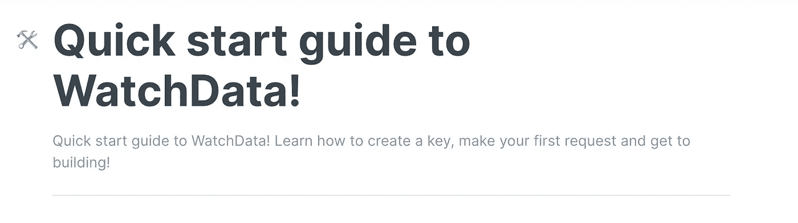

**现在在元掩码中创建一个自定义 RPC 配置**

转到您的元掩码钱包，单击顶部的网络下拉列表，选择底部的自定义 RPC。

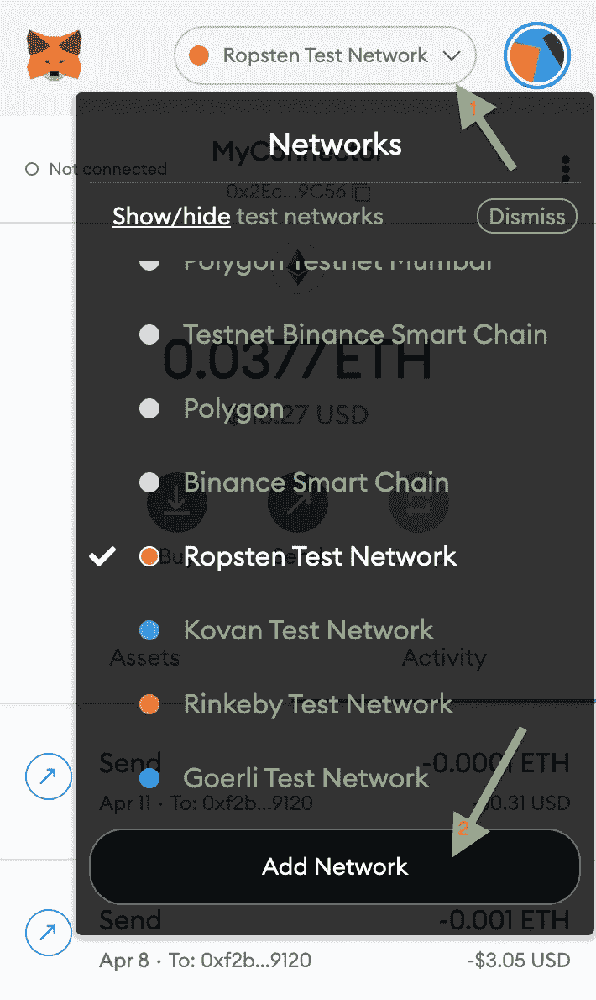

然后，您将看到以下屏幕:

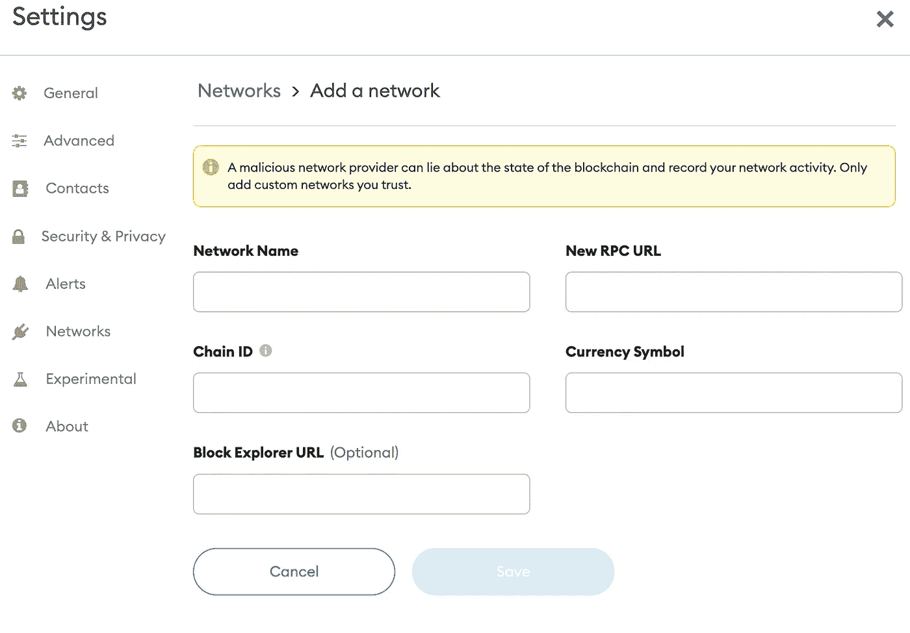

**让我们用自定义 RPC 信息填充这些字段。**

1.  对于您的网络，您可以指定任何您想要的名称。我们将使用 Ropsten 测试网络，在本例中，我们将其命名为 WatchData Ropsten
2.  对于新的 RPC URL 字段，生成一个键并复制您需要使用的区块链的 HTTP 链接。

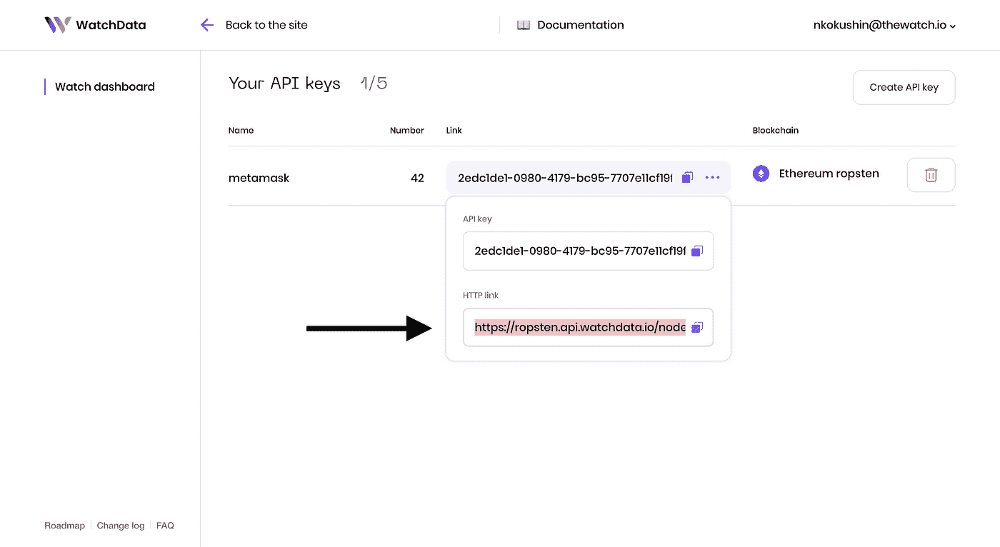

> 如果您无法登录您的帐户，请注册并创建您的个人密钥。

最终的 HTTP 应该是这样的:

```
[https://ropsten.api.watchdata.io/node/jsonrpc?api_key=Y](https://ropsten.api.watchdata.io/node/jsonrpc?api_key=b04681c9-f717-4db8-991e-37ae3270fd5b)OUR_API_KEY
```

3.查找您要连接的网络的链 ID。

*   以太坊主网— chainID = 1
*   以太坊 Ropsten — chainID = 3

4.**货币符号**和**块浏览器 URL** 是可选的。对于大多数链，这里不需要输入。

完成后，您的配置应该如下所示:

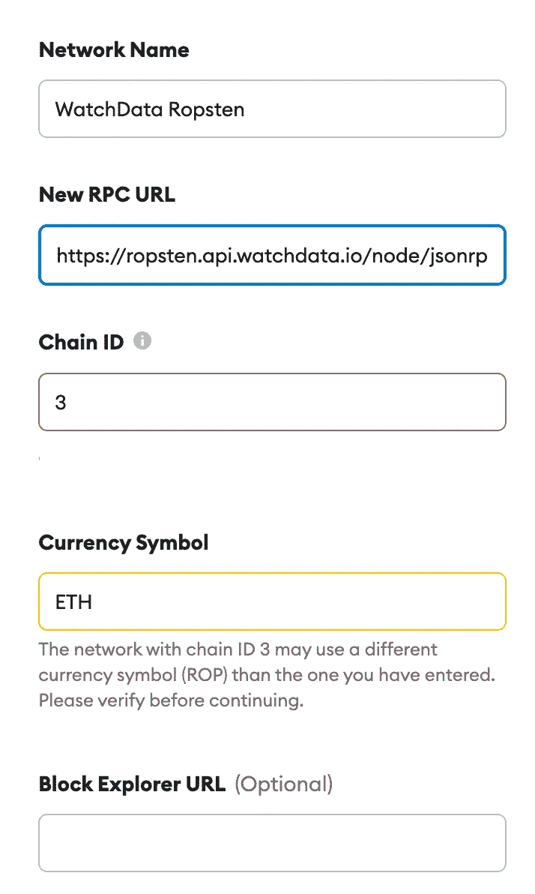

如果你得到一个警告也不用担心，例如:*“这个链 ID 目前被 ropsten 网络使用。”。*这只是 MetaMask 提醒你，同一条链有不同的配置，没问题。填写完这些信息字段后，只需点击“保存”即可！

**就这样！你完了！**

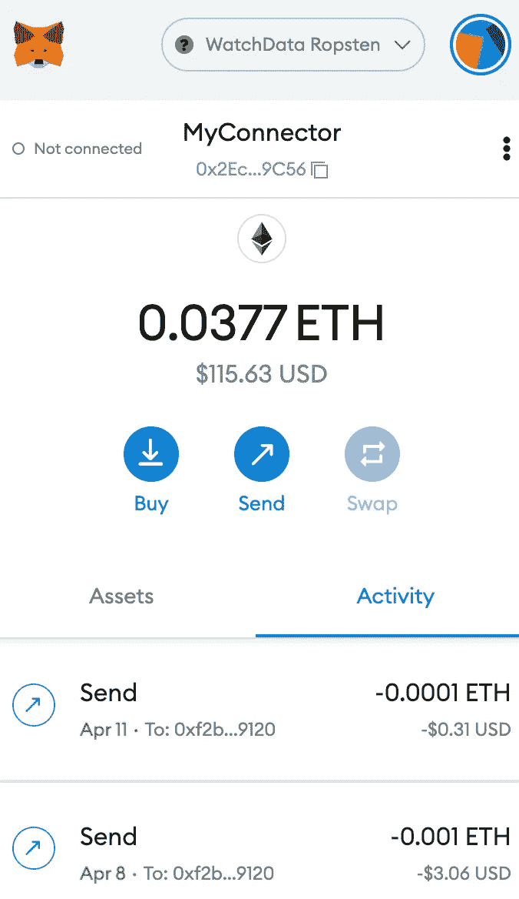

**现在让我们发送事务，看看它是如何工作的！**

我将在这个地址 0x F2 b 92 ee 818 A8 ea 2095 b13c 831 F5 a 7010 b 3299120 转移测试硬币

为此，只需选择 WatchData 网络，然后点击“发送”按钮，输入收件人的地址和令牌数量。

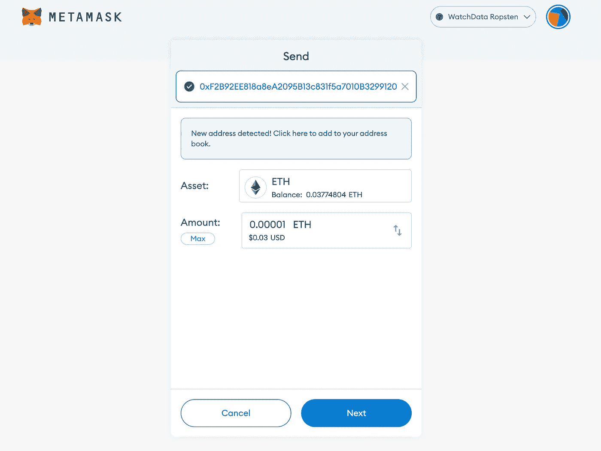

您将看到一个横幅，警告您发送交易，如果您同意，请单击“确认按钮”，您的交易将被发送给收件人

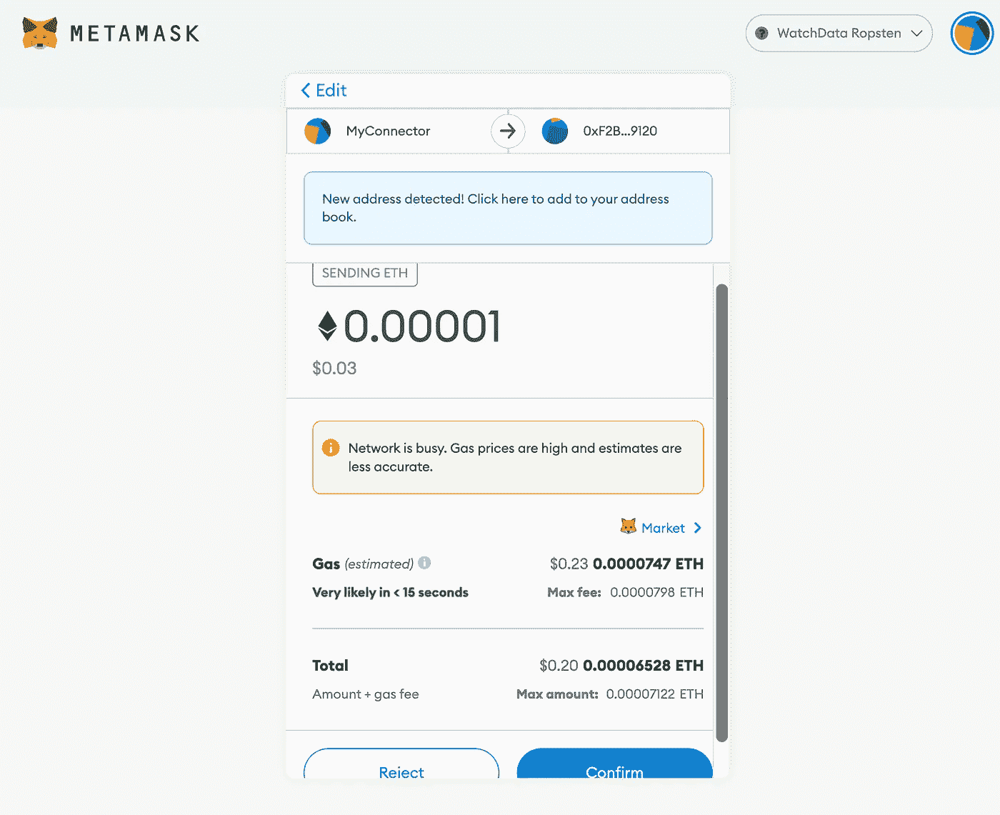

发送后，您的事务立即获得待定状态。您也可以在[以太扫描](https://ropsten.etherscan.io/)上检查其状态

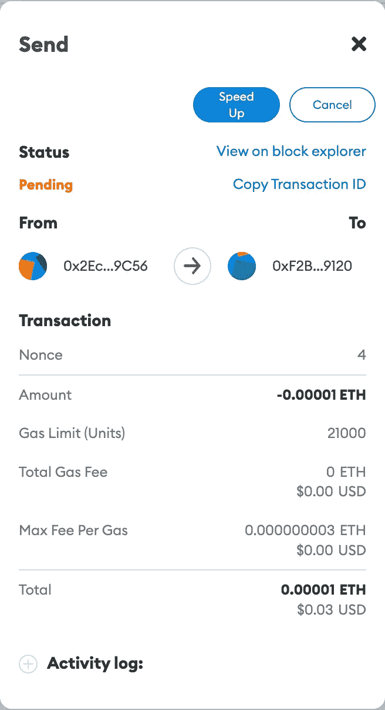

如我们所见，交易成功发送。

下面是它的 hash[0x 003 b 404806 e 714 be b8 c 10 a 7 e 222 b 212270 CCC 9 a 43 a 60d 9 BD 7 feb 7 c 841 a 027 b 93](https://ropsten.etherscan.io/tx/0x003b404806e714beb8c10a7e222b212270ccc9a43a60d9bd7feb7c841a027b93)

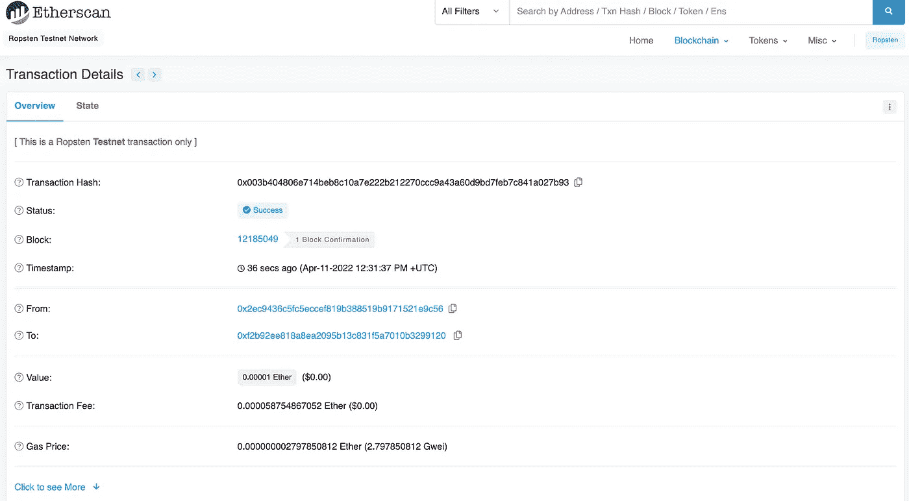

今天就到这里，伙计们！我希望这篇文章对你有用。您可能已经注意到，将 WatchData 添加到元掩码非常简单明了。

> 加入 coin monks[Telegram group](https://t.me/joinchat/Trz8jaxd6xEsBI4p)学习加密交易和投资

谁知道呢，也许你会觉得我们的区块链 api 很有趣:)

> [](https://bit.ly/3vsLqpJ)***注册 WatchData 现在就开始享受我们 API 的所有好处吧。***

**试试我们独特的产品驱动的 API。只需点击一下鼠标，即可从区块链获得大量信息！**

# **有用的链接**

*   **[WatchData main](https://bit.ly/3qazk2l)**
*   **[WatchData 推特](https://twitter.com/watchdata_io)**
*   **[观察数据不一致](https://bit.ly/3wbP3Cq)**
*   **[WatchData 文档](https://bit.ly/3tfwj2R)**