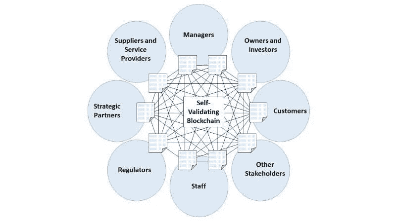

# 为什么你应该以 DAO 的形式启动你的创业

> 原文：<https://medium.com/coinmonks/why-you-should-launch-your-start-up-as-a-dao-ccdf7cb8fcc?source=collection_archive---------43----------------------->

## 企业家和道

*“最富有的 10%的人拿走了全世界一半以上的收入”*

莎拉是新毕业的。这些年来，她一边读书，一边从家乡购买各种时尚饰品，转卖给同学。

她的无品牌小生意越做越大，她赢得了如此多的顾客。现在她想把它建成一个正式注册的企业。

莎拉认为她别无选择，只能公开注册成为一家公司。但是说真的，为什么必须是公司呢？有没有更好的选择？

几十年来，公司一直是想创办新企业的企业家的解决方案。

公司是利润驱动的企业。该公司接受投资者和股东的资金，为他们提供收益。
同时确保如果企业破产，他们不会遭受损失。

公司在一种系统中运作，在这种系统中，成员根据相对地位或权威进行排名。

高层的首席执行官拥有最高权力，做出最终决策。

这种做法的另一个不利之处是，低层员工的辛勤工作报酬很低。

如果 Sarah 可以拥有一个由员工和客户组成的社区，他们可以对业务成功的步骤发表意见，

所有积极的参与者都会得到适当的奖励。类似的事情是存在的，它们是合作。

然而，要开始合作，注册过程是一个麻烦。之后，你必须获得物理空间(办公室)，并获得必要的设备和家具。

初创企业的合作受到地理位置的限制。人力资源经理、会计和行政人员也必须被雇佣。

这对莎拉来说是个巨大的负担，因为她是初学者。

莎拉可以避免经历所有这些，如果她组织她的业务作为一个分散的自治组织。

阿道不需要实体办公空间。

DAOs 的规则和操作是在它的代码和智能合约上设置的。这是不可更改的，任何人都可以看到

智能合同完成了人力资源经理和行政人员的工作。

包括工资支付在内的所有交易都存储在区块链上，任何人都可以看到。

世界上任何地方的任何人都可以加入任何道。

DAO 可以通过创建和出售其令牌来获得资金。不需要不知名的投资人和股东。

Dao 在成员之间有更好的沟通和互动。所有决定都是一致做出的，每个人都有发言权。

莎拉可以顺利地启动一把刀。Dao 开始被主流采用。未来就在这里。

> 加入 Coinmonks [电报频道](https://t.me/coincodecap)和 [Youtube 频道](https://www.youtube.com/c/coinmonks/videos)了解加密交易和投资

# 另外，阅读

*   [有哪些交易信号？](https://coincodecap.com/trading-signal) | [Bitstamp vs 比特币基地](https://coincodecap.com/bitstamp-coinbase) | [买索拉纳](https://coincodecap.com/buy-solana)
*   [ProfitFarmers 回顾](https://coincodecap.com/profitfarmers-review) | [如何使用 Cornix 交易机器人](https://coincodecap.com/cornix-trading-bot)
*   [十大最佳加密货币博客](https://coincodecap.com/best-cryptocurrency-blogs) | [YouHodler 评论](https://coincodecap.com/youhodler-review)
*   [my constant Review](https://coincodecap.com/myconstant-review)|[8 款最佳摇摆交易机器人](https://coincodecap.com/best-swing-trading-bots)
*   [MXC 交易所评论](/coinmonks/mxc-exchange-review-3af0ec1cba8c) | [Pionex vs 币安](https://coincodecap.com/pionex-vs-binance) | [Pionex 套利机器人](https://coincodecap.com/pionex-arbitrage-bot)