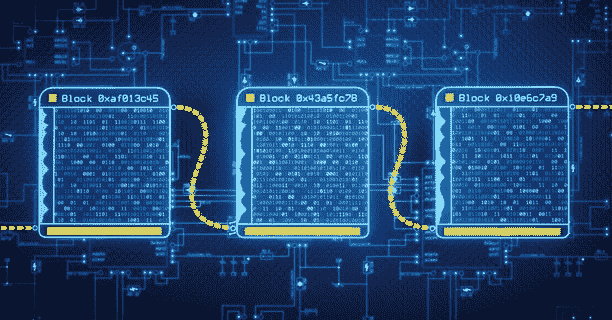
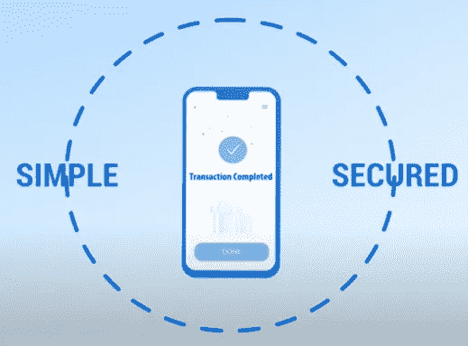
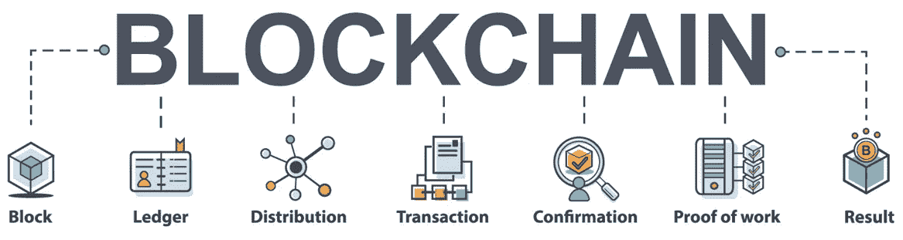
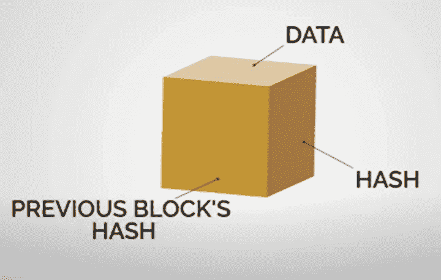
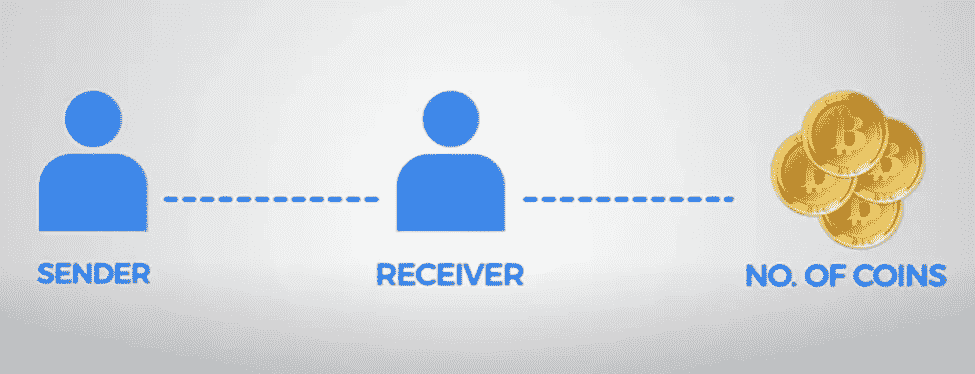
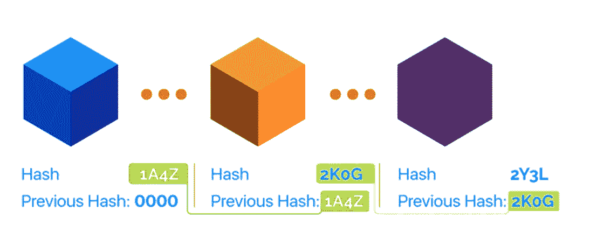

# 2022 年为什么要学区块链

> 原文：<https://medium.com/coinmonks/why-you-should-learn-blockchain-in-2022-81cd1bb91b5f?source=collection_archive---------21----------------------->

## ***区块链是 2022 年最抢手的技术之一。这不仅有助于你在工作中取得进步，也有助于你提升自己的形象。***

在过去几年里，你肯定听过很多“区块链技术”这个术语，最有可能与比特币等加密货币相关。事实上，你可能会问，“什么是区块链技术？”区块链似乎是一个老生常谈，但只是在理论意义上，因为没有外行人可以理解的有意义的意义。

**让我们探索更多关于区块链技术的知识！**

你有没有想过有没有更简单安全的方式来完成交易？你是不是也觉得对付网上钱包、银行、第三方应用就够了？

好吧，如果你对这些问题的答案是肯定的，那么这里是你需要知道的关于区块链的一切。

每次当你在选举中投票时，你有没有想过，是否有任何保证你的选票会被计算或不会有任何骗局，我们得到这个叫做印度选举委员会的中央机构的保证，并盲目信任他们。如果我们能够将这一权力掌握在手中，或者向自己保证，是的，我们的选票正在被计算在内，而不是相信其他一些权力机构，那会怎么样？你知道吗，这可以通过一个结构良好的区块链来完成，不需要任何更高的权威或第三方的确认。

中本聪在 2009 年采用了同样的技术创造了一种数字加密货币，俗称比特币。区块链现在非常受欢迎。

区块链最初是由一组研究人员在 1991 年引入的，目的是给数字文档加上时间戳，这样它们就不会像公证人一样被篡改。然而，直到 2009 年比特币的创造者中本聪(SATOSHI NAKAMOTO)采用了区块链，它才被全球采用或变得重要。

**区块链到底是什么？**

简而言之，区块链是一个独特的系统，它记录数据的方式变得很难，或者说几乎不可能**改变、入侵或欺骗系统**。

区块链本质上是一个交易的数字分类账，分布在区块链的整个计算机系统网络上，对任何人和所有人完全开放。顾名思义，区块链是一个由多个块组成的链，每个块包含几个事务，每次有新的或最新的事务时，这些事务就会累加起来。为了确保最大的安全性，每次有新的交易时，记录都会添加到每个参与者的分类账中，以保证工作的透明度。一旦数据被记录在区块链中，由于其独特的工作方式，几乎不可能改变。

**区块链是如何工作的？**

好吧，让我们仔细看看这个区块，了解区块链的功能。

区块链的每个街区主要包含三样东西:

1.  数据
2.  块的哈希
3.  上一个块的散列

因此，我们将从存储在每个块中的**数据**开始。有不同类型的区块链，每个数据块中存储的数据高度依赖于它是哪种类型的区块链。

我们将通过一个例子来理解，

比特币区块链存储了交易细节，包括发送方**、接收方**以及最重要的已交易硬币数量**。**

****

**接下来，我们将看到关于**哈希**，任何参与者众多的分散数据库都被称为**分布式分类账技术(DLT)** 。类似地，区块链是 DLT 的一种类型，因为它由几个参与者管理，在这些参与者中，交易是用严格的加密签名(通常称为哈希)来记录的。**

**我们可以将哈希与指纹进行比较，因为它总是唯一的，就像指纹一样。每个哈希都通过这个哈希或指纹来标识其块和内容。一旦创建了块，就计算其哈希。每当块中的数据发生某些或其他变化时，哈希就会自动受到干扰，换句话说，当您想要检测块的变化时，哈希是非常重要的块元素。如果您发现指纹或哈希发生了变化，它就不再是同一个块了。**

**现在，块的第三个也是最后一个元素是前一个块的**散列，让我们首先知道区块链的这种技术是中本聪能够信任比特币系统的原因，因为它确保了数据的最大安全性。****

**在区块链中，前一个块的哈希有效地创建了脾气验证序列中的块链，因为哈希异常敏感。这些块中的每一个都存储了它前面的块指纹以及它自己唯一的指纹。此外，您输入的任何信息都存储在这些块中。**

****

**它们的哈希将这些块相互连接，因此，如果您试图篡改任何块的数据，该特定块的指纹或哈希将自动更改，从而导致所有后续块发生更改，因为这些块是相互连接的。最终整个区块链都会被摧毁。**

**因此，几乎不可能篡改数据块中的数据，因为一旦定义了数据，以后就不能更改。**

****学习区块链技术的原因？****

**这是人们谈论最多的技术之一，它将成为继互联网之后的“下一件大事”，因为它提供了一种在网络上建立数字信任的机制。目前，这项技术正被整合到各个部门的现有系统和流程中。这是一项多方面的技术，预计将在未来产生深远的影响。**

**下面列出了你现在应该学习区块链的原因:**

**一个繁荣的就业市场，有极好的职业机会**

**对区块链专业人员的大量需求**

**越来越多地采用区块链技术**

**跨各种行业的广泛应用**

**改善数据隐私并确保更好的网络安全**

**突破性技术提高透明度和改善治理**

**进行更明智的投资并增加利润**

**我希望这篇文章能激励你和我一起踏上区块链之旅。**