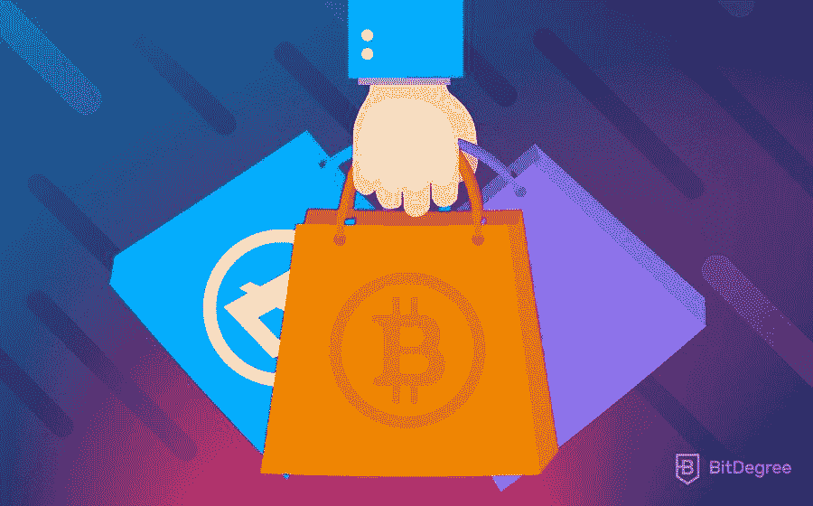
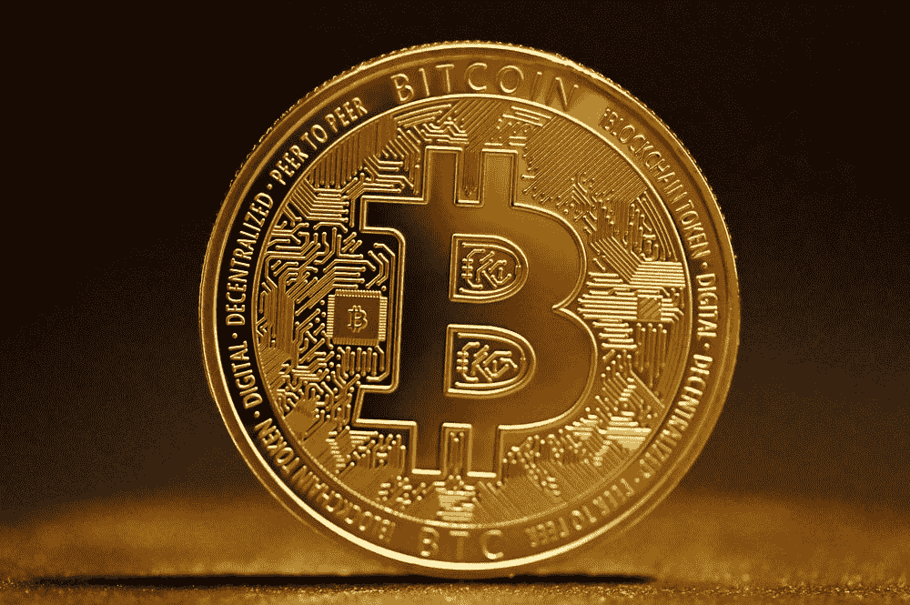
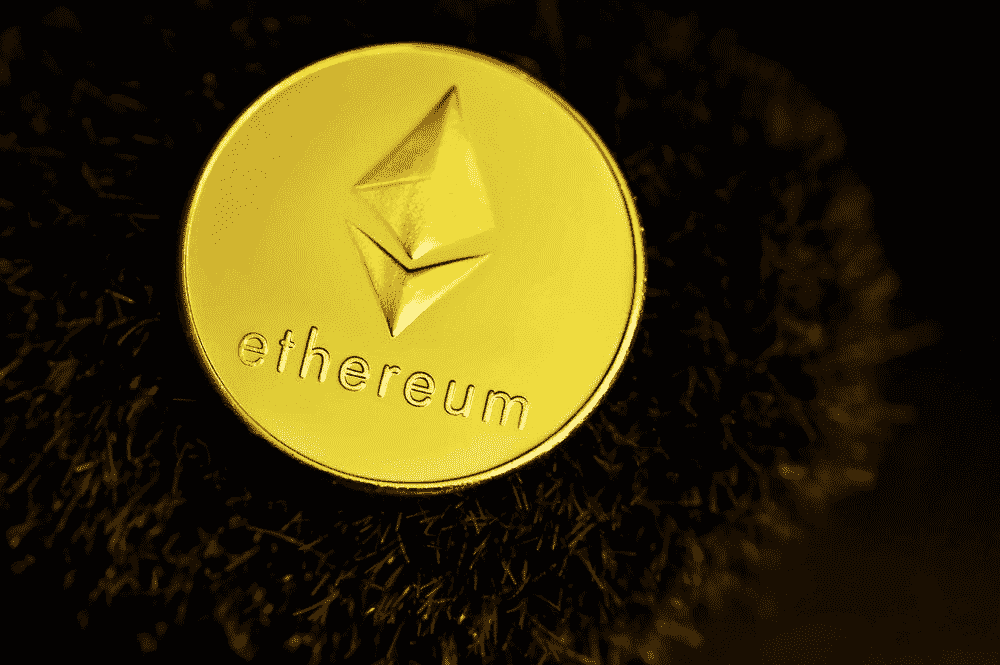
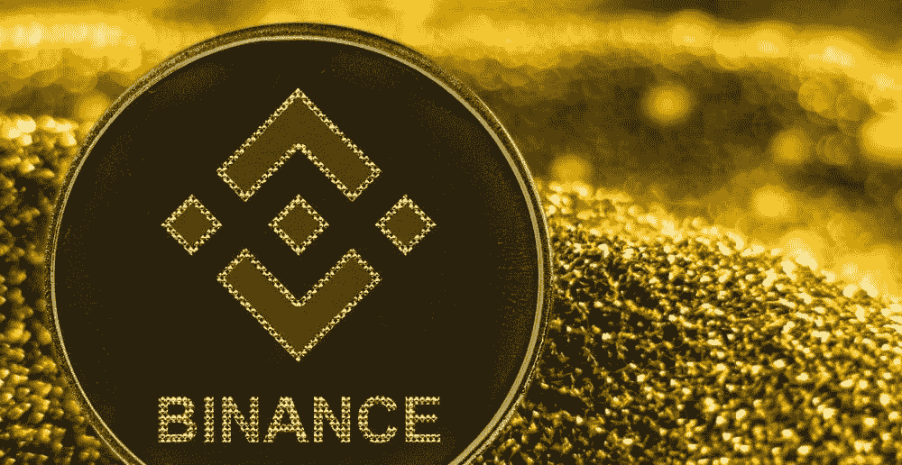
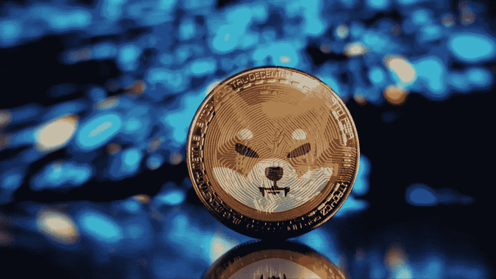
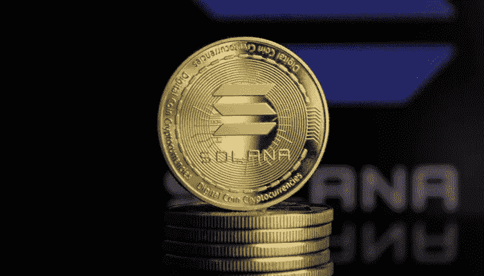
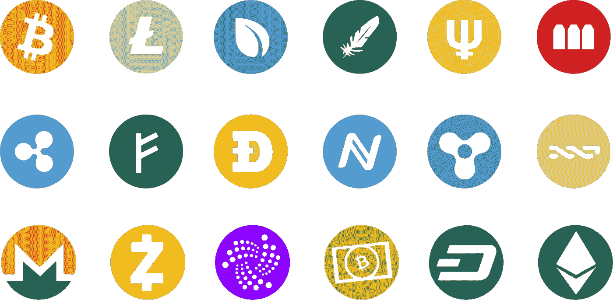

# 为什么你应该拥有至少 1 种加密货币？哪些加密硬币有长期盈利回报？

> 原文：<https://medium.com/coinmonks/why-you-should-own-at-least-1-cryptocurrency-fdb6185542bf?source=collection_archive---------39----------------------->

Image Source: BitDegree

考虑今天投资一项资产，一年后获得超出你预期的利润。听起来棒极了。在适当的情况下，借助必要的投资专业知识，这是可能的。

接触各种市场资产或投资计划变得比以往任何时候都更容易。只需轻轻一点，你就可以了解任何投资计划，包括它的好处，投资回报，以及任何与赚取收入有关的事情。

[*加密货币*](/coinmonks/simple-way-to-understand-cryptocurrency-by-day-to-day-examples-9f3bb62f7c9c) 投资就是这样一种可能给你带来丰厚利润的投资。这似乎是有争议的！

取决于你住在哪里，加密货币要么是合法的，要么是非法的，许多人对投资它持怀疑和偏执的态度。

> “由于缺乏适当的知识，加密货币被印度政府和不了解加密货币的公众视为一种赌博或彩票计划。”

许多了解比特币知识的投资者在过去十年中取得了非凡的成功，其技术对未来世界来说是如此具有革命性，以至于它是金融不可否认和不可避免的未来。

> “加密货币作为一项技术有其自身的优势和各种应用，在适当的实施和指导下，可以加强我们的经济。”

从我的经验来看，加密货币是一种可以消除传统金融漏洞和壁垒的技术。加密货币消除了市场中的腐败和交易操纵，因为它的过程是透明的，对运行区块链的每个设备都是可见的。

作为加密货币的投资者，在下达任何买卖订单时，关注加密的基本面和技术面更为重要。

有许多硬币，你可以选择投资，并获得良好的长期回报。根据我的经验，下面提到的这些硬币保证在动荡的市场中为你提供 100%的安全回报。

## [**比特币(BTC):**](https://bitcoin.org/en/)

加密货币之王，比特币是所有投资者的绝对最爱。比特币之所以成为一种必须拥有的货币，是因为其强大的基本面理解和区块链算法，该算法可以在国际市场上提供两种不同货币之间的轻松流动性(比如通过比特币轻松地将₹兑换成美元，无需任何手续)。

比特币拥有开放总账区块链技术，通过提供显示买家和卖家之间发送的比特币数量的交易 id，为货币和可跟踪交易提供了便捷的流动性。

比特币的供应量有限，只有 2100 万枚。这造成了稀缺性，矿工的采矿奖励每 4 年减半，使得赚取免费比特币的机会更少，从长期来看，这增加了比特币的价值。

> 这种理念使得比特币成为中非萨尔瓦多的法定货币，受到加拿大、美国、法国、英国、阿联酋和许多其他国家的监管。

## [**【以太坊(ETH):**](https://ethereum.org/en/)

以太币是所有加密货币中市值第二大的货币，仅次于比特币。以太坊从根本上来说是强大的，并得到了去中心化组织以太坊及其创始人 Vitalik Buterin 的支持。

以太坊是一个开源的区块链，个人/企业可以创建自己的区块链项目或加密货币令牌，跟踪数据库记录或永久存储文档，并且是安全的。

以太坊提供了一个 NFT(不可伪造的代币)交易的生态系统和一个为矿工创造收入的模式，并在以太坊交易中收取部分汽油费。

因此，对于初学者来说，拥有以太坊是必须的，因为它的项目背后有着内在的价值和愿景。

## [币安币(BNB):](https://www.binance.com/en)

币安币是由中央集权公司交易所及其创始人赵昌鹏支持的最聪明的区块链项目之一。币安在币安链上运营，在促进交易所应用程序中的交易网络、提供智能合约服务、NFT 交易以及在 Web 3.0 上构建软件应用程序方面有多个用例。

币安区块链有一个自动燃烧机制，限量供应 2 亿枚硬币，只有在维持其内在市场价值时才会耗尽。

币安硬币集中提供类似于银行的服务和盈利方案，如赌注(加密定期存款)、Defi 赌注(持有债券并产生利息回报)和其他设施，如一个加密硬币到另一个的转换(比特币到币安硬币，索拉纳硬币到以太币)。

这使得币安硬币成为最聪明的投资硬币之一，除了交易和投资之外，还有一个保证盈利的模式。

## [柴犬(SHIB):](https://shibatoken.com/)

Image Source: VOI

柴犬是一个迷因币，最初被设计为 dogecoin 杀手和 dogecoin 竞争对手。柴犬在埃隆·马斯克和大企业家的影响下运营。如果投资时机正确，单日提供 10 倍的投资回报！

**不建议将柴犬币作为长期投资**，但短期投资和多种使用案例，如促进电影票预订(在美国)，以及与旅游公司的合同，使这种硬币不仅仅是一种迷因币。

## [**索拉纳币(SOL):**](https://solana.com/)

Image Source: Blaze Trends

Solana coin 于 2019 年推出，上市价格仅为 0.55 美元，自那以来，由于其智能合同计划和为 web 3.0 开发构建应用程序或软件的服务，它的旅程一直在稳步攀升，越来越受欢迎。

最近的新闻显示，索拉纳硬币甚至被美国政府接受(将来作为官方签证硬币)。

Solana coin 被许多投资者视为以太坊的竞争对手，因为与以太坊相比，它的开采成本低，使用其服务的电力消耗少。Solana 通过降低交易的会计成本和电力消耗，使交易具有可扩展性。

Solana coin 提供类似于币安硬币和以太坊的服务，具有独特的股权证明(PoS)和历史证明(PoH)机制，记录每笔交易的时间和 IP 地址，使其成为透明的区块链。

因此，从基本面来看，Solana 受到许多名人和商业投资者的信任，并承诺基于其用例的长期回报。

## **底线:**

目前，有超过 1200 个加密硬币或代币在加密世界中运行。每个加密硬币都有不同的用途和基本用例，提供其内在价值并产生投资者的兴趣。

> 最好是投资能提供长期稳定回报的加密硬币，而不是通过投资任何随机硬币来追逐短期收益。

> 上面提到的硬币只是我的观点，因为在目前的市场情况下，它受到许多投资者的信任。这不是任何投资建议。
> 
> “谢谢你读我的文章。鼓掌、分享并关注我的[个人资料(点击此处)](/@barateprajwal25)以了解更多更新和内容。”
> 
> 加入 Coinmonks [电报频道](https://t.me/coincodecap)和 [Youtube 频道](https://www.youtube.com/c/coinmonks/videos)了解加密交易和投资

# 另外，阅读

*   [最佳以太坊钱包](https://coincodecap.com/best-ethereum-wallets) | [电报上的加密货币机器人](https://coincodecap.com/telegram-crypto-bots)
*   [交易杠杆代币的最佳交易所](https://coincodecap.com/leveraged-token-exchanges)
*   [最佳加密分析或链上数据](https://coincodecap.com/blockchain-analytics) | [Bexplus 评论](https://coincodecap.com/bexplus-review)
*   [NFT 十大市场造币集锦](https://coincodecap.com/nft-marketplaces)
*   [AscendEx Staking](https://coincodecap.com/ascendex-staking)|[Bot Ocean Review](https://coincodecap.com/bot-ocean-review)|[最佳比特币钱包](https://coincodecap.com/bitcoin-wallets-india)
*   [Bitget 回顾](https://coincodecap.com/bitget-review)|[Gemini vs block fi](https://coincodecap.com/gemini-vs-blockfi)|[OKEx 期货交易](https://coincodecap.com/okex-futures-trading)
*   [美国最佳加密交易机器人](https://coincodecap.com/crypto-trading-bots-in-the-us) | [经常性回顾](https://coincodecap.com/changelly-review)