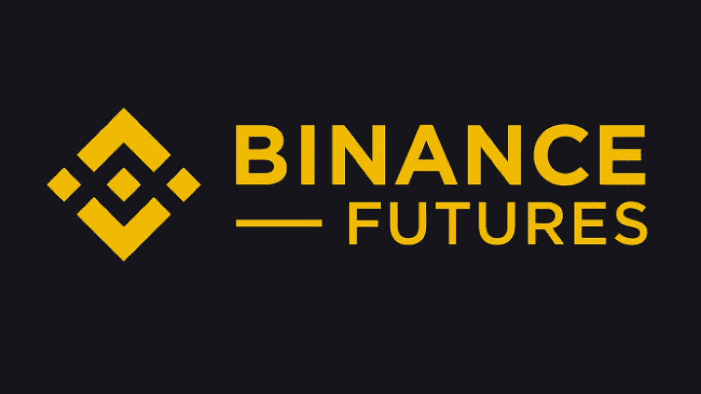

# 为什么你应该交易币安期货

> 原文：<https://medium.com/coinmonks/why-you-should-trade-on-binance-futures-8000693a96f0?source=collection_archive---------21----------------------->

[SOURCE](https://cryptopotato.com/binance-futures-beginners-guide-exchange-review/)

> 葡萄酒还是啤酒？城市还是农村？说话还是听？Doge 还是柴犬？长还是短？

生活中最美好的事情之一是有选择的余地和探索各种事物的自由。无论是这样还是那样，或者是在众多选项中做出选择，变化都是生活的调味品。因此，不难理解为什么加密衍生品交易在交易员中迅速变得非常流行。事实上，每个月都有数万亿美元的交易，交易范围也在不断扩大，因为越来越多的交易者不断寻找快速获利的机会，而不管市场的走向如何。考虑到这一点，领先的加密货币交易平台，如币安，为用户提供了广泛的交易选项，不仅提供现货交易，还提供保证金、期权和期货交易。在这些产品中，如果期货交易是你喜欢的，那么这篇文章就是为你准备的。所以和我一起去冒险吧！让我们探讨一下为什么币安是期货交易的最佳交易所。

# 为什么要和币安交易期货？

与币安进行期货交易有很多好处，因为用户可以利用高流动性、低交易费用和广泛的杠杆来进行交易。

但是还有更多。。。

## **大量可供选择的交易对**

回到关于期权的美丽的整个讨论，币安期货将它带到了一个全新的水平，因为它提供了一系列广泛的加密货币交易对。目前，有超过 530 个加密对加密交易对。用户可以交易任何东西，从重量级(如或 ETH)到 DeFi tokens(如 UNI 或 DAI)到 memecoins(如 Dogecoin 和 Shiba Inu)。但这并没有结束，因为新的硬币不断上市，为交易者提供最佳的交易体验。

## **流动性**

币安期货是加密货币市场中流动性最强的衍生品交易所之一，这意味着交易者总是可以期待他们的买卖订单得到及时满足，甚至不用担心滑点。

## **交易费用低**

费用越低越好。对吗？然后我有一条有趣的消息。事实上，这是我最喜欢的方法之一，任何每天进行多次交易的人都会同意我的观点，低费用是件好事。你猜怎么着？有了币安期货，你不必担心过高的费用。该平台的收费结构非常低。在币安期货上，做市商/接受者费用可以低至 0.000%/0.017%。对于像我这样的交易者来说，这意味着我们可以保留辛苦赚来的利润。我说阿门，如果你认为这是疯狂的，那么当你发现这些费用可以通过简单地持有 BUSD 或 BNB 而被进一步削减时，你会发疯的。

## **卷**

币安拥有超过 2860 万活跃用户，无可否认的事实是交易量很大。大量的币安用户帮助该平台实现了数万亿美元的交易量。在 2021 年，币安独自承担了 7.7 万亿美元的加密交易量，并在 24 小时内达到 760 亿美元的峰值。

## **多语言支持**

认识到庞大的用户群和随之而来的多样性，币安提供了令人难以置信的客户服务，支持 17 种不同的语言，以及一个非常容易使用的用户界面。这意味着，无论你来自世界的哪个角落，币安都会覆盖你，你可以参与到加密革命中来。万岁！

## **安全**

有句话说得好，“权力越大，责任越大。”币安深知这一责任，并建立了世界上最安全的交易平台之一。多种安全功能(如 KYC、2FA 和反网络钓鱼代码)已经到位，以帮助用户保护自己免受恶意行为者的攻击。此外，用户可以保证他们的资金是币安的 SAFU，因为该交易所拥有 3 亿美元的保险基金，以保护破产交易者免受不利损失，同时确保获胜交易者的利润得到全额支付。

你还在等什么？真的，你还在等什么？利用这些好处，开始与币安交易期货。还没报名吗？从这里开始:【https://www.binance.com/en/buy-sell-crypto?ref=YA35VD1V】T4

***还有哦，别忘了注意安全！回头见。***

## 参考

 [## 你应该在币安期货交易的 10 个理由|币安博客

### 币安期货提供了大量的密码选择，新的硬币不断上市，为交易者提供…

www.binance.com](https://www.binance.com/en/blog/futures/10-reasons-why-you-should-trade-on-binance-futures-421499824684903288) 

> 加入 Coinmonks [电报频道](https://t.me/coincodecap)和 [Youtube 频道](https://www.youtube.com/c/coinmonks/videos)了解加密交易和投资

# 另外，阅读

*   [Bookmap 评论](https://coincodecap.com/bookmap-review-2021-best-trading-software) | [美国 5 大最佳加密交易所](https://coincodecap.com/crypto-exchange-usa)
*   [如何在 FTX 交易所交易期货](https://coincodecap.com/ftx-futures-trading) | [OKEx vs 币安](https://coincodecap.com/okex-vs-binance)
*   [CoinLoan 评论](https://coincodecap.com/coinloan-review) | [YouHodler 评论](/coinmonks/youhodler-4-easy-ways-to-make-money-98969b9689f2) | [BlockFi 评论](https://coincodecap.com/blockfi-review)
*   [XT.COM 评论](https://coincodecap.com/profittradingapp-for-binance) | [币安评论](https://coincodecap.com/xt-com-review)
*   [SmithBot 评论](https://coincodecap.com/smithbot-review) | [4 款最佳免费开源交易机器人](https://coincodecap.com/free-open-source-trading-bots)
*   [比特币基地僵尸工具](/coinmonks/coinbase-bots-ac6359e897f3) | [AscendEX 审查](/coinmonks/ascendex-review-53e829cf75fa) | [OKEx 交易僵尸工具](/coinmonks/okex-trading-bots-234920f61e60)
*   [如何在印度购买比特币？](/coinmonks/buy-bitcoin-in-india-feb50ddfef94) | [瓦济克斯评论](/coinmonks/wazirx-review-5c811b074f5b)