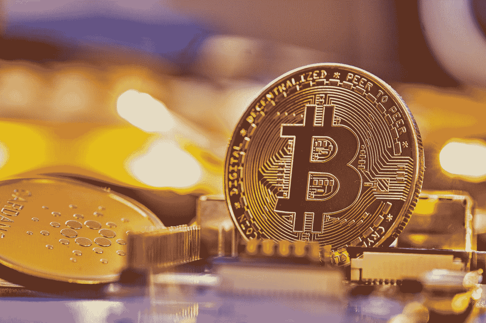
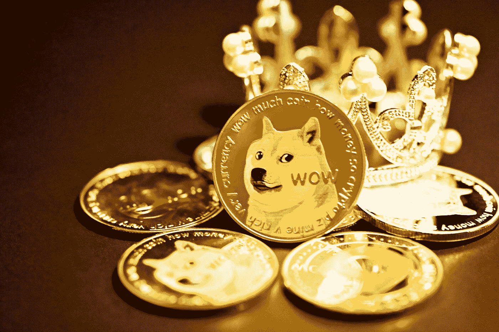
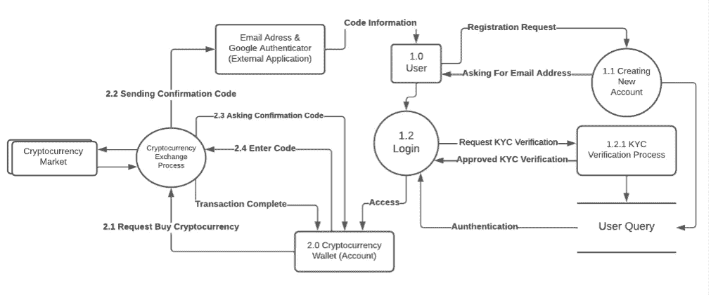
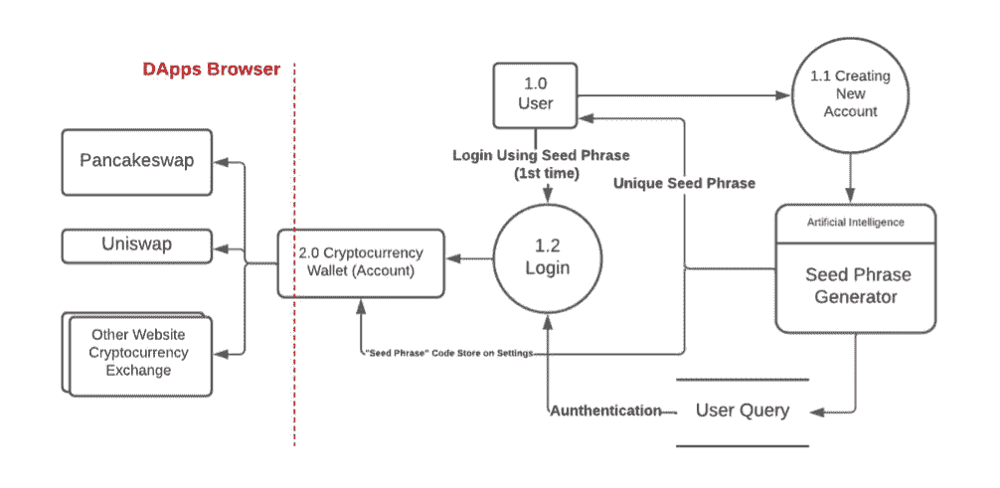
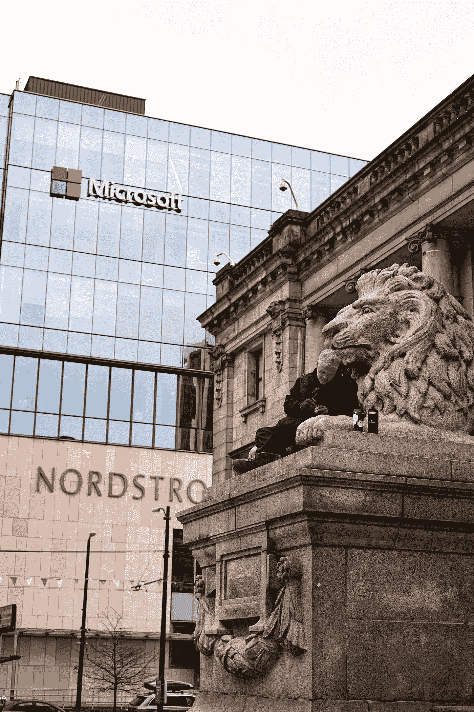

# 从网络安全的角度来看，为什么你不应该把所有的钱都投入到替代货币中

> 原文：<https://medium.com/coinmonks/why-you-shouldnt-pour-all-your-money-into-an-altcoin-a-cybersecurity-perspective-63dbe8e356f2?source=collection_archive---------41----------------------->

Photo by [Michael Förtsch](https://unsplash.com/@michael_f?utm_source=medium&utm_medium=referral) on [Unsplash](https://unsplash.com?utm_source=medium&utm_medium=referral)

> 我自担风险，我只是从安全的角度给出应用，而不是硬币价值的“波动”和“涨跌”

加密货币自 2013 年以来一直在发展，其概念与比特币相同，是一种没有商品(即国家货币，黄金)支持的纯网络货币*【1】*。

如今，加密货币不仅仅限于比特币，还包括另一种区块链货币(以太坊、卡尔达诺、币安币)。这些导致了应用程序、网站和平台的巨大发展，以便购买这些多种类型的加密货币。币安交易所是世界上最大的加密货币钱包之一；很多人使用这个平台，是因为觉得这是一个安全有保障的购买加密货币的系统。该系统使用一个 google authenticator 应用程序和一个双因素认证，该认证与每笔交易中的电话号码和电子邮件相关联(见图 1)。

它还使用 KYC(了解你的客户)识别，如活性检测，以避免欺骗攻击[2]。

## 那么什么是 alt-coin 呢？一种毫无价值的新硬币，有时会爆炸！10000%成为某种有价值的东西(仍然很低，但是你用 1 美元乘以 10000，给自己买了一辆新车，而不是一辆好车)

是的，新的加密货币正在快速发展，并不是所有的加密货币都在币安平台上市。此外，币安正在发布币安智能链，这是一种集中式区块链，可以通过使用智能合同和现有的编码模板以简单的方式用于制造硬币[3]。

> 随着新加密货币(尤其是 alt-coin)的快速出现，以及手机、热门钱包和一切东西的使用量不断增加，开发人员正在开发一种新的加密货币移动钱包，他们的目标是让加密货币更容易使用[4，5]

Photo by [Kanchanara](https://unsplash.com/es/@kanchanara?utm_source=medium&utm_medium=referral) on [Unsplash](https://unsplash.com?utm_source=medium&utm_medium=referral)

> 你知道 dogecoin 是 altcoin 的一种吗？在进入币安并被埃隆先生剥削之前

保安呢。仅使用种子短语(私钥)代码作为钱包的唯一标识[6]。

这是主要原因:**应用** / **热钱包系统不安全**

这些移动钱包(即 Trustwallet、Metamask)没有 KYC 标识，并使用外部 web 服务(如 Pancakeswap)在其系统上购买加密货币。我试着分析购买加密货币的移动钱包的交易系统和加密货币内的区块链系统。(我稍后会解释这一点)

这是币安平台的架构…

看到这一点，投资币安是更可取和安全的

再次强调，投资风险自担…

> *这就像分析“拉斯维加斯赌场”的安全性，所有的警卫，闭路电视和东西——而不是赌博游戏*

Wow what a complex way to register yourself! (Good Job Binance!) — source : my own drawing and analysis

## Trustwallet？你真的能相信钱包吗？

> (免责声明:没有政治动机，因为这适用于其他平台，如 MetaMask，比特币基地等-你的名字)我只是喜欢押韵 lol

以下是我的一些技术分析…

**移动加密货币或热钱包交易系统**

该系统是在一个或多个应用程序中使用的加密协议[7]。

在注册阶段(例如 TrustWallet)，用户从应用程序获得私钥(种子短语)和加密货币钱包地址，而无需注册任何电子邮件地址或电话号码。这个私钥由来自 **BIP39 助记符**的 12-24 个随机短语单词组成，例如“金字塔”、“狼”、“短语”【8】。这些连续的唯一的 12-24 个随机短语代表创建新钱包后的用户帐户。

一旦应用程序创建了钱包，用户必须通过从他们的大账户(即币安交易所)向应用程序提供的地址发送加密货币来填充钱包。

然后，用户可以通过访问 Android 应用程序用户界面上的 DApps 选项卡来购买加密货币。DApps 页面上的界面是一个 web 浏览器，上面有一个外部加密货币网站的列表。在访问其中一个加密货币网站后，该网站会要求将用户的钱包连接到该网站。因此，他们可以事后在系统上兑换加密货币。

这是他们框架的可能解释，

No login, this is even worse than 5$ Fiv*rr editor website

为你所谓的“黑客”攻击留下了很大的空隙

# **微软著名分析方法:跨步**

Photo by [Mohammad Rezaie](https://unsplash.com/@heinrich_boll?utm_source=medium&utm_medium=referral) on [Unsplash](https://unsplash.com?utm_source=medium&utm_medium=referral)

STRIDE 威胁模型是微软推广的威胁模型之一，缩写代表欺骗、篡改、否认、完整性、拒绝服务和提升权限。该方法将通过以攻击者为中心、以系统为中心和以资产为中心来分析移动加密货币钱包系统。

第一个首字母缩略词表示欺骗，即使用他人的证件冒充他人[9]。在 TrustWallet 系统中，给予用户的唯一凭证是 12 到 24 个单词的种子短语。此外，任何用户都可以在输入种子短语之前访问钱包，而无需使用任何特定的 IP 或电子邮件登录。

可信钱包系统中最有可能发生以攻击者为中心的欺骗攻击，因为攻击者只需要获得恢复种子短语的机密性，就可以访问受害者的钱包并取走钱包中的所有加密货币。另一方面，强制使用 12 到 24 个单词的 BIP 39 助记符的恢复种子短语需要 12 到 24 个单词组合的 2^*256*可能性[10]，这很难做到，几乎不可能。

> 加入 Coinmonks [电报频道](https://t.me/coincodecap)和 [Youtube 频道](https://www.youtube.com/c/coinmonks/videos)了解加密交易和投资

使用 BIP 39 助记符的 12-24 个单词组合的加密是一种合适的加密方法。但是，在以系统为中心的情况下，攻击者可以使用另一种技术来重新获得机密短语代码，因为该代码位于应用程序内部(在设置选项卡下)。黑客技术，如网络钓鱼和使用间谍软件或剪贴板捕获恶意软件从移动设备收集数据，可以为攻击者检索代码。这种以资产为中心的攻击也有很高的影响；例如，在印度尼西亚有一个新趋势，许多名人，从音乐家到没有计算机科学背景的 YouTubers，正在创建自己的令牌，并说服他们的观众购买他们的令牌。[11]由于这种硬币易于制造和发行，它大多在 Pancakeswap 上上市。大多数观众是普通的家庭主妇和粉丝，他们对计算机科学，尤其是网络安全知之甚少，但他们正在投资数千美元[12]。这使得它们成为攻击者的完美目标。

第二个分析是篡改。篡改的定义是修改参数以操纵数据的细节、价格、产品数量和用户凭证[13]。在以移动钱包系统为中心的情况下，篡改几乎是不可能的，因为加密货币存储在区块链的单个记录上，这使得多台计算机拥有自己的数据库。即使他们篡改了移动应用程序，加密货币的数量和金额也将取决于更新后的区块链。以攻击者为中心，攻击者几乎不可能篡改应用程序，因为号码存储在高度加密的区块链中。

第三个是否认。当系统无法跟踪用户的交易或活动日志，并且无法追踪攻击者的身份时，就会发生否认攻击。在某些情况下，攻击者使用操纵来生成另一个名称以消除可追溯性[14]。与此同时，TrustWallet 系统无法跟踪钱包使用者的活动，因为攻击者所需的唯一凭证是种子短语。TrustWallet 系统仅将用户视为种子短语，因此很难在实际用户和攻击者之间进行比较。另一方面，TrustWallet 的开发者在创建新的钱包之前向用户提供一些法律条款，例如“如果我丢失了我的秘密短语，我的资金将永远丢失”和“我完全有责任保证我的秘密短语的安全”。使用这个法律术语，开发者并不打算追踪每一个可能的攻击者，并使攻击者没有否认攻击的动机，因为系统已经支持他们的活动变得不可追踪。

下一个是信息泄露，这是敏感数据的机密性的泄漏[15]。这可能很难，因为种子短语存储在系统数据库中。在以系统为中心的系统中，种子短语本身使用 12 到 24 个随机短语词加密，并保存在数据库中，不同的用户拥有他们自己唯一的种子短语。从以攻击者为中心的角度来看，这种攻击的可能性相对较小，因为数据库很难被攻破，并且没有特定的网站存储多个用户的大量种子短语。

如果有人在在线笔记、电子邮件收件箱和另一个网站上保存了他们的种子短语代码，被窃听和入侵的可能性会更高。当真实用户无法重新获得对系统或其他网络资源的任何访问权时，就会发生拒绝服务攻击[16]。在以系统为中心的移动加密货币钱包中，当用户试图在外部网站上购买加密货币时，可能会发生拒绝服务。攻击者只针对他们指定的外部网站来阻止用户的访问。然而，这种攻击的可能性相对较小。

相反，在[https://pancakeswap . finance](https://pancakeswap.finance)【17】上的首页已经出现了 DNS 劫持方式的 MItM 拦截。攻击者的动机是通过放置一个输入框来收集种子短语，以便受害者在进入网站时输入授权的恢复种子短语。

最后一个分析是特权的提升；当较低特权的用户获得对较高特权的访问时，特权提升发生。在这个移动钱包系统中，用户只能访问他们自己的钱包，而开发者不能访问他们的账户，因为种子短语是由算法特征生成的，这对该系统不构成威胁。

总之，STRIDE 模型面临的最大威胁是欺骗。攻击者的最高动机只是获得对种子短语的访问权，这是该系统的弱点，他们会不择手段获取种子短语代码。

这个应用程序很容易被欺骗，当他们得到你的种子密钥，那就是你的钱，你的希望和梦想刚刚消失，噗！因为恶搞。

这就是为什么没有一个网站或系统或应用程序可以安全地容纳另类硬币，但对于投资来说，如果你有一个妖精朋友建议你投资，试着把你 1/3 的财富都投进去

他不会保护你不被恶搞，或者他想恶搞你。

> 试着看看《华尔街之狼》，试着理解 shitstock，看看这家公司是什么样子
> 
> 是的，另类投资创业基本上是一样的
> 
> +总结每个人都在谈论的“这是未来”

**参考文献**

[1] Meiklejohn *等*，《一把比特币:匿名人支付的特征》，2013 年，第 127-140 页。

[2]泰雷兹集团，*银行业中的 KYC 是什么？(已更新)[在线]提供:https://www . Thales group . com/en/markets/digital-identity-and-security/banking-payment/issuation/id-verification/know-your-customer*

[3]币安，*如何创建自己的加密货币【在线】可用:*[*https://academy . binance . com/en/articles/How-to-create-your-own-cryptocurrency*](https://academy.binance.com/en/articles/how-to-create-your-own-cryptocurrency)

[4]radica ti Group Inc .*2021–2025 年移动统计报告*

【trust wallet，*什么是信托钱包？【在线】可用:*https://support . trust wallet . com/en/support/solutions/articles/67000659178-what-is-trust-wallet-

[6]币安，*什么是加密钱包？【在线】可用:*[*https://academy . binance . com/en/articles/crypto-wallet-types-explained*](https://academy.binance.com/en/articles/crypto-wallet-types-explained)

[7] R. Anderson，*安全工程:构建可靠的分布式系统指南*。约翰·威利的儿子们，2008 年。

[8]比特币，*种子短语定义【在线】可用:*[https://en.bitcoin.it/wiki/Seed_phrase](https://en.bitcoin.it/wiki/Seed_phrase)

[9]欧共体理事会，T *hreat 建模，威胁建模的重要性[在线]可用:*[*【https://www.eccouncil.org/threat-modeling/】*](https://www.eccouncil.org/threat-modeling/)

[10] Github， *BIP-39 助记符[在线]可用:*[*https://Github . com/bit coin/bips/blob/master/bip-0039 . mediawiki*](https://github.com/bitcoin/bips/blob/master/bip-0039.mediawiki)

[11] VOI，放轻松…新的 ASIX 代币在 Pancakeswap 交易，CoFTRA 的禁令还没有颁布？*【在线】可用:*https://voi . id/en/technology/133986/relax-new-asix-token-traded-on-pancakeswap-co tras-ban-is-not-enabled-yet

[12] D .潘嗣敬(2022 年 2 月)，*bui bu rugi ASIX token Dar 2500 万卢比 hing ga 1200 万卢比:Fomo tak paham resiko？【在线】可用:*[https://finance . detik . com/fin tech/d-5940743/bui bu-ngaku-rugi-asix-Dari-RP-25-juta-萨斯-RP-12-juta-fomo-tak-paham-risi ko](https://finance.detik.com/fintech/d-5940743/buibu-ngaku-rugi-asix-dari-rp-25-juta-sisa-rp-12-juta-fomo-tak-paham-risiko)

[13] A. K. Dalai，S. K. Panigrahy 和 S. K. Jena，“一种防止 web 应用程序中参数篡改攻击的消息认证新方法”， *Procedia Eng .*，第 38 卷，第 1495-1500 页，2012 年。

[14]j . detrix，*你需要知道的关于 DeFi 的一切[在线]可获得:*

[https://qz . com/2065446/everything-you-need-know-on-decentralized-finance-defi/](https://qz.com/2065446/everything-you-need-to-know-about-decentralized-finance-defi/)

[15] S. Marium，Q. Nazir，A. Ahmed，S. Ahthasham 和 A. M. Mirza，“使用 RSA 实现 EAP 以增强云计算的安全性”， *Int .基础应用科学。*，第 1 卷，第 3 期，第 177-183 页，2012 年。

[16]美国 CISA 州长，*了解拒绝服务攻击[在线]可用:*https://www.cisa.gov/uscert/ncas/tips/ST04-015

[17]a . Roy(2021 年 3 月)，DeFi 项目 DNS 劫持攻击:PancakeSwap 重新获得访问权；Cream 的网站仍然被攻破*【在线】可用:*[https://AMB crypto . com/defi-project-DNS-劫持-攻击-pancakeswap-regains-access-creams-网站-仍然被攻破/](https://ambcrypto.com/defi-project-dns-hijack-attack-pancakeswap-regains-access-creams-website-still-compromised/)

[18] IBM，*安全政策和目标[在线]可用:*[*https://www.ibm.com/docs/en/i/7.1?主题=安全-策略-目标*](https://www.ibm.com/docs/en/i/7.1?topic=security-policy-objectives)