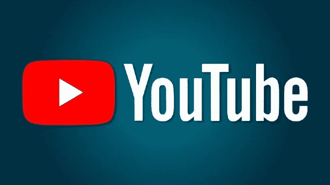

# 为什么 YouTube 计划帮助内容创作者进入 NFTs？

> 原文：<https://medium.com/coinmonks/why-youtube-plans-to-help-content-creators-get-into-nfts-fbefa144c265?source=collection_archive---------10----------------------->

继脸书、Instagram 和 Twitter 之后，轮到 YouTube 涉足加密货币的世界了。视频托管平台目前正在探索为内容创建者添加与不可替换令牌(NFT)相关的功能的可能性。

Why YouTube plans to help content creators get into NFTs ?

## YouTube 关注 NFTs