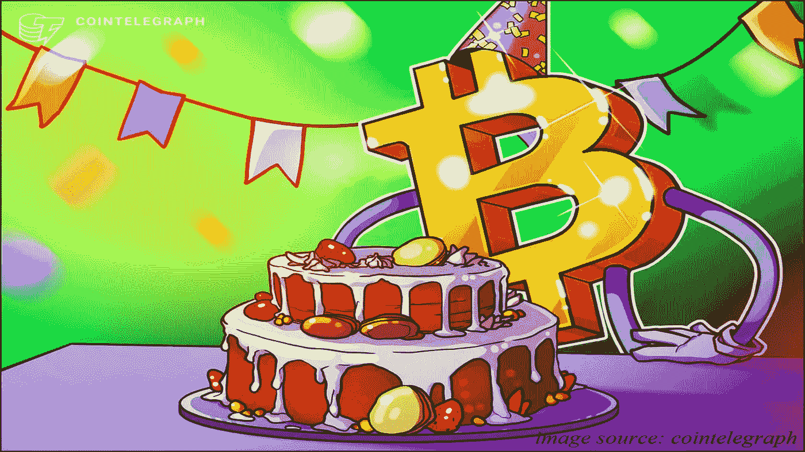
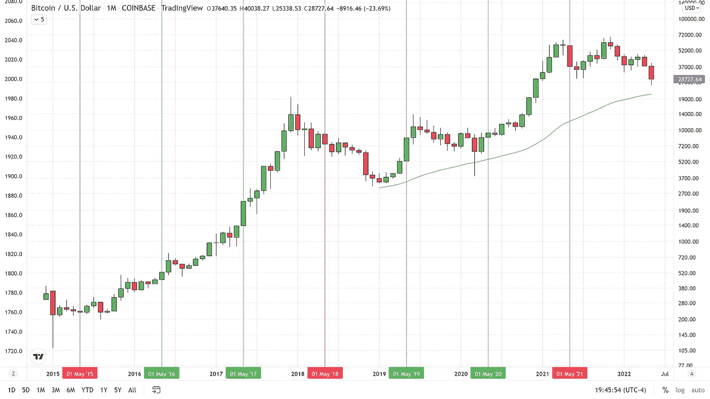

# 比特币会再次出现 5 月 19 日的抛售吗？

> 原文：<https://medium.com/coinmonks/will-bitcoin-have-another-may-19th-sell-off-1c8fb268c670?source=collection_archive---------68----------------------->

去年 5 月 19 日对于像我这样的比特币牛市来说是可怕的一天。我记得很清楚，因为那天是我的生日。那一年我没有如愿以偿，但今年市场继续大规模抛售正是我所希望的。

从 2015 年到 2020 年，5 月通常是比特币的好月份。在这六年期间，比特币有两倍的月蜡烛变成绿色。一些年来，特别是 2017 年和 2019 年，比特币在 5 月份取得了巨大的收益。但去年可能是每个人都记得的一年，在 5 月 12 日至 5 月 19 日的一周时间里，比特币的价值下跌了约 50%，触及我们今天交易的 29，000 美元左右的低点，而本月初的交易价格接近 59，000 美元。

今年和去年的不同之处在于，我实际上是希望股市大幅下跌，而不是祈祷股市重返牛市。是什么改变了我的态度？我对比特币生日愿望的改变，代表了我情绪的改变。虽然去年我担心如果比特币崩溃或无法继续创造新的历史高点，BTC 的采用将面临风险。今年，我相信，无论价格如何波动，比特币都不会消失。我希望 BTC 尽可能低地漂移，这样我就能以更好的价格自己购买一些。今年是我的生日，我希望我们在 5 月 19 日再跌 12，000 美元，这样我就可以多捞一些，最好是在触底的时候。

那么，何时何地会触底？什么时候比较难回答，但我猜是未来三到十二个月的某个时候。我认为，根据我目前的研究，最低会在 17，000 美元左右——18，000 美元。不管怎样，不管我现在的观点是什么，我都希望我的生日礼物是比特币，哈哈。

发送到:BC 1 qex 03 zffegdnmphv 3 jxttp 06 H3 vlfrjxnccp 7 wz

对于任何有兴趣查看更多关于比特币的文章的人，只需点击这个[链接](https://www.thegoldforecast.com/bitcoin)。

> 加入 Coinmonks [电报频道](https://t.me/coincodecap)和 [Youtube 频道](https://www.youtube.com/c/coinmonks/videos)了解加密交易和投资

# 另外，阅读

*   [Bookmap 评论](https://coincodecap.com/bookmap-review-2021-best-trading-software) | [美国 5 大最佳加密交易所](https://coincodecap.com/crypto-exchange-usa)
*   最佳加密[硬件钱包](/coinmonks/hardware-wallets-dfa1211730c6) | [Bitbns 评论](/coinmonks/bitbns-review-38256a07e161)
*   [新加坡十大最佳加密交易所](https://coincodecap.com/crypto-exchange-in-singapore) | [收购 AXS](https://coincodecap.com/buy-axs-token)
*   [红狗赌场评论](https://coincodecap.com/red-dog-casino-review) | [Swyftx 评论](https://coincodecap.com/swyftx-review) | [CoinGate 评论](https://coincodecap.com/coingate-review)
*   [投资印度的最佳加密软件](https://coincodecap.com/best-crypto-to-invest-in-india-in-2021)|[WazirX P2P](https://coincodecap.com/wazirx-p2p)|[Hi Dollar Review](https://coincodecap.com/hi-dollar-review)
*   [加拿大最佳加密交易机器人](https://coincodecap.com/5-best-crypto-trading-bots-in-canada) | [库币评论](https://coincodecap.com/kucoin-review)