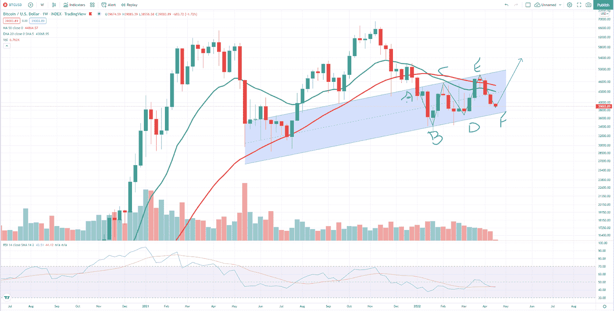
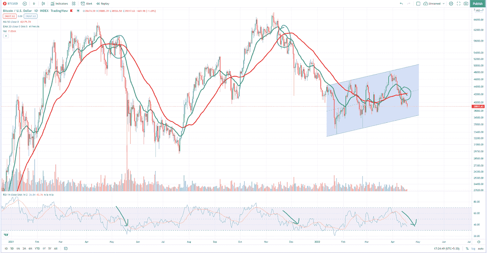

# 比特币会成为 HODL 吗？

> 原文：<https://medium.com/coinmonks/will-bitcoin-hodl-the-line-c45be33a58a8?source=collection_archive---------65----------------------->

这是一个漫长的周末，圣周，逾越节周，还有周末聚会？但是随着一周的开始，夏季的热浪正在席卷全球，我很确定许多人已经开始为暑假做计划了？

好吧，来到市场前面，一切都不太好。没有人控制市场的事实使它变得如此有趣。大多数主要市场上周末关闭，但正如你所知，加密市场运行 24/7 和 365 天没有任何中断，因为没有人控制和操作这个市场，这难道不令人惊讶吗？

现在我们来看看比特币市场的表现。

从周线蜡烛图开始，BTCUSD 对仍然在 50 天移动平均线和 20 天指数移动平均线下方运行。在过去的三周里，交易量有所下降。虽然市场在宏观上仍处于下行趋势，但它正显示出轻微的改善。我们仍然可以画一条上升趋势支撑线，但从过去四周的红色蜡烛线来看，问题是，比特币 HODL 会是这条线吗？

另一件要注意的事情是，当价格处于下降趋势时，交易量并不显著，也不会有任何变动。在宏观尺度上，BTCUSD 价格正在创造更高的高点，并尊重支撑线。所以，在结论中，如果多头仍能守住周蜡烛图上的支撑，我们可以期待价格反转。

另一方面，在看日线蜡烛图的时候，我们在观察一些东西。50 天移动平均线和 20 天指数移动平均线交叉。如果我们回顾历史，每次它们交叉时，市场通常会在很长一段时间内下跌。RSI 指标证明了这一点，目前，它显示空头占据上风。因此，如果多头未能保持并扭转价格走势，我们可能需要在 36，777 美元附近找到新的支撑。

这就是今天的最新消息，投资安全。

*嗨，如果我们是第一次见面，我是研究分析师阿库佐，你可以在推特上关注我* [*这里*](https://twitter.com/Kuzotelohe) *。也请关注我的 Twitter 页面 PlanB Invest* [*这里*](https://twitter.com/story_bitcoin) *我在这里分享每日、每周对比特币和加密市场的分析，以帮助你做出明智的决定。*

*注意:投资加密包含风险。提交人对资产损失没有责任。这只是为了教育和信息的目的，因此，它不应该被视为财务建议。请在投资前做好自己的研究。*

> *加入 Coinmonks* [*电报频道*](https://t.me/coincodecap) *和* [*Youtube 频道*](https://www.youtube.com/c/coinmonks/videos) *了解加密交易和投资*

# 另外，阅读

*   [3 商业评论](/coinmonks/3commas-review-an-excellent-crypto-trading-bot-2020-1313a58bec92) | [Pionex 评论](https://coincodecap.com/pionex-review-exchange-with-crypto-trading-bot) | [Coinrule 评论](/coinmonks/coinrule-review-2021-a-beginner-friendly-crypto-trading-bot-daf0504848ba)
*   [莱杰 vs n 格拉夫](/coinmonks/ledger-vs-ngrave-zero-7e40f0c1d694) | [莱杰纳诺 s vs x](/coinmonks/ledger-nano-s-vs-x-battery-hardware-price-storage-59a6663fe3b0) | [币安评论](/coinmonks/binance-review-ee10d3bf3b6e)
*   [Bybit Exchange 审查](/coinmonks/bybit-exchange-review-dbd570019b71) | [Bityard 审查](https://coincodecap.com/bityard-reivew) | [Jet-Bot 审查](https://coincodecap.com/jet-bot-review)
*   [3 commas vs crypto hopper](/coinmonks/3commas-vs-pionex-vs-cryptohopper-best-crypto-bot-6a98d2baa203)|[赚取加密利息](/coinmonks/earn-crypto-interest-b10b810fdda3)
*   最好的比特币[硬件钱包](/coinmonks/hardware-wallets-dfa1211730c6) | [BitBox02 回顾](/coinmonks/bitbox02-review-your-swiss-bitcoin-hardware-wallet-c36c88fff29)