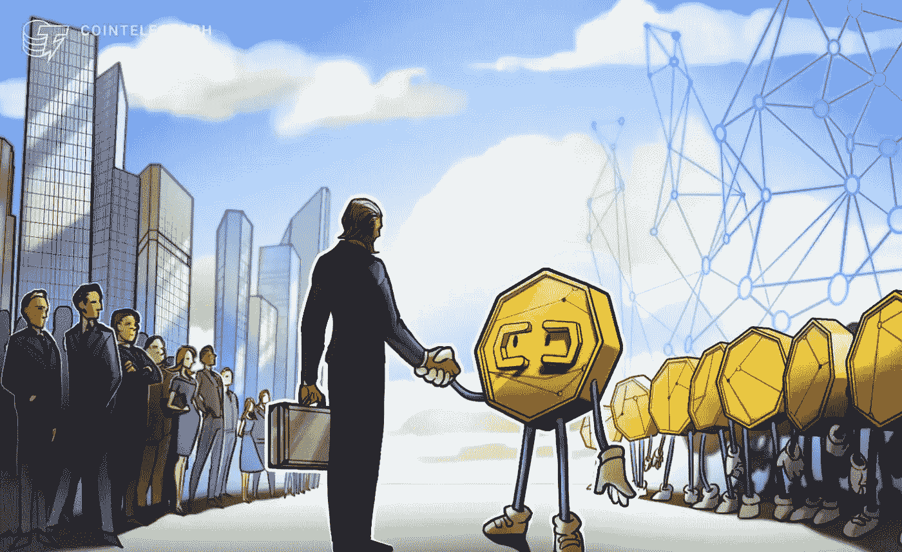
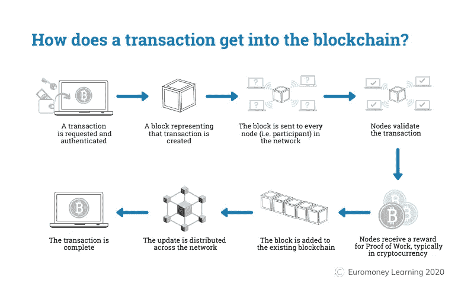
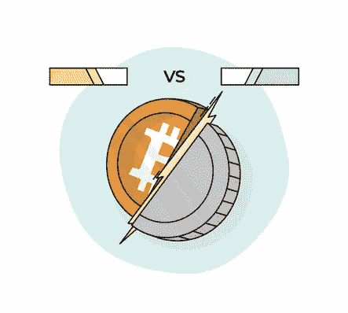

# 区块链会让金融业脱媒吗？

> 原文：<https://medium.com/coinmonks/will-blockchain-disintermediate-the-financial-industry-402e087885fd?source=collection_archive---------21----------------------->

> 区块链将在金融脱媒中扮演什么样的角色？我们准备好了吗？这篇文章对金融的未来提供了非常简要的见解，同时涵盖了当今世界中的部分非中介化和现实用例。

[https://cointelegraph.com/news/adapt-or-die-payments-giants-partner-with-crypto-firms-to-ensure-security](https://cointelegraph.com/news/adapt-or-die-payments-giants-partner-with-crypto-firms-to-ensure-security)

## 金融中间媒介作用

金融中介是第三方[，它将贷款人和借款人联系在一起，旨在满足他们的金融需求](https://stats.oecd.org/glossary/detail.asp?ID=972)。**金融中介(FIs)** 创建基金和管理支付系统，通常以一种高效的方式进行，例如批量进行金融活动，降低整体成本。

[**FIs 的例子**](https://gocardless.com/guides/posts/what-are-financial-intermediaries/) **:**

*   银行
*   共同基金
*   证券交易所
*   财务顾问
*   保险公司
*   养老基金

## **什么是脱媒？**

[脱媒](https://www.investopedia.com/terms/d/disintermediation.asp)就是消灭金融中介(FIs)或任何中间人。随着银行和非银行金融机构出现在市场中，中介在很大程度上是我们当前的金融状况——本文希望以此为基础。

> ***【非银行金融机构】***
> 
> [非银行金融机构](https://www.worldbank.org/en/publication/gfdr/gfdr-2016/background/nonbank-financial-institution)提供替代性金融服务(如金融咨询、风险分担、汇款等)，但没有正式的银行执照，因此不能接受存款。非银行金融机构包括典当行、保险公司、小额贷款公司等。这些机构并不直接与银行竞争，而是通过分拆金融服务包(通常由银行提供)提供利基服务来满足客户需求，从而对银行形成补充。这通常允许剩余资源的重新分配，并提供量身定制的专业服务。

## 区块链网络看起来像什么？

区块链是一种去中心化的数据存储结构，可以透明和不变地存储交易。数据不是以集中的方式存储的，而是分散在整个网络中，因此，如果由于任何原因一个节点出现故障/崩溃，相同的信息会保存在网络上的所有其他节点上，并且区块链会继续执行。

How a blockchain records a transaction — Simplified ([Source](https://www.euromoney.com/learning/blockchain-explained/how-transactions-get-into-the-blockchain))

它通过匿名和安全地认证交易，让您在不信任的环境中建立信任。 [**公共区块链**](https://www.techtarget.com/searchcio/feature/What-are-the-4-different-types-of-blockchain-technology) 对公众开放，任何人都可以在其中添加信息，但没有人可以对区块(如比特币的网络)进行更改。拥有这种无权限的网络允许互联网上的任何人登录到网络上并成为“节点”。只要节点上还有计算机，它就会继续运行。

**另一方面，私有区块链**是只有授权的个人才能访问的私有网络。通常用于组织，它受益于更快的速度(由于与公共网络相比节点更少)，更好的安全性，授权和可访问性。一个组织可以在用户对用户的基础上限制对区块链的访问，尽管有些人可能会声称这并不完全是一种“去中心化”的模式，这种模式通常是在“区块链”在谈话时承诺的。

混合区块链也存在，它是无许可和有许可区块链的混合。最后，**区块链财团**支持混合区块链网络上的多个组织进行信任协作。这可以在多个银行或研究机构之间使用，因为它允许多个实体组成一个皮层，而不必选举“领导者”或主持人。

## 区块链给金融表带来了什么？

到目前为止，只有两种支付方式——现金或中介支付(包括所有数字支付方式)。

*“自从计算机出现以来，数字对象的本质就是它们并不稀缺。可以无休止地复制，因此不可能用它们来制造货币，因为发送它们只会复制它们。”* *******

重复消费的可能性太高了，这就需要中介和他们的保证，即付款人不会两次(或更多次)使用同一笔资金。现金交易仅限于物理上的接近，而数字银行需要中介来进行安全交易。

那么，区块链在这一切中扮演什么角色呢？

比特币(由区块链技术支持)由中本聪创造，是第一个成功设计的解决方案，允许交易在没有第三方中介的情况下发生。这样做的原因是因为它是可验证的(通过其强大的共识机制，称为工作证明)，并且比特币的数量很少(总共只有 2100 万个比特币)。

人们可以争论区块链和中间人之间的安全程度。但交易成本要低得多，而且它消除了对资金的集中控制(例如来自政府的控制)。

我一直在说区块链有多棒，但接受度、可访问性、互操作性和可扩展性只是被认为是阻碍这个名叫中本聪的疯狂匿名家伙将我们的世界旋转 180 度、催眠每个人转而使用加密技术并让银行破产的一些因素。

这显然没有发生，原因如下:

## 中介的剩余角色

***与外界融合***

[如果区块链不能与其他现有系统(或外部世界)互操作](https://www.finextra.com/blogposting/18972/blockchain-and-interoperability-key-to-mass-adoption)，就会出现孤岛。如果不与组织使用的当前技术和/或系统集成，区块链将很难使用，因此会影响其采用率并增加其用例的缺乏。就像集成任何新技术(不仅仅是区块链)一样，需要集成来顺利实现和运行，否则它的全部潜力不会形成。

对于像金融这样复杂的行业，一个区块链无法满足所有功能，并且没有与其他系统甚至其他区块链集成的能力，一旦采用区块链，就很难扩展。在更深的层面上，运行不同版本并拥有不同治理规则的金融机构加剧了孤岛问题。一系列互不关联的区块链可能会产生更长的交付周期，从而抵消区块链的效率。

***区块链执行的是金融活动，不是金融服务***

金融机构的一些基本职能是提供定制的金融建议、对决策重要的相关信息、市场研究数据等。这是区块链网络无法提供的。一般建议和重要的[信息可以很容易地在区块链](https://www.researchgate.net/publication/349173292_Revealing_the_Disintermediation_Concept_of_Blockchain_Technology_How_Intermediaries_Gain_From_Blockchain_Adoption_in_a_New_Business_Model)上获得，但是，这些信息是由整个网络共享的，因此不适合进行个案咨询。此外，如果没有任何中介，不太懂技术的个人将很难在区块链上学习和访问服务。因此，中介机构仍然需要提供金融服务，以填补区块链在现阶段无法填补的空白。

[https://blog.bankera.com/en/crypto-banking-vs-banking-for-the-blockchain-era/](https://blog.bankera.com/en/crypto-banking-vs-banking-for-the-blockchain-era/)

## 那么，在糟糕的金融世界中，区块链的位置在哪里呢？

随着区块链系统有望降低成本、提高效率和改善数据安全性，可以实施它来实现特定财务活动的自动化。

***智能合约:***

由于区块链的透明性和不变性，法律上可强制执行的智能合同可以保存在网络上，如果所有各方都满足某些条件，则允许任务发生。例如，当满足预定的条款和条件时，付款会自动转账。在不符合智能合约的情况下，它不会继续，中介可以介入并采取适当的行动。

***降低风险:***

区块链可以通过减少信息不对称和减少滞后来降低交易各方的不确定性风险。通过能够自动化实时信息交换，各方可以保持在同一页面上。国际支付和该行业的其他部分存在大量重复，这造成了延迟和混乱——这可以通过区块链解决。

***精简流程:***

了解你的客户(KYC)是大多数金融机构开展的一项基本活动，出于监管和合规目的需要。像 [KYC 链](https://kyc-chain.com)这样的服务可以通过提供实时更新和提高信任来帮助简化 KYC 流程。通过允许在银行和其他相关方之间无缝交换文档，自动化客户识别和开户可能是有益的。

Partior 是一个在金融机构中实施区块链的真实例子。 [Partior 由 JP Morgan、DBS Bank 和 Temasek](https://www.ledgerinsights.com/jp-morgan-dbs-blockchain-payment-platform-partior-launches-first-pilot/) 创建，是新加坡的一个银行间支付系统，允许企业区块链平台提高跨境支付的速度并降低成本。这是新加坡金融管理局创造一种成功的中央银行数字货币(CBDC)的尝试，以创造结算的确定性并使交易透明。

虽然区块链在今天的金融行业中的作用可能还不显著，但不断变化的环境可能会导致一个以区块链为基础的行业，接受并采用区块链作为基础。主要障碍之一是缺乏在任何行业实施区块链的法规、标准和框架。总的来说还处于不成熟阶段，只会随着时间和相邻的技术发展而进步。

## 关键要点

区块链很棒。不仅仅是因为它是一个很棒的流行语，还因为它有我们在金融行业需要的有用属性。交易可以得到验证，金融活动可以进行，信任可以建立——所有这些都不需要第三方中介。这使得它成为一项非常诱人的技术。

然而，由于缺乏标准和与现有系统的互操作性，缓慢的增长是不可避免的。它无法提供定制的金融服务，这也限制了它的使用案例。因此，成功集成区块链对于创建一个敏捷的技术网络至关重要，否则将会创建一个孤岛式的环境。

通过与区块链等新技术保持同步，金融机构可以变得更加高效，并利用竞争优势。借助智能合同、自动化某些流程(例如 KYC)以及与区块链各方的协作，it 可以降低风险并确保信息流动更加顺畅。展望未来，不仅要与现有系统整合，还要与法律、法规和治理整合，这对其成功至关重要。

*   我强烈推荐阅读由 Saifedean Ammous *撰写的《比特币标准》(The Bitcoin Standard)，该书深入研究了货币的历史，对金融的未来以及比特币在其中的潜在作用进行了有趣的探讨。*

> *加入 Coinmonks* [*电报频道*](https://t.me/coincodecap) *和* [*Youtube 频道*](https://www.youtube.com/c/coinmonks/videos) *了解加密交易和投资*

# 另外，阅读

*   [3 商业评论](/coinmonks/3commas-review-an-excellent-crypto-trading-bot-2020-1313a58bec92) | [Pionex 评论](https://coincodecap.com/pionex-review-exchange-with-crypto-trading-bot) | [Coinrule 评论](/coinmonks/coinrule-review-2021-a-beginner-friendly-crypto-trading-bot-daf0504848ba)
*   [莱杰 vs n rave](/coinmonks/ledger-vs-ngrave-zero-7e40f0c1d694)|[莱杰 nano s vs x](/coinmonks/ledger-nano-s-vs-x-battery-hardware-price-storage-59a6663fe3b0) | [币安评论](/coinmonks/binance-review-ee10d3bf3b6e)
*   [Bybit 交易所评论](/coinmonks/bybit-exchange-review-dbd570019b71) | [Bityard 评论](https://coincodecap.com/bityard-reivew) | [Jet-Bot 评论](https://coincodecap.com/jet-bot-review)
*   [3 commas vs crypto hopper](/coinmonks/3commas-vs-pionex-vs-cryptohopper-best-crypto-bot-6a98d2baa203)|[赚取加密利息](/coinmonks/earn-crypto-interest-b10b810fdda3)
*   最好的比特币[硬件钱包](/coinmonks/hardware-wallets-dfa1211730c6) | [BitBox02 回顾](/coinmonks/bitbox02-review-your-swiss-bitcoin-hardware-wallet-c36c88fff29)
*   [block fi vs Celsius](/coinmonks/blockfi-vs-celsius-vs-hodlnaut-8a1cc8c26630)|[Hodlnaut 审核](/coinmonks/hodlnaut-review-best-way-to-hodl-is-to-earn-interest-on-your-bitcoin-6658a8c19edf) | [KuCoin 审核](https://coincodecap.com/kucoin-review)
*   [Bitsgap 审查](/coinmonks/bitsgap-review-a-crypto-trading-bot-that-makes-easy-money-a5d88a336df2) | [Quadency 审查](/coinmonks/quadency-review-a-crypto-trading-automation-platform-3068eaa374e1) | [Bitbns 审查](/coinmonks/bitbns-review-38256a07e161)
*   [加密复制交易平台](/coinmonks/top-10-crypto-copy-trading-platforms-for-beginners-d0c37c7d698c) | [Coinmama 评论](/coinmonks/coinmama-review-ace5641bde6e)
*   [印度加密交易所](/coinmonks/bitcoin-exchange-in-india-7f1fe79715c9) | [比特币储蓄账户](/coinmonks/bitcoin-savings-account-e65b13f92451)