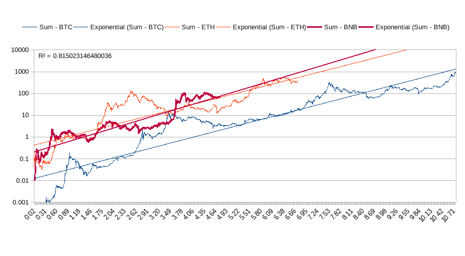
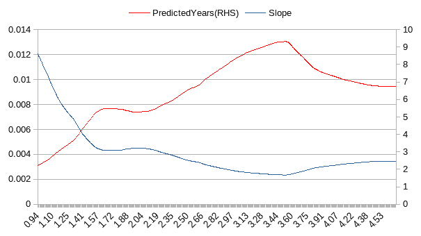
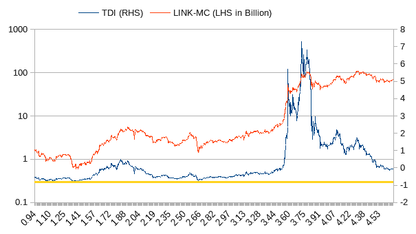
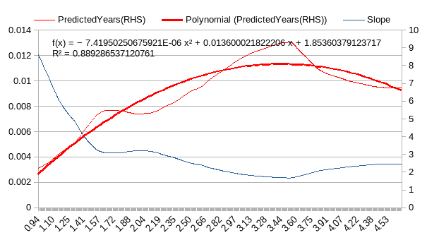
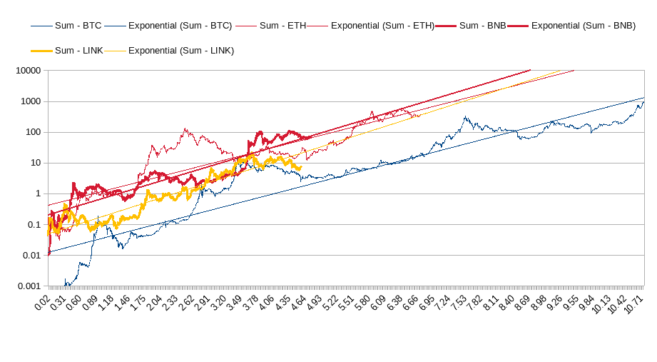

# $BNB 会挑战以太坊成为最快达到 1 万亿美元的资产吗

> 原文：<https://medium.com/coinmonks/will-bnb-challenge-ethereum-to-be-the-fastest-asset-to-reach-1t-455115ef7875?source=collection_archive---------20----------------------->

根据本系列的第一篇文章 [*如何识别&追踪下一个万亿资产*](/coinmonks/how-to-identify-track-the-next-trillion-dollar-assets-2045f5b2a29a?source=rss----721b17443fd5---4) ，已经布局出一个分析框架，得出一个结论:以太坊的代币 Ether 有望成为下一个万亿资产，最快在一年左右即 7.5 年后取代比特币成为下一个万亿资产。 ***这里的下一个大问题是，币安连锁店的平台标志 BNB 是否会在更短的时间内挑战以太，达到 1 万亿美元的市值。***

截至 2022 年 3 月 30 日，BNB 的市值为 714 亿美元，其供应量上限为 165，116，760 枚硬币，这些硬币都已经在流通。

让我们看看 BNB 在文章 [*如何识别&追踪下一个万亿美元资产*](/coinmonks/how-to-identify-track-the-next-trillion-dollar-assets-2045f5b2a29a?source=rss----721b17443fd5---4) 中概述的下一个万亿美元资产分析框架中的位置。

BNB 历史图表以及比特币和以太坊

与$LINK 不同，前一篇文章 [*为什么 LINK 是$1T 资产的首选*](/coinmonks/why-link-is-the-top-candidate-for-1t-asset-bb34bba36353?source=rss----721b17443fd5--cryptocurrency) 详细阐述了，$BNB 虽然与$LINK 同年出生，但一直试图通过纠缠以太坊的趋势来挑战 BTC-ETH 趋势带的上限，并且在大多数时间里，$BNB 在出生后的同一时期比比特币强大得多。

指数趋势线，由它自己的历史曲线定义，占历史的 80%以上，在 6.77 年拦截了 1 万亿美元的刻度线，考虑到自$BNB 推出以来已经有 4.6 年了，转换为仅仅两年的时间。现在$BNB 流通市值为$ 716 亿， ***即将到来的万亿化将在模型*** 预测的 2 年内产生约 14 倍(1000B/71.6B)的收益率。

然而，在对投资前景感到兴奋之前，人们应该调查趋势的性质，即趋势梯度，看看预测有多可靠。

$BNB Slope & Predicted Years

BNB 在第一年和第三个季度几乎是在模仿瑞士联邦理工学院，随后两年的表现大大低于瑞士联邦理工学院，最近一年的表现出人意料地超过了瑞士联邦理工学院，最终市值为 710 亿美元，而同期结束时瑞士联邦理工学院的市值为 189 亿美元。上面的趋势梯度图清楚地揭示了 BNB 趋势发展的两个阶段。一年前，当 BNB 几乎将自己排除在 1 万亿美元最快资产的竞争对手之外时，趋势梯度开始如此迅速地逆转，以至于一年后，BNB 成为最有能力的竞争对手之一。然而，问题仍然是趋势梯度是否会再次逆转，或者它在未来几年将如何演变。

为了回答这个问题，首先要访问 TDI 又名*趋势偏离指数*，它衡量的是实际值与趋势线所指示的值之间的差异。

TDI (Trend Deviation Index)

鉴于 TDI 的大部分值都在 0 附近波动，TDI 图显示，除了一年前的飙升之外，BNB 历史上很好地遵循了自己定义的趋势，即使在飙升之后，其市值也逐渐回到了趋势水平。因此，只要趋势梯度保持稳定，1T 年的预测是可靠的。因此，分析的重点转移到趋势梯度将如何发展的问题上。与之前文章中 BTC、瑞士联邦理工学院和林克的所有分析不同，这里的趋势梯度没有明显的模式，需要更高阶的建模。

Trend Gradient Regressive Fitting

2 次多项式回归非常符合趋势梯度曲线，并揭示了即将到来的下降趋势。 ***如果守恒适用且趋势梯度的水平发展被假定，似乎从现在起的总计 6.77 年或 2 年将是 1 万亿美元目标年的合理预测。***

此外，上述分析能否转化为巨大的投资机会？嗯，要看时机和与其他投资机会的比较。

在上一篇文章 [*为什么林克是 1T 资产*](/coinmonks/why-link-is-the-top-candidate-for-1t-asset-bb34bba36353?source=rss----721b17443fd5--cryptocurrency) 的首选中，我们使用 TDI 来确定定位时机，因此我们正在做同样的事情来判断这是否是做多 BNB 的最佳时机。 ***答案是模糊的，因为 BNB 的价格/市值正好与趋势线重叠，TDI 仍有下降的空间，这意味着价格/市值可能会向南*** 远离趋势线。另一方面，让我们看看 BNB 和林克并排。

$BNB Alongside $LINK In The BTC-ETH Band

看来$BNB 和$林克在一个更高的阶段上是平行的，只是因为有一个 BNB 的激增，而林克仍然不知何故被抑制，并且仍然在等待在不久的将来它自己的激增。此外，投资指标本身也很好:BNB 美元两年内增长 14 倍，林克美元 3-4 年内增长 100 倍。请注意，BNB 的 2 年 1 万亿美元预测并不意味着 BNB 的市值在 1 万亿美元时达到顶峰，而是意味着根据这一分析框架，我们正在推理存档市值目标的时间框架。

总之，根据我们的下一个万亿美元资产分析框架， ***BNB 有很大的潜力成为继以太坊之后下一个最快达到 1 万亿美元的资产，据推测，它在两年内的万亿化使其成为目前 14 倍的投资候选。但 TDI 只是中性的，而不是有利的时机进入任何位置的 BNB，机会甚至黯然失色时，与链接。***

*请注意，本文不作为投资建议，只应被视为提供信息。*

> 加入 Coinmonks [电报频道](https://t.me/coincodecap)和 [Youtube 频道](https://www.youtube.com/c/coinmonks/videos)了解加密交易和投资

# 另外，阅读

*   [如何在印度购买比特币？](/coinmonks/buy-bitcoin-in-india-feb50ddfef94) | [WazirX 审查](/coinmonks/wazirx-review-5c811b074f5b)
*   [CryptoHopper 替代品](/coinmonks/cryptohopper-alternatives-d67287b16d27) | [HitBTC 审查](/coinmonks/hitbtc-review-c5143c5d53c2)
*   [CBET 评论](https://coincodecap.com/cbet-casino-review) | [库科恩 vs 比特币基地](https://coincodecap.com/kucoin-vs-coinbase)
*   [折叠 App 审核](https://coincodecap.com/fold-app-review) | [Kucoin 交易机器人](/coinmonks/kucoin-trading-bot-automate-your-trades-8cf0ca2138e0) | [Probit 审核](https://coincodecap.com/probit-review)
*   [如何匿名购买比特币](https://coincodecap.com/buy-bitcoin-anonymously) | [比特币现金钱包](https://coincodecap.com/bitcoin-cash-wallets)