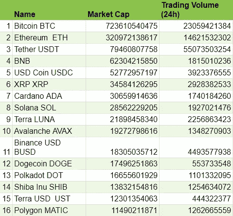
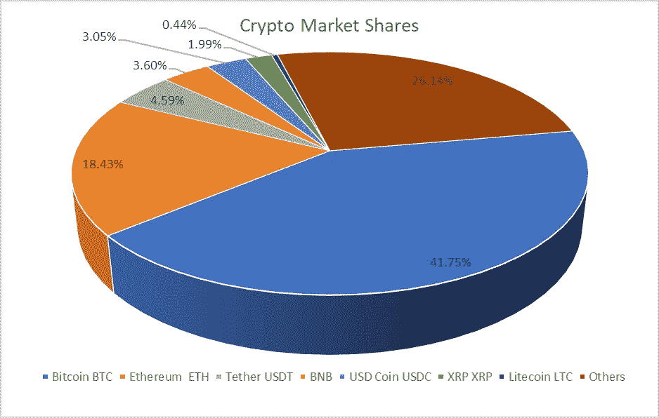
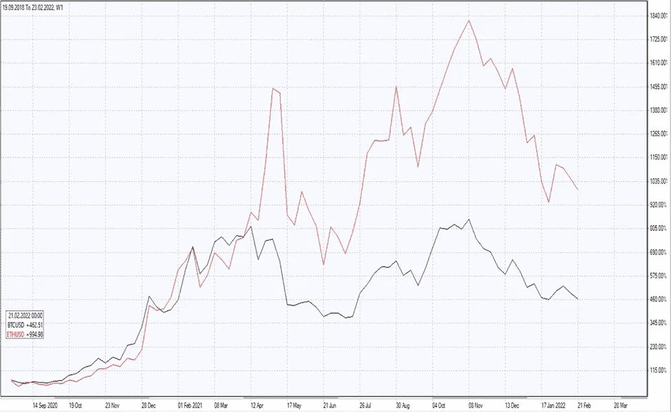
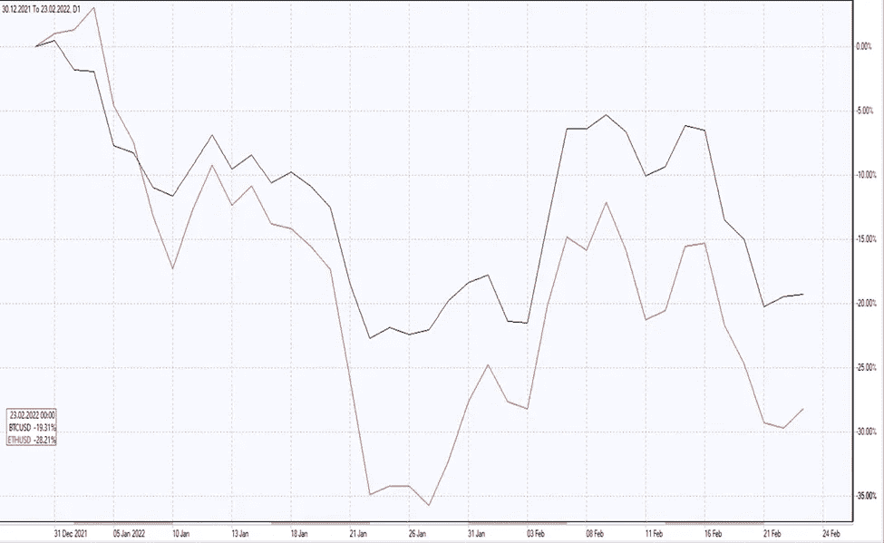

# BTC 的衰落会影响整个加密市场吗？下一步是什么？

> 原文：<https://medium.com/coinmonks/will-btc-decline-impact-the-crypto-market-overall-what-is-next-83da5779c993?source=collection_archive---------40----------------------->

# 1.BTC 的衰落会影响整个加密市场吗？

截至 2022 年 2 月，已有近 10，000 种加密货币存在，但其中大多数交易量很少或没有交易量。截至 2022 年 2 月 23 日，日交易量超过 10 亿美元的加密货币数量为 14 种。名单附后。

有趣的是，日交易量超过 10 亿美元的加密货币列表与市值最高的 16 种加密货币列表相匹配，但有两个例外——它不包括柴犬和泰拉美元，根据 Coinmarketcap.com 的数据，它们的 24 小时交易量不到 10 亿美元。

市值最高的 16 种加密货币名单的另一个值得注意的特点是，它们合计占 1.3 万亿美元加密货币总市值的 84.63%。市值最高的 6 种加密货币，加上莱特币，约占加密货币总市值的 73%。下面的饼图反映了它们在 1.3 万亿美元的加密货币总市值中所占的市场份额。

**Cryptocurrencies market shares as of February 23, 2022**

资本化最高的两种加密货币——比特币和以太坊，合计占总市值的 60%以上，其中比特币资本化占 13 亿美元加密货币总市值的 41.75%，如上图所示。仅这一事实就暗示，比特币价格的[变化应该会对整个加密市场产生重大影响。](https://www.ifcmarkets.com/en/cryptocurrency-converter)

这个假设可以通过观察市值最高的两种加密货币——比特币和以太坊——的价格变化动态来检验。下面的两个图表在同一个图表上显示了两个时期比特币和以太坊的价格变化动态:2019 年 9 月至 2022 年 2 月和 2021 年 12 月至 2022 年 2 月，分别以周和日为时间框架。

**Chart 3: Percentage price change Sep 2018-Feb 2022**

**Chart 4: Percentage price change Dec 2021-Feb 2022**

从这两个图表中可以明显看出，以太坊跟随比特币的脚步:这两种顶级加密货币几乎总是一起涨跌！所以答案是肯定的:BTC 的衰落直接影响了整个加密市场。

# 2.比特币的下一步是什么？

如下图所示，当前的偏向显然对比特币不利。比特币本周将继续下跌，我预计它将在如图所示的黄色方框中交易。它将测试支撑位，下一个支撑位在 34666 美元，它将从这个位置反射回来。

# 3 其他加密货币的下一步是什么？

我预计其他加密货币将效仿比特币。因此，其他 cryptos 将表现出相同的动态——它们下周将继续下跌，但应该会在周末逆转其下滑趋势。