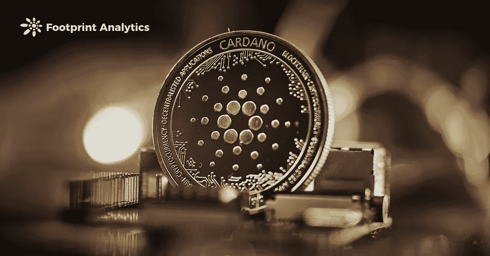
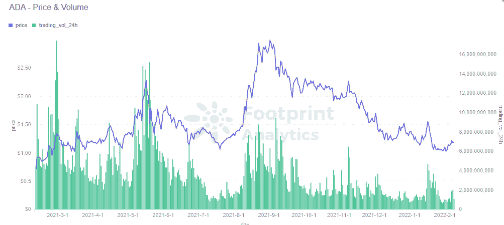
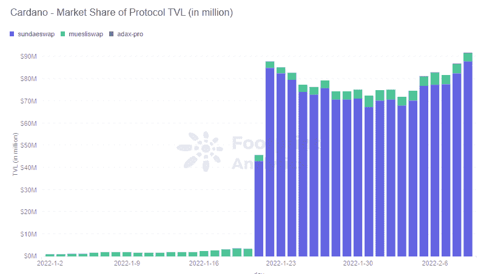
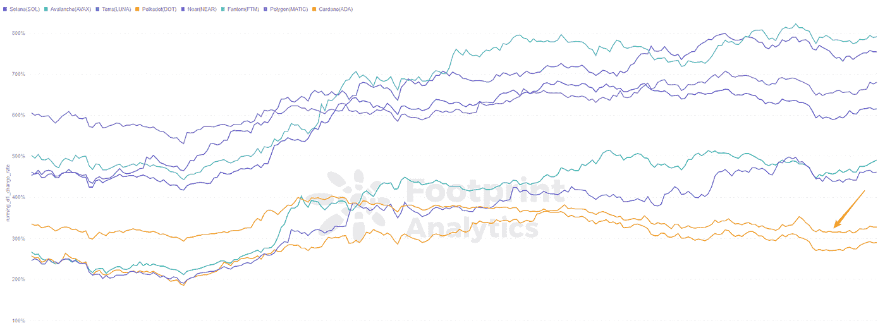

# 卡尔达诺会在 2022 年爆发吗？

> 原文：<https://medium.com/coinmonks/will-cardano-explode-in-2022-b1a3bb6343ec?source=collection_archive---------30----------------------->

经过多年的技术微调，Cardano 的时代终于到来了吗？

数据来源:[卡尔达诺仪表盘](https://footprint.cool/HpFu)

经过多年的技术微调，Cardano 终于在 1 月 20 日推出了第一款 DEX，名为 SundaeSwap。推出当天，其 TVL 就达到了 430 万美元。卡尔达诺的股票 ADA 在此前一周上涨了 10%。

[卡达诺](https://footprint.cool/HpFu)的时代终于到来了吗？

# 什么是卡尔达诺

Cardano 成立于 2015 年，自称区块链 3.0。它旨在结合[比特币](https://footprint.cool/8aas)和[以太坊](https://footprint.cool/war6)的精华，解决与可扩展性、互操作性和可持续性相关的问题。

卡尔达诺的优势在于其学术和科学的哲学基础。

IOHK 是 Cardano 的开发基金会之一，负责与世界各地的学术团队合作，研究和审查协议的更新，以确保其可扩展性。

卡尔达诺对加密货币有着伟大的长期愿景。它认为区块链的新技术应该为商业或金融系统服务。它希望创建一个能够支持每秒数千笔交易的链，一个允许政府和企业跟踪系统信息的平台，甚至实现民主治理。

# 围绕卡尔达诺的争议

[ADA](https://footprint.cool/HpFu) 目前市值排名第 7，24 小时交易量排名第 15。

*Footprint Analytics — ADA Price and Volume*

尽管卡尔达诺的市值很高，但它是一个两极分化的项目。这就是为什么有些人对它的评价过高。

**1。卡尔达诺的发展一直比较缓慢。** Cardano 在 2021 年 9 月才推出第一批智能合约，大约是在 mainnet 上线 6 年后。

虽然卡尔达诺连锁店有超过 170 个项目正在建设中，但到目前为止只有五个项目投入使用。其中之一就是 SundaeSwap。

*Footprint Analytics — Protocols on Cardano*

**2。ADA 令牌缺乏应用场景。** ADA 目前的角色仅用于下注，价格受 FOMO 影响。与其他生态系统发展强劲的连锁企业相比，ADA 的代币价格在过去一年增长缓慢。

*Footprint Analytics — Top Chain Token Price Thrend*

**3。对其技术设计和实现的关注。** [社区中出现了许多问题](https://www.reddit.com/r/CryptoCurrency/comments/s7pjy5/12_reasons_cardano_cant_scale_in_2022/)，这些问题可能表明 Cardano 的 TPS、交易费用和可伸缩性并不尽如人意。Cardano 上的第一个 SundaeSwap 在上线时遇到了网络拥塞，无法进行交易。

Cardano 的主要前提是，其超慢的开发将由同类最佳的性能和安全性来证明。它能否做到这一点还有待观察。

**卡尔达诺案**

面对关于 DApp 发射和技术实现的问题，支持者认为 Cardano 是面向未来的。Cardano 的目标是与政府和金融机构合作，因此需要更长的时间来准备更安全的解决方案。

以下是卡尔达诺的主要论点:

*   **先进的技术理念:** Cardano 独有的共识算法 Ouroboros，通过两层网络架构，持有实现百万 TPS 的可能性。
*   **专业评审:** Cardano 是第一个经过同行评审的区块链项目，这意味着 Cardano 的代码在推出之前要经过专业的同行评审，以确保技术的可行性。
*   **强大的社区:** Cardano 有一个强大而热情的社区，聚集了许多专业人士、研究人员、教授、开发人员和投资者。
*   **资金实力** : Cardano 目前拥有 1.6 亿美元的资金，将为后续的生态系统建设提供有力支持。

支持者还认为，阿隆佐升级是卡尔达诺生态系统爆发的起点。随着生态系统的扩展，ADA 将有更丰富的应用场景，价格也会上涨。

# 卡尔达诺会在 2022 年爆发吗？

不可否认，卡尔达诺的愿景是令人向往的，来得正是时候，拥挤和高成本困扰着以太网。

然而，市场上的强劲竞争对手比任何人 5 年前想象的都要多。

夏季过后，DApps 爆炸了。其他连锁店也在激烈竞争，试图在 DeFi 市场分一杯羹。如果有谁能活下来，那将是那些随着用户的发展而满足他们需求的产品。

大鲸鱼不在乎[油费](https://footprint.cool/Yas8)，他们在乎的是流动性。他们需要在尽可能少的价格影响和滑点的情况下，快速进出资金。

而流动性是需要大量用户提供的东西。这是以太坊的一个重要优势，由于其在流动性方面的先发优势，以太坊在公共链中牢牢占据领先地位。

换句话说，卡尔达诺需要将其先进的理念和技术付诸实践。

只有当更多的 DApps 得到实施，以确保链上应用的正常运行，用户能够参与生态系统的建设，而不仅仅是令牌交易时，Cardano 才会是一个安全的赌注。

**什么是足迹分析**

足迹分析是一个一体化的分析平台，用于可视化区块链数据和发现见解。它清理和整合链上数据，因此任何经验水平的用户都可以快速开始研究令牌，项目和协议。凭借一千多个仪表板模板和一个拖放界面，任何人都可以在几分钟内构建自己的定制图表。发掘区块链数据，利用足迹进行更明智的投资。

[网站](https://www.footprint.network/) | [推特](https://twitter.com/Footprint_DeFi) | [不和](https://discord.com/invite/3HYaR6USM7) | [电报](https://t.me/joinchat/4-ocuURAr2thODFh) | [Youtube](https://www.youtube.com/channel/UCKwZbKyuhWveetGhZcNtSTg)

> 加入 Coinmonks [电报频道](https://t.me/coincodecap)和 [Youtube 频道](https://www.youtube.com/c/coinmonks/videos)了解加密交易和投资

# 另外，阅读

*   [如何在 Uniswap 上交换加密？](https://coincodecap.com/swap-crypto-on-uniswap) | [A-Ads 审查](https://coincodecap.com/a-ads-review)
*   [加密货币储蓄账户](/coinmonks/cryptocurrency-savings-accounts-be3bc0feffbf) | [YoBit 评论](/coinmonks/yobit-review-175464162c62)
*   [Botsfolio vs nap bots vs Mudrex](/coinmonks/botsfolio-vs-napbots-vs-mudrex-c81344970c02)|[gate . io 交流回顾](/coinmonks/gate-io-exchange-review-61bf87b7078f)
*   [CoinFLEX 评论](https://coincodecap.com/coinflex-review) | [AEX 交易所评论](https://coincodecap.com/aex-exchange-review) | [UPbit 评论](https://coincodecap.com/upbit-review)
*   [AscendEx 保证金交易](https://coincodecap.com/ascendex-margin-trading) | [Bitfinex 赌注](https://coincodecap.com/bitfinex-staking) | [bitFlyer 评论](https://coincodecap.com/bitflyer-review)
*   [Bitget 回顾](https://coincodecap.com/bitget-review)|[Gemini vs block fi](https://coincodecap.com/gemini-vs-blockfi)cmd |[OKEx 期货交易](https://coincodecap.com/okex-futures-trading)
*   [AscendEx Staking](https://coincodecap.com/ascendex-staking)|[Bot Ocean Review](https://coincodecap.com/bot-ocean-review)|[最佳比特币钱包](https://coincodecap.com/bitcoin-wallets-india)