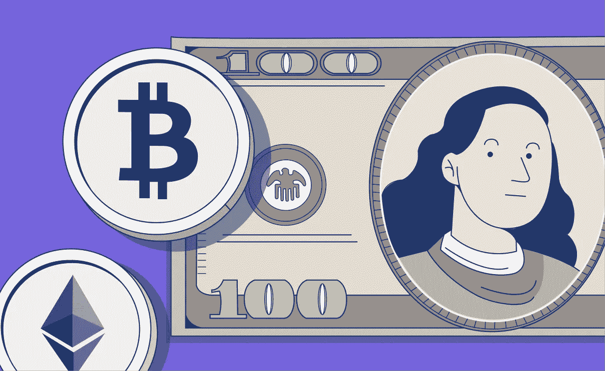

# 密码会取代货币吗？

> 原文：<https://medium.com/coinmonks/will-crypto-ever-replace-money-52c265cd2c44?source=collection_archive---------51----------------------->

皮尤研究中心的一份报告表明，听说过加密货币的美国人比实际购买或投资加密货币的美国人多。这份 2021 年 11 月的报告在对美国成年人进行调查后发现，86%的人至少听说过一点加密货币，其中 24%的人说他们听说过很多加密货币。只有 16%的调查参与者亲自购买、交易或使用过加密货币。

皮尤进一步指出，在 2015 年，只有 48%的成年人听说过比特币，不到 1%的人购买过加密货币，这表明在过去的七年里，加密技术的应用并不广泛。这些发现强调，我们距离大多数美国人真正购买或使用加密货币还有几年时间。

在 crypto 能够达到大规模采用的阶段并有可能被定位为货币的可行替代品之前，用户首先需要完全理解并接受数字资产的价值。密码也需要服务于货币目前提供的主要功能。

# 货币的三个主要功能是什么？

建立一些关于金钱的基本概念和功能是值得的。我们期望金钱有一些基本的用途，它们如下:

1.**记账单位**:该功能确保不同商品或服务的比较尺度。这是必要的，这样统一的价值标准才能被广泛接受——这样，我们就“知道”一美元能买到什么。

2.**交易媒介**:结算债务或获取商品的公认支付方式。这是货币的一个重要方面，因为它体现了公众对资产的信任——这是货币普遍使用的一个必要特征。

3.**价值储存**:给定资产在短期和长期内维持支付能力的内在能力。最好的“价值储存”实际上可以以超过市场通胀的速度增值。

# 比特币和以太坊会取代美元吗？

从根本上说，比特币是作为政府发行的货币的一种安全的点对点替代物而创建的，而以太坊是“作为加密货币以太网(ETH)和你今天可以使用的数以千计的应用背后的社区建设技术而创建的。”

比特币基本上是一种革命性的(尽管有限)计算机代码集合，旨在成为法定货币的替代品。以太坊是应用程序的软件编程基础，这些应用程序推动去中心化金融、不可替代令牌(NFT)、智能合同——几乎是开发者可以想象的任何东西。

为了有助于形象化区别:如果这些密码是露营装备，比特币将是纯金斧头，以太坊将是类固醇瑞士军刀。

具体到上述货币功能，比特币已经发展成为一种在价值储存方面几乎无可匹敌的资产。它作为加密领域内的基准帐户单位，用于衡量所有其他货币。比特币货币通常被称为“数字黄金”，因为 BTC 与储值的字面“黄金标准”——黄金有许多相似的属性。与黄金一样，比特币最具决定性的属性是其稀缺性。只有 2100 万 BTC 将被生产。与不断增长的需求相比，每年开采的供应量减少了一半，每四年比特币开采量的减少确保了每枚比特币的持续升值。

# 比特币的另一面

然而，BTC 的基本编码标准将交易速度限制在令人痛苦的 5 到 10 分钟，使 BTC 成为一个不合格的交易机制。对于比特币“最大化主义者”和其他铁杆支持者来说，这无关紧要，因为他们可以用自己的 BTC 作为抵押，用其他流动货币贷款来支付账单或购物。

# ETH 的案例

与之形成鲜明对比的是，以太坊的一个主要优势是，随着越来越多的应用程序在其上推出以供广泛使用，如 NFTs 和分散式金融，其强大的网络效应将继续扩大。甚至有朝一日可能取代以太坊的所谓“以太杀手”,如 Cardano 和 Polkadot，也运行在它们本应取代的网络上。

根据 dapp 的*状态，*目前有超过 2400 个分布式应用(dapp)建立在以太坊之上。这些 DApps 支持涉及生活方方面面的案件，包括健康信息、身份、市场、金融、数据安全、保险、有形财产、媒体、游戏以及许多其他方面。

这个广阔领域的字面意思是以太。它不仅是比比特币更好的交易媒介，而且正在成为比以前更好的价值储存手段，因为[部署了通货紧缩协议](https://blockchain.news/analysis/ethereum-2.0-full-upgrade-will-prompt-a-1-percent-annual-deflation-rate)，例如 2021 年 8 月在 [EIP-1559 升级](https://www.cnbc.com/2021/08/04/what-to-know-about-the-ethereum-london-hard-fork-eip-1559-upgrade.html)下的程序化硬币燃烧。

# 最终裁决

目前，比特币或以太坊这两种顶级加密技术都不太可能完全取代美元，但它们也不需要。有足够多的独特案例和实用程序，它们可以共存并提供各自的价值。

不过有一点是肯定的——随着加密技术的不断发展，对 Cointelli 等成熟的[加密报税解决方案](https://cointelli.com/features)的需求肯定会变得更加迫切。

> 加入 Coinmonks [电报频道](https://t.me/coincodecap)和 [Youtube 频道](https://www.youtube.com/c/coinmonks/videos)了解加密交易和投资

# 另外，阅读

*   [BlockFi vs Celsius](/coinmonks/blockfi-vs-celsius-vs-hodlnaut-8a1cc8c26630)|[Hodlnaut 回顾](/coinmonks/hodlnaut-review-best-way-to-hodl-is-to-earn-interest-on-your-bitcoin-6658a8c19edf) | [KuCoin 回顾](https://coincodecap.com/kucoin-review)
*   [Bitsgap 审查](/coinmonks/bitsgap-review-a-crypto-trading-bot-that-makes-easy-money-a5d88a336df2) | [Quadency 审查](/coinmonks/quadency-review-a-crypto-trading-automation-platform-3068eaa374e1) | [Bitbns 审查](/coinmonks/bitbns-review-38256a07e161)
*   [密码本交易平台](/coinmonks/top-10-crypto-copy-trading-platforms-for-beginners-d0c37c7d698c) | [Coinmama 评论](/coinmonks/coinmama-review-ace5641bde6e)
*   [印度的加密交易所](/coinmonks/bitcoin-exchange-in-india-7f1fe79715c9) | [比特币储蓄账户](/coinmonks/bitcoin-savings-account-e65b13f92451)
*   [OKEx vs KuCoin](https://coincodecap.com/okex-kucoin) | [摄氏替代品](https://coincodecap.com/celsius-alternatives) | [如何购买 VeChain](https://coincodecap.com/buy-vechain)