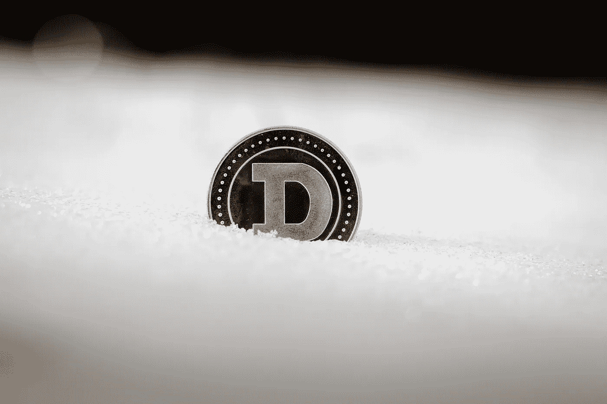

# 埃隆马斯克会用 Dogecoin 做火星币吗？

> 原文：<https://medium.com/coinmonks/will-elon-musk-use-dogecoin-as-mars-currency-c5c7b95301f2?source=collection_archive---------50----------------------->

Dogecoin 是在 2013 年作为一种玩笑货币被创造出来的，但自那以后它就有了自己的生命。柴犬主题的加密货币已经在迷因爱好者和加密爱好者中流行起来。特斯拉和 SpaceX 的亿万富翁首席执行官埃隆·马斯克一直是 Dogecoin 的坚定支持者。自从 2019 年 4 月首次在推特上发布加密货币以来，他甚至开玩笑说要在火星上使用它作为货币，因为他是 Dogecoin 的粉丝。2021 年 2 月，他甚至在推特上说 Dogecoin 是他“最喜欢的”密码。

虽然 Dogecoin 不太可能被用作官方货币，但如果马斯克的公司在火星上建立殖民地，它可能会被用作一种支付形式。目前，它仍然是一种有趣而古怪的加密货币，受到加密社区许多人的喜爱。

## 埃隆·马斯克是谁？

埃隆·里夫·马斯克 FRS(/ˈiːlɒn/·埃隆；生于 1971 年 6 月 28 日)是商业巨头、工业设计师和工程师。他是 SpaceX 的创始人、CEO、CTO、首席设计师；特斯拉公司的早期投资者、首席执行官和产品架构师；无聊公司创始人；Neuralink 联合创始人；以及 OpenAI 的联合创始人和首任联合主席。作为亿万富翁，马斯克是世界上最富有的人之一。

马斯克的母亲是加拿大人，父亲是南非人，在南非比勒陀利亚长大。他曾短暂就读于比勒陀利亚大学，17 岁时移居加拿大，就读于女王大学。两年后，他转学到宾夕法尼亚大学，获得了经济学和物理学双学士学位。1995 年，他搬到加州，在斯坦福大学(Stanford University)上学，但他决定投身商界，与哥哥金巴尔(Kimbal)共同创办了网络软件公司 Zip2。这家初创公司于 1999 年被康柏公司以 3 . 07 亿美元收购。同年，马斯克与人共同创立了网上银行 X.com，该银行于 2000 年与 Confinity 合并，成立了 PayPal 公司，随后于 2002 年被易贝以 15 亿美元的价格收购。

2002 年，马斯克成立了航天制造商 SpaceX 和太空运输服务公司，他是首席执行官、首席技术官和首席设计师。2004 年，他加入电动汽车制造商特斯拉汽车公司(现在的特斯拉公司)，担任董事长和产品架构师，并于 2008 年成为其首席执行官。2006 年，他帮助创建了太阳能服务公司 SolarCity，目前是特斯拉的子公司。

2015 年，马斯克共同创立了 OpenAI，这是一家非营利研究公司，旨在促进友好的人工智能，以造福整个人类。2016 年，他联合创办了专注于开发脑机接口的神经科技公司 Neuralink Corp .，并创办了隧道施工业务 Boring Company。马斯克还提出了 Hyperloop，一种高速真空列车运输系统。

## 那么为什么埃隆·马斯克这么喜欢 Dogecoin 呢？特斯拉真的会开始接受 Dogecoin 作为其汽车的付款方式吗？

以下是你需要知道的关于埃隆·马斯克和 Dogecoin 的事情。

Dogecoin 是一种分散式加密货币，创建于 2013 年，是对比特币的模仿。它最初是一个笑话，但由于其低廉的费用和快速的交易时间而迅速流行起来。它对硬币的供应没有限制，这意味着它会导致通货膨胀。然而，绝大多数硬币已经被开采，流通中的数量有限。

最近几个月，由于埃隆·马斯克和马克·库班等名人对 Dogecoin 的兴趣增加，doge coin 的价值飙升。截至 2021 年 2 月，一枚 Dogecoin 大约值 0.05 美元。与比特币(BTC)等每枚价值超过 50，000 美元的其他加密货币相比，这仍然相对较低。

埃隆·马斯克在 2019 年 4 月首次发布了关于 Dogecoin 的推特，称它“非常酷”。此后，他多次在推特上发布关于 Dogecoin 的消息，甚至在 2021 年 2 月称其为他“最喜欢的”加密。目前还不清楚为什么埃隆·马斯克如此喜欢 Dogecoin，但这可能是因为它的低价和快速交易时间。Dogecoin 也比其他加密货币更容易获得，因为你可以购买硬币的一部分，而不是整个硬币。

特斯拉尚未宣布任何开始接受 Dogecoin 作为支付方式的计划，但埃隆·马斯克的推文引发了人们对未来可能发生这种情况的猜测。如果特斯拉开始接受 Dogecoin，这可能会进一步提高加密货币的价值。

## 加密货币有可能成为火星的官方货币吗？

让一种加密货币成为火星的官方硬币是可能的，但埃隆·马斯克不太可能选择 Dogecoin 作为这种货币。有几个原因可以解释为什么另一种货币更适合这项任务。

Dogecoin 是作为一个笑话而创建的，它不具备与其他加密货币相同的可信度。它也没有足够大的市值成为一种稳定的货币。另一种加密货币，如比特币或以太坊，更有可能被用作火星的官方货币。

**阅读更多关于 Cryptochartis.com 的类似文章，它是真实、公正的加密货币新闻、预测和市场分析的主要来源。**

> 加入 Coinmonks [电报频道](https://t.me/coincodecap)和 [Youtube 频道](https://www.youtube.com/c/coinmonks/videos)了解加密交易和投资

# 另外，阅读

*   [用信用卡购买密码的 10 个最佳地点](https://coincodecap.com/buy-crypto-with-credit-card)
*   [最好的卡达诺钱包](https://coincodecap.com/best-cardano-wallets) | [Bingbon 副本交易](https://coincodecap.com/bingbon-copy-trading)
*   [印度最佳 P2P 加密交易所](https://coincodecap.com/p2p-crypto-exchanges-in-india) | [柴犬钱包](https://coincodecap.com/baby-shiba-inu-wallets)
*   [8 大加密联盟项目](https://coincodecap.com/crypto-affiliate-programs) | [eToro vs 比特币基地](https://coincodecap.com/etoro-vs-coinbase)
*   [最佳以太坊钱包](https://coincodecap.com/best-ethereum-wallets) | [电报上的加密货币机器人](https://coincodecap.com/telegram-crypto-bots)
*   [交易杠杆代币的最佳交易所](https://coincodecap.com/leveraged-token-exchanges) | [购买 Floki](https://coincodecap.com/buy-floki-inu-token)