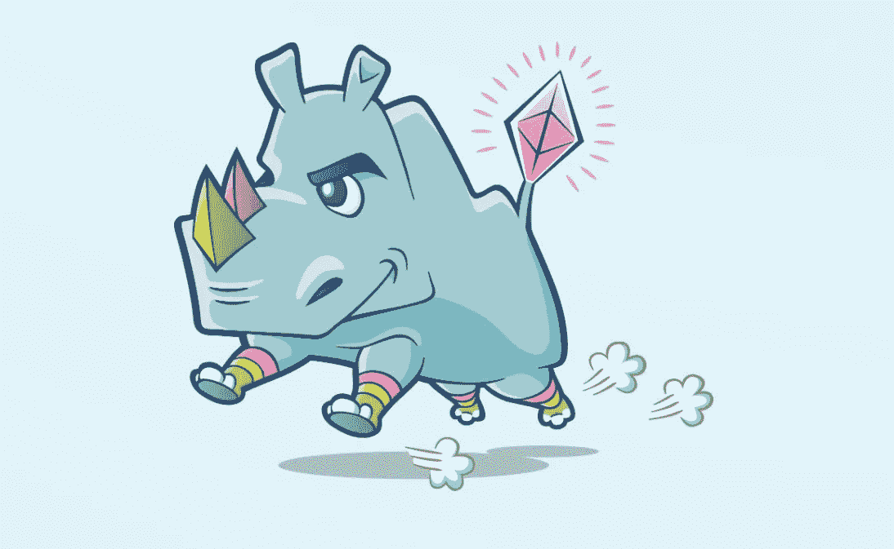
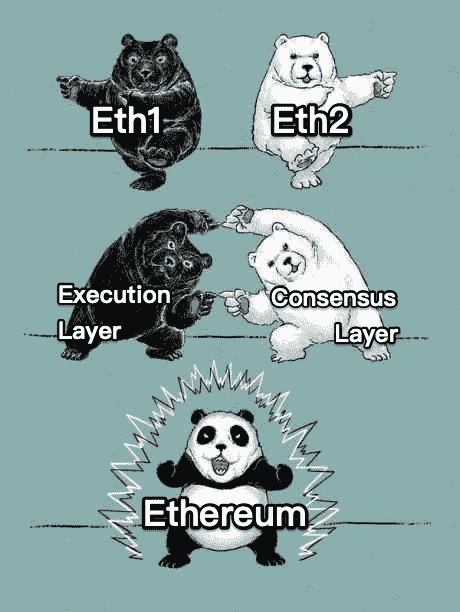
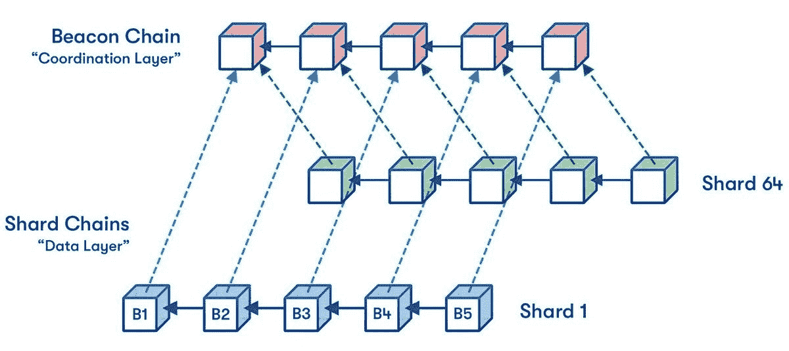
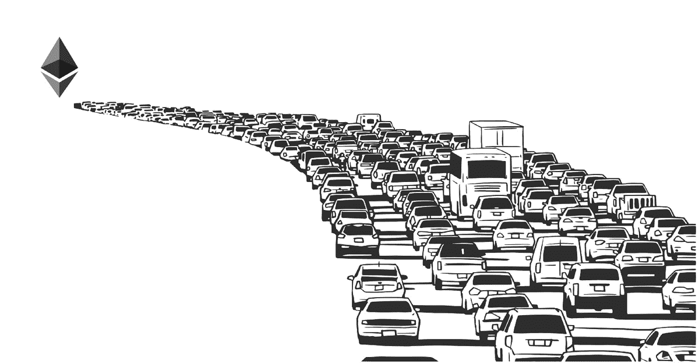
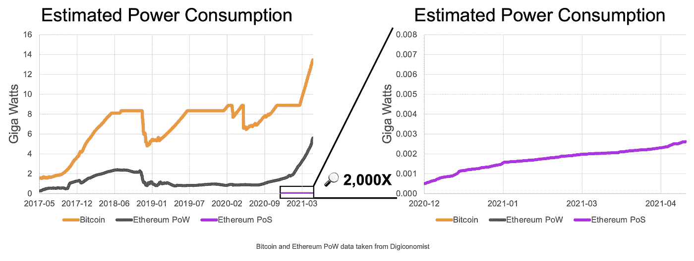
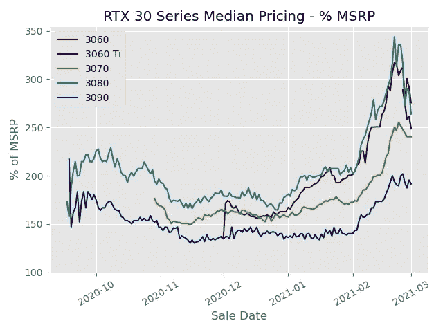

# ETH 2.0 会是败局还是最终的看涨催化剂？

> 原文：<https://medium.com/coinmonks/will-eth-2-0-be-the-downfall-or-ultimate-bullish-catalyst-2584ad406dd6?source=collection_archive---------37----------------------->

ETH 会推出新令牌吗？

号码

术语“Eth2.0”或最初称为“Serenity”，只是该项目的名称或术语。以太坊网络的升级是秘密进行的，主要是对其基础设施的改变。

我们今天使用的以太坊主网继续受到(PoW)工作证明的保护。ETH 一直在通过信标链向(PoS)利害关系证明共识机制发展。

这被称为…

本质上，合并就是这两个系统最终走到一起。

最终使 ETH 更具可扩展性、安全性和可持续性！

mainnet 将把运行智能合同的能力引入 PoS 系统，加上以太坊的全部历史和当前状态，以确保所有 ETH 持有者和用户的平稳过渡。

**嗯，好吧，那信标链是什么？**

信标链于 2020 年 12 月 1 日发布。这将向 ETH 介绍 POS，一种帮助您保护 ETH 安全的新方法。验证器将会在链中处理事务和创建新的块。

本质上，参与网络的人越多，网络就变得越分散，越不会受到攻击。这就是碎片链的用武之地。

**什么是分片？**

分片是水平分割数据库以分散负载的过程。这将通过创建称为“碎片”的新链来减少网络拥塞并增加 TPS。

这些“碎片”将通过将网络扩展到 64 区块链来增加网络容量和提高交易速度。

**酷酷酷酷，那么是什么让 ETH2.0 通缩呢？**

ETH 的日排放量将减少 90%,从 12，000 ETH/天降至 1280 ETH/天。

*将 ETH 的年通胀率从 4.3%降至 0.43%*

更不用说，在合并后的几个月里，PoS 验证员的奖励将从 4.5%上升到 10%-15%。

最棒的是，ETH 的能耗将下降 99.95%！

想象一下，有多少精明的资金可以投入其中！

还记得 Tesla 由于气候问题不再接受 BTC，因为它使用 PoW 共识机制。

**ETH 目前有哪些局限性？**

1.  ETH 只能处理大约 15-45 TPS(每秒事务数)

有点像这个 TBH。

2.目前挖掘区块和核实交易的方法是不可持续的

下图显示了 BTC 和瑞士联邦电力公司与瑞士联邦电力公司之间的估计耗电量。

3.高准入门槛

随着硬件价格的上涨，世界各地的游戏玩家都讨厌我们，这使得人们很难购买 GPU 并收回投资回报。

总而言之，ETH 走向环保，拥有高收益和通货紧缩的象征性经济政策可能会导致机构采用的激增！

如果你喜欢以线程的方式阅读，请查看下面的推文:

> 加入 Coinmonks [电报频道](https://t.me/coincodecap)和 [Youtube 频道](https://www.youtube.com/c/coinmonks/videos)了解加密交易和投资

# 另外，阅读

*   [ypto 交易信号为 Huobi](https://coincodecap.com/huobi-crypto-trading-signals) | [Swapzone 回顾](/coinmonks/swapzone-review-crypto-exchange-data-aggregator-e0ad78e55ed7)
*   最佳[密码交易机器人](https://coincodecap.com/best-crypto-trading-bots) | [购买索拉纳](https://coincodecap.com/buy-solana) | [矩阵导出评论](https://coincodecap.com/matrixport-review)
*   [Coldcard 评论](https://coincodecap.com/coldcard-review) | [BOXtradEX 评论](https://coincodecap.com/boxtradex-review)|[uni swap 指南](https://coincodecap.com/uniswap)
*   [比特币基地评论](/coinmonks/coinbase-review-6ef4e0f56064) | [德里比特评论](/coinmonks/deribit-review-options-fees-apis-and-testnet-2ca16c4bbdb2) | [FTX 评论](/coinmonks/ftx-crypto-exchange-review-53664ac1198f)
*   [联合国硬币评论](https://coincodecap.com/unocoin-review) | [最佳加密赌注硬币](https://coincodecap.com/best-crypto-staking-coins)