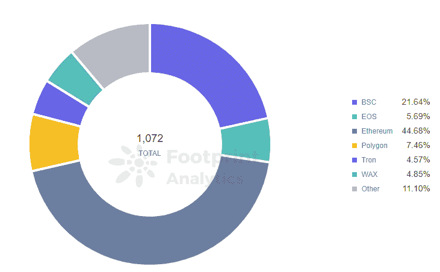

# GameFi 会成为 Polygon 的增长动力吗？

> 原文：<https://medium.com/coinmonks/will-gamefi-be-a-growth-driver-for-polygon-92aafcfda07b?source=collection_archive---------37----------------------->

向日葵农民事件引发了关于 Polygon 网络稳定性和天然气费用的讨论，以及对 Polygon 上 GameFi 开发的关注。

数据来源:[多边形上的 GameFi](https://footprint.cool/Ti39)

今年 1 月，《向日葵农民》一度是 Polygon 的顶级游戏，拥有 459.4 万用户。它占用了超过 70%的连锁资源，导致[多边形](https://footprint.cool/irLp)拥堵，汽油成本飙升 50 倍。

*Footprint Analytics：GameFi Volume in Polygon*

但是，与其他最近的 T4 项目不同，这绝不是一夜成名的故事。

2022 年 1 月 9 日，向日葵农民证实它被黑客入侵。大多数用户都是机器人。从那时起，该项目一直处于维护模式，因为它试图优化游戏，然后在 4 到 8 周内推出第二个版本的测试版。

这一事件引发了关于 Polygon 网络稳定性和汽油费的讨论，以及对 Polygon 上 [GameFi 的岩石式开发的担忧。](https://footprint.cool/Ti39)

# 多边形上的 GameFi 开发

作为以太坊的一个分支，Polygon 的 EVM 兼容性和低费用使其在培育 GameFi 生态系统方面具有显著优势。总共有 80 个 GameFi 项目在 Polygon 上，仅次于以太坊和币安。

*Footprint Analytics：GameFi Volume by Chain*

用户在 Polygon 上使用最多的 3 个 GameFi 协议是:

*   Arc8 是一个移动电子竞技游戏平台，允许用户与对手进行游戏，并赚取 GMEE 代币。Arc8 拥有出色的游戏体验。
*   REVV 是一款有自己的代币 REVV 的游戏。玩家可以购买 NFT 汽车或在比赛中获胜。
*   **Pegaxy** 是一款科幻题材的赛马游戏，以其科幻风格和优秀的游戏系统吸引了众多用户。用户可以购买或租用 PEGA(马)来比赛。

Pexagy 几乎占 Polygon GameFi 交易量的全部。

*Footprint Analytics：GameFi Token in Polygon*

*Footprint Analytics：GameFi Token in Polygon*

# GameFi 会成为 Polygon 的增长动力吗？

GameFi 驱动的增长可能还有很长的路要走。

**1。优化 GameFi 项目以吸引更多用户**

目前，成功的 GameFi 项目要么是 DeFi 加 NFTs，要么是游戏化的 DeFi。

比如 Axie Infinity 通过 NFTs 给玩家分配收益，而 [DeFi Kingdoms](https://footprint.cool/cotb) 以 DeFi 为核心，让玩家以游戏的形式体验 DeFi。这两种模式都被证明是成功的。

Polygon 上的 GameFi 项目缺乏与 DeFi 或 NFTs 的有机集成，这使得它们在收入激励、分散化和玩家参与方面有很大的改进空间。

**2。利用生态系统激励措施**

作为一家大力发展 NFT 和 GameFi 项目的连锁企业，BSC 推出了最有价值建造者(MVB) II 计划，定期举办黑客马拉松、“学习与赚取”活动等等。通过这些，BSC 启动并支持了几个 GameFi 项目，包括 CryptoBlades、MyDeFiPet、MOBOX 和 X World Games。

Polygon 还建立了 Polygon 工作室，决心扩大其 GameFi 和 NFT 的足迹。该工作室去年 12 月投资了 GameOn 项目，以支持其基于 NFT 的游戏开发，这可能是一个良好的开端。

**3。对产业链发展方向的思考**

作为一个 EVM 兼容链，BSC 兼容以太坊，同时积极扩大其生态系统景观。它已经孵化了许多有前途的项目，如 Pancakeswap、Venue 和 Medx。同样，它在 GameFi 领域也不遗余力。

*Footprint Analytics：Protocols in Binance*

同样兼容以太坊的 Polygon 吸引了 Aave、Curve 等头条项目，但以太坊依然是这些项目的主阵地。

[例如，Polygon 上的 Aave](https://footprint.cool/8t5F) 在 2021 年 6 月从 38 亿美元跌至 20 亿美元后，一直在 20 亿美元的范围内波动，没有恢复到峰值。

*Footprint Analytics：Aave TVL by Chian*

*Footprint Analytics：Protocols in Polygon*

另一方面，Polygon 成立 Polygon Studio，引领 NFT 和 GameFi 的发展。

Polygon 似乎仍在考虑是专注于成为顶级以太坊兼容链，还是进入 NFT 和 GamFi 领域发展自己的生态系统。

# 摘要

虽然 GameFi 吸引了市场和资本的关注，但 GameFi 项目仍然面临网络性能有限、用户参与度低、游戏可玩性不足等问题。

Polygon 在事务速度、成本和可伸缩性方面的优势是不可否认的。但 GameFi 的发展需要一些推动才能在竞争激烈的游戏领域脱颖而出。

# 什么是足迹分析

足迹分析是一个一体化的分析平台，用于可视化区块链数据和发现见解。它清理和整合链上数据，因此任何经验水平的用户都可以快速开始研究令牌，项目和协议。凭借一千多个仪表板模板和一个拖放界面，任何人都可以在几分钟内构建自己的定制图表。发掘区块链数据，利用足迹进行更明智的投资。

*足迹网址:*[*https://www . Footprint . network/*](https://www.footprint.network/)

*不和:*[*https://discord.gg/3HYaR6USM7*](https://discord.gg/3HYaR6USM7)

*碎碎念:*[*【https://twitter.com/Footprint_DeFi】*](https://twitter.com/Footprint_DeFi)

*Youtube:*[*https://www.youtube.com/channel/UCKwZbKyuhWveetGhZcNtSTg*](https://www.youtube.com/channel/UCKwZbKyuhWveetGhZcNtSTg)

> 加入 Coinmonks [电报频道](https://t.me/coincodecap)和 [Youtube 频道](https://www.youtube.com/c/coinmonks/videos)了解加密交易和投资

# 另外，阅读

*   [密码本交易平台](/coinmonks/top-10-crypto-copy-trading-platforms-for-beginners-d0c37c7d698c) | [Coinmama 审核](/coinmonks/coinmama-review-ace5641bde6e)
*   [印度的加密交易所](/coinmonks/bitcoin-exchange-in-india-7f1fe79715c9) | [比特币储蓄账户](/coinmonks/bitcoin-savings-account-e65b13f92451)
*   [OKEx vs KuCoin](https://coincodecap.com/okex-kucoin) | [摄氏替代品](https://coincodecap.com/celsius-alternatives) | [如何购买 VeChain](https://coincodecap.com/buy-vechain)
*   [币安期货交易](https://coincodecap.com/binance-futures-trading)|[3 commas vs Mudrex vs eToro](https://coincodecap.com/mudrex-3commas-etoro)
*   [如何购买 Monero](https://coincodecap.com/buy-monero) | [IDEX 评论](https://coincodecap.com/idex-review) | [BitKan 交易机器人](https://coincodecap.com/bitkan-trading-bot)
*   [CoinDCX 评论](/coinmonks/coindcx-review-8444db3621a2) | [加密保证金交易交易所](https://coincodecap.com/crypto-margin-trading-exchanges)
*   [红狗赌场评论](https://coincodecap.com/red-dog-casino-review) | [Swyftx 评论](https://coincodecap.com/swyftx-review) | [CoinGate 评论](https://coincodecap.com/coingate-review)
*   [Bookmap 点评](https://coincodecap.com/bookmap-review-2021-best-trading-software) | [美国 5 大最佳加密交易所](https://coincodecap.com/crypto-exchange-usa)
*   [如何在 FTX 交易所交易期货](https://coincodecap.com/ftx-futures-trading) | [OKEx vs 币安](https://coincodecap.com/okex-vs-binance)