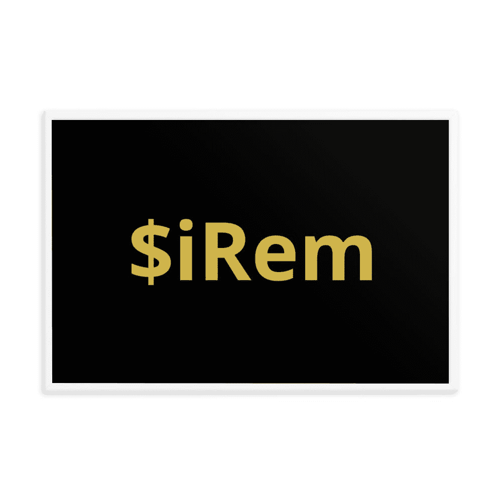

# iRem 会成为游戏行业的下一个大元宇宙吗？—无限领域

> 原文：<https://medium.com/coinmonks/will-irem-be-the-next-big-metaverse-hype-around-the-gaming-industry-infinity-realm-cadcc6657448?source=collection_archive---------24----------------------->

元宇宙现在是科技领域最热门的话题之一。然而，早在宣布将脸书更名为 Meta 之前，这个概念就已经在科技领域占据了一席之地。在小说《冰雪奇缘》中，尼尔·斯蒂芬森(作者)将栩栩如生的化身形象化。他还谈到了 3D 结构和不同的虚拟现实环境。让我们了解更多一点。

# 什么是元宇宙？

真实的元宇宙是一个虚拟世界，包括 3D 全息化身、AR 和 VR、视频和一些其他通信模式。随着这个概念的逐渐兴盛，它将创造一个超真实的世界。

因此，元宇宙包含了不同的技术元素，用户将生活在一个数字世界中。此外，用户可以工作、娱乐，并与朋友保持联系。他们也将享受虚拟旅行和参加音乐会。

# 元宇宙的未来

元宇宙承诺比你现在从互联网上得到的更具互动性、沉浸感和协作性。然而，尽管一些企业家有远大的抱负，区块链将强化元宇宙的概念。它将为玩家开发一个可持续的生态系统。因此，可以假设元宇宙将影响传统的工作和活动。它还将改变我们相互交流的方式。

当疫情震惊世界的时候，互联网拯救了就业世界。同样，游戏行业也从技术密集型世界中发现了价值。

元宇宙有潜力通过基于虚拟现实的可穿戴设备来彻底改变这些行业。此外，这些技术先进的可穿戴设备将使用户能够在玩游戏时利用虚拟世界。因此，元宇宙有无穷的潜力。

最重要的是将法定货币转换为加密货币的能力。你将能够在元宇宙和现实世界之间切换。消费者也将购买虚拟土地和数字化身。他们可以使用自己的加密令牌举办聚会。

# 元宇宙在博彩业的影响

元宇宙已经进入了数字游戏世界。堡垒之夜、Roblox 和《我的世界》让玩家可以享受一个不同的世界。这些游戏背后的公司有野心通过利用元宇宙为玩家提供更好的东西。

元宇宙在不同的视频游戏中也很受欢迎，比如 Horizon(脸书的社交虚拟现实应用)。喜欢这款游戏的玩家可能会对社交网络功能感兴趣。

风险投资基金、Big-Tech 和几家初创公司已经投资了原型元宇宙模型。然而，最突出的名字是苹果、脸书、亚马逊和微软。

玩家会在几个游戏中感受到元宇宙的影响。在几年内，他们会发现元宇宙游戏环境几乎在每一个平台上，让玩家有机会在独特的环境中玩游戏。在用 AR-VR 制作沉浸式游戏的同时，元宇宙必须帮助提高参与度和货币化。

正如我们提到的货币化，在秘密世界中讨论是很重要的。传统游戏让你购买力量和装备。玩赚取游戏将允许财政利润。这些游戏会给他们奖励，这些奖励可以转换成现实生活中的资产。

此外，由于公共区块链存储所有内容，因此不存在伪造的风险，因此除了玩家或持有者之外，其他任何人都只能有限地访问游戏资产。然而，区块链让证明所有权和转移资产变得容易而不受限制。玩家将能够安全地存储代币，并获得秘密奖励，而且，游戏创作者不能拿走区块链保护的代币。玩家会觉得自己是科幻小说中的人物。区块链技术已经开始为人们提供从日常生活中逃离到另一个现实的机会。

[https://www.youtube.com/watch?v=ot4OYcwAtjg](https://www.youtube.com/watch?v=ot4OYcwAtjg)？相对=0

# 使用元宇宙进行游戏的无限境界

在加密货币的世界里，比特币获得了很高的市值。然而，也有基于币安网络的元宇宙本地加密令牌。例如，虚拟元宇宙(沙盒)使玩家能够建立、玩和货币化虚拟体验。

最好的社区驱动令牌之一是 iRem，它运行在币安网络上。有了 iRem，你的加密游戏世界将变得非常有趣。

尽管 iRem 是一种新的加密令牌，但它已经成为一种有信誉的令牌。iRem 代币旨在确保社区内的优秀游戏和透明度。

iRem 令牌持有者将能够在虚拟空间中访问不同的应用和服务。

此外，有了 iRem 令牌，你将能够做以下事情，游戏中的能力，虚拟皮肤，事件，化身，物品，包括数字化身的衣服，等等。iRem 令牌的价值在虚拟世界内外都适用。

今年虚拟货币购买量有所增加。因此，在未来的一年里，通过使用加密货币，将与虚拟世界有更深更好的联系。

要了解更多关于 iRem 令牌的信息，您可以访问我们的网站 [Infinity Realm](https://infinityrealm.co/)

*原载于 2022 年 3 月 13 日 https://www.infinityrealm.co***。**

> *加入 Coinmonks [电报频道](https://t.me/coincodecap)和 [Youtube 频道](https://www.youtube.com/c/coinmonks/videos)了解加密交易和投资*

# *另外，阅读*

*   *[WazirX vs coin dcx vs bit bns](/coinmonks/wazirx-vs-coindcx-vs-bitbns-149f4f19a2f1)|[block fi vs coin loan vs Nexo](/coinmonks/blockfi-vs-coinloan-vs-nexo-cb624635230d)*
*   *[比斯勒评论](https://coincodecap.com/bitsler-review)|[WazirX vs coin switch vs coin dcx](https://coincodecap.com/wazirx-vs-coinswitch-vs-coindcx)*
*   *[7 大副本交易平台](https://coincodecap.com/copy-trading-platforms) | [BuyCoins 点评](https://coincodecap.com/buycoins-review)*
*   *[XT.COM 评论](https://coincodecap.com/profittradingapp-for-binance)币安评论 |*
*   *[SmithBot 评论](https://coincodecap.com/smithbot-review) | [4 款最佳免费开源交易机器人](https://coincodecap.com/free-open-source-trading-bots)*